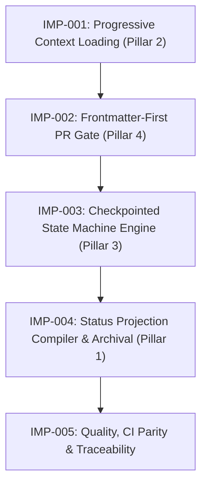

# Implementation Plan: Next-Gen Autonomous Dynamic Workflow Architecture

## 1. Plan Summary

| Item | Detail |
|---|---|
| Work Item | Issue #272 — Next-Gen Autonomous Dynamic Workflow Architecture |
| Change Type | Framework / Meta Change (`framework-meta`) |
| Risk Level | High |
| Owner | Developer Agent (`implementation-planning`) |
| Target Branch / Ticket | `feat/issue-272-next-gen-dynamic-workflow-discovery` / Issue #272 |

### Acceptance Criteria & NFR Restatement Checklist

Before beginning code changes, the following requirements from BA Discovery (`docs/records/requirements/2026-09-11-next-gen-dynamic-workflow-discovery.md`) and SA SDD (`docs/records/sdd/2026-09-11-next-gen-dynamic-workflow-sdd.md`) are locked as non-negotiable verification gates:

- [ ] **AC-001 (Boot Context $\le 3,500$ tokens)**: Core Bootloader Tier 1 (`docs/workflow/core-bootloader.md`) measures $\le 3,500$ tokens (character count / 4) while preserving 100% of safety invariants, golden rules, and human approval gates. Canonical Reference Library (8 files) remains intact as Tier 3 reference library ($\le 30,000$ tokens).
- [ ] **AC-002 (Role Context Injection $\le 1,500$ tokens)**: On-demand role context payload via `scripts/inject-role-context.mjs <role_id>` measures $\le 1,500$ tokens.
- [ ] **AC-003 (Invalid Role Fail-Closed)**: Requesting an unregistered role exits with code `1`, emitting structured JSON error on stderr.
- [ ] **AC-004 (Worktree Sharded Concurrency & Projection)**: Parallel feature branches with independent shards (`docs/records/work-items/{issue_id}/task-state.json`) achieve 0.0% Git merge conflict rate; root `PROJECT_STATUS.md` is compiled post-merge without manual edits.
- [ ] **AC-005 (Checkpointed State Transition)**: Valid transition persists updated task state atomically with timestamp, actor, sequence number, and mandatory evidence references.
- [ ] **AC-006 (Illegal Transition & Evidence Rejection)**: Illegal transition, missing required evidence, or exceeding retry limit ($\le 2$ rework attempts) is rejected with exit code $\ne 0$; file remains untouched.
- [ ] **AC-007 (Frontmatter-First Metadata Extraction)**: PR body with valid YAML frontmatter + complex markdown prose/code blocks parses with 100% deterministic accuracy.
- [ ] **AC-008 (Dual-Compatibility PR Gate)**: Frontmatter PRs parse via safe YAML AST; legacy PRs parse via regex with advisory deprecation warning; malformed frontmatter fails closed immediately.
- [ ] **AC-009 (Closeout Allowlist Shard Archival - Constraint 1)**: `scripts/work-item-readiness.mjs` allows `docs/records/work-items/archive/**` in closeout PRs without raising `'closeout files are not authorized'`.
- [ ] **AC-010 (Review Gate Script Enforcement - Constraint 2)**: Any diff modifying or adding `.mjs`/`.js` files includes a matching `docs/records/qa/*-code-review.md` record, satisfying `scripts/validate-review-gate.mjs`.
- [ ] **AC-011 (Project State Stale Marker Prevention - Constraint 3)**: `scripts/compile-status-projection.mjs` formats status tables in Markdown without lines matching `/^\s*-\s+Status:\s*/i` carrying forbidden stale markers (`uncommitted`, `pending review`, `pending merge`), satisfying `scripts/validate-project-state.mjs`.
- [ ] **AC-012 (Hook Containment Invariant - Constraint 4)**: All npm rules in `.claude/settings.json` are reachable from `.githooks/` or CI, and all validator scripts in `scripts/` are registered in `package.json`, passing `test/hook-containment.test.mjs` per ADR-0022.
- [ ] **AC-013 (Dual-Host CI Parity - Constraint 5)**: 1:1 command parity maintained between `.github/workflows/validate-contracts.yml` and `.gitlab-ci.yml`, verified by `scripts/validate-ci-parity.mjs`.
- [ ] **AC-014 (Contract Schema Naming Invariant - Constraint 6)**: Schemas ending in `*-state.schema.json` strictly map to `*-workflow.yaml` policies; envelope and CAS schemas use pinned non-colliding names (`durable-task-envelope.schema.json`, `status-cas-request.schema.json`), passing `scripts/validate-contracts.mjs`.
- [ ] **BR-001 (No Root Status Mutation on Feature Branch)**: Feature branches write only to issue-sharded task files; root `PROJECT_STATUS.md` mutation is blocked by edit guards.
- [ ] **BR-002 (Preserve Human Approval Gates)**: Suspended tasks transition to `blocked` with `stop_reason: "human_review_required"`; autonomous progression without human resume evidence is prohibited.
- [ ] **BR-003 (Zero-Boot Skill Content)**: All 31 skills remain on-demand (0 tokens loaded at session boot).
- [ ] **BR-004 (Contract Polymorphism & Deterministic Schemas)**: All state transitions and PR metadata conform strictly to JSON Schema Draft 2020-12 contracts.

---

## 2. Inputs Reviewed

| Artifact | Status | Notes |
|---|---|---|
| REQUIREMENT_DISCOVERY.md | Available (`docs/records/requirements/2026-09-11-next-gen-dynamic-workflow-discovery.md`) | Authoritative BA requirement specification defining US-001–US-004, AC-001–AC-008, BR-001–BR-004, and R-001–R-004 risk mitigations. |
| SDD.md | Available (`docs/records/sdd/2026-09-11-next-gen-dynamic-workflow-sdd.md`) | Approved SA architectural design document updated with Component §5, AC-009–AC-014, and the 6 GitHub Workflows, Git Hooks, and CI Parity architectural constraints. |
| TECHNICAL_DESIGN.md | N/A | Fully subsumed by the approved SDD document. |
| API_CONTRACT.md | Available (SDD §392–§526) | `task-state.schema.json` (v2), `pr-frontmatter.schema.json` (v1), `durable-task-envelope.schema.json`, and `status-cas-request.schema.json`. |
| TEST_PLAN.md | In progress (QA Agent) | Test strategy and acceptance verification matrices outlined herein to feed QA Agent test plan authoring. |

---

## 3. Affected Areas

| Area | Files / Components | Expected Change |
|---|---|---|
| **Workflow / Docs** | `docs/workflow/core-bootloader.md`<br>`docs/workflow/roles/*.md`<br>`docs/operating-model/CONTEXT_BUDGET.md` | New Tier 1 Core Bootloader ($\le 3,500$ tokens); modular on-demand role context files ($\le 1,500$ tokens each); context budget target updates. |
| **Contracts & Schemas** | `docs/contracts/schemas/pr-frontmatter.schema.json`<br>`docs/contracts/schemas/task-state.schema.json`<br>`docs/contracts/schemas/durable-task-envelope.schema.json`<br>`docs/contracts/schemas/status-cas-request.schema.json` | New PR frontmatter schema (Draft 2020-12); updated v2 task state schema; new durable task envelope schema; new status CAS request schema with non-colliding names. |
| **Tooling & Scripts** | `scripts/inject-role-context.mjs`<br>`scripts/validate-context-budget.mjs`<br>`scripts/work-item-readiness.mjs`<br>`scripts/lib/task-state-machine.mjs`<br>`scripts/task-machine-cli.mjs`<br>`scripts/compile-status-projection.mjs`<br>`scripts/validate-edit-guards.mjs` | New role context injector; dual-budget validation mode preserving `CANONICAL_FILES`; frontmatter AST parser with legacy fallback and expanded closeout allowlist; state machine engine with atomic write/CAS; status projection compiler with stale-marker-safe table format and archive lifecycle; edit guard preventing root status edits on feature branches. |
| **Templates** | `.github/PULL_REQUEST_TEMPLATE.md`<br>`.gitlab/merge_request_templates/default.md` | Scaffolding YAML frontmatter block added at lines 1-N of PR/MR templates. |
| **Config & CI** | `package.json`<br>`.github/workflows/validate-contracts.yml`<br>`.gitlab-ci.yml` | New npm scripts registered per hook containment (`status:compile`, `validate:status-projection`, `inject:role-context`); 1:1 validator command parity across GitHub and GitLab pipelines. |
| **QA Records** | `docs/records/qa/YYYY-MM-DD-issue-272-*-code-review.md` | Mandatory QA code review records added for any PR diff touching `.mjs` scripts to satisfy `scripts/validate-review-gate.mjs`. |
| **Tests** | `test/validate-context-budget.test.mjs`<br>`test/inject-role-context.test.mjs`<br>`test/work-item-readiness.test.mjs`<br>`test/task-state-machine.test.mjs`<br>`test/compile-status-projection.test.mjs`<br>`test/edit-guards.test.mjs`<br>`test/validate-ci-parity.test.mjs`<br>`test/hook-containment.test.mjs` | Unit, schema, and integration tests covering all 5 work packages, dual-compatibility modes, CAS conflicts, atomic writes, projection accuracy, hook containment, and CI parity. |

---

## 4. Task Breakdown

The architecture is implemented across 5 ordered, atomic work packages (IMP-001 to IMP-005):



### Cross-Cutting Mandate: QA Code Review Gate Enforcement (Constraint 2, AC-010)

Per `scripts/validate-review-gate.mjs`, every PR diff touching or introducing `.mjs` or `.js` files MUST include an accompanying review record under `docs/records/qa/` matching `*-code-review.md`. Therefore, each work package that touches or creates script files mandates authoring its respective QA review record:
- IMP-001: `docs/records/qa/2026-09-11-issue-272-imp001-context-loading-code-review.md`
- IMP-002: `docs/records/qa/2026-09-11-issue-272-imp002-pr-gate-code-review.md`
- IMP-003: `docs/records/qa/2026-09-11-issue-272-imp003-state-machine-code-review.md`
- IMP-004: `docs/records/qa/2026-09-11-issue-272-imp004-status-projection-code-review.md`
- IMP-005: `docs/records/qa/2026-09-11-issue-272-imp005-ci-parity-code-review.md`

---

### IMP-001: Progressive Context Loading Engine (Pillar 2)

- **Owner**: `developer-agent`
- **Objective**: Author `docs/workflow/core-bootloader.md`, implement `scripts/inject-role-context.mjs`, update `scripts/validate-context-budget.mjs` while preserving `CANONICAL_FILES`, and register scripts in `package.json` for hook containment.
- **Target Metrics**: Core bootloader $\le 3,500$ tokens; role injection $\le 1,500$ tokens; canonical reference library preserved $\le 30,000$ tokens; 100% hook containment compliance.

#### Detailed Subtasks:
1. **Task 1.1: Author Core Bootloader (`docs/workflow/core-bootloader.md`)**
   - Synthesize essential operational rules from `AGENTS.md` and `docs/workflow/`:
     - Operating Principles & Golden Rules (no direct main pushes, explicit handoffs, atomic commits).
     - Mandatory Human Approval Gates (`AGENT_OPERATING_MODEL.md#human-approval-gates`).
     - Universal Stop Conditions & Boundary Rules.
     - Dispatch & Handoff Contract Index (imperative pointers to `dynamic-routing.md` and `handoff-contract.md`).
     - Role & Skill Manifest: Compact table of 11 roles and 31 skills with 1-sentence descriptions ($\approx 300$ tokens).
   - Strict size constraint: Total character count $\le 14,000$ ($\le 3,500$ tokens via `chars / 4`).
2. **Task 1.2: Author Modular Role Context Files (`docs/workflow/roles/*.md`)**
   - Author individual on-demand context markdown files for registered agents:
     - `ba-agent.md`, `sa-agent.md`, `developer-agent.md`, `qa-agent.md`, `pm-agent.md`, `config-agent.md`, `documentation-agent.md`, `orchestrator-agent.md`, `release-agent.md`, `security-agent.md`, `data-agent.md`.
   - Each role file contains role-specific responsibilities, quality gates, and domain conventions strictly constrained to $\le 1,500$ tokens ($\le 6,000$ characters).
3. **Task 1.3: Implement Role Context Injector (`scripts/inject-role-context.mjs`)**
   - CLI Signature: `node scripts/inject-role-context.mjs <role_id> [--json]`.
   - Implement `ROLE_REGISTRY` enum validation: `['ba-agent', 'sa-agent', 'developer-agent', 'qa-agent', 'pm-agent', 'config-agent', 'documentation-agent', 'orchestrator-agent', 'release-agent', 'security-agent', 'data-agent']`.
   - If `<role_id>` is valid: Read corresponding file from `docs/workflow/roles/{role_id}.md` (or role adapter below frontmatter) and stream to stdout.
   - If `<role_id>` is invalid: Emit structured JSON error to stderr and exit with code `1` (AC-003):
     ```json
     {
       "status": "ERROR",
       "error_code": "INVALID_ROLE_IDENTIFIER",
       "message": "Role 'xyz' is not registered.",
       "allowed_roles": ["ba-agent", "sa-agent", "developer-agent", "..."]
     }
     ```
4. **Task 1.4: Update Dual-Budget Validator (`scripts/validate-context-budget.mjs`) & Preserve `CANONICAL_FILES`**
   - **Preservation Contract**: Preserve `export const CANONICAL_FILES` exactly in `scripts/validate-context-budget.mjs` because `scripts/validate-edit-guards.mjs` imports `CANONICAL_FILES` directly to guard those files against unauthorized modification.
   - Export constants: `BOOTLOADER_TARGET = 3500`, `BOOTLOADER_FILE = 'docs/workflow/core-bootloader.md'`, `ROLE_BUDGET_TARGET = 1500`, `TARGET = 30000`.
   - Implement dual evaluation mode in default run:
     - Tier 1: Validates `docs/workflow/core-bootloader.md` $\le 3,500$ tokens.
     - Tier 2: Validates all files under `docs/workflow/roles/*.md` $\le 1,500$ tokens each.
     - Tier 3: Validates existing 8 files in `CANONICAL_FILES` $\le 30,000$ tokens.
   - Support CLI flags: `--bootloader`, `--canonical`, and `--roles`. Fail closed if any tier exceeds its declared threshold.
5. **Task 1.5: Register Scripts in `package.json` for Hook Containment (`test/hook-containment.test.mjs`)**
   - Per ADR-0022 and `test/hook-containment.test.mjs`, every script in `scripts/` named `validate-*.mjs` must have a corresponding `"validate:<name>"` entry in `package.json`, and any Claude settings rule must be reachable from `.githooks/` or CI workflows (Constraint 4, AC-012).
   - Register `"inject:role-context": "node scripts/inject-role-context.mjs"` in `package.json`.
   - Wire unit tests in `test/inject-role-context.test.mjs` and update `test/validate-context-budget.test.mjs`.
6. **Task 1.6: QA Code Review Record for IMP-001**
   - Author `docs/records/qa/2026-09-11-issue-272-imp001-context-loading-code-review.md` covering changes to `validate-context-budget.mjs` and `inject-role-context.mjs` to satisfy `validate:review-gate` (Constraint 2, AC-010).

---

### IMP-002: Frontmatter-First PR Safety Gate (Pillar 4)

- **Owner**: `developer-agent`
- **Objective**: Author `docs/contracts/schemas/pr-frontmatter.schema.json`, implement dual-compatibility AST parser and closeout allowlist expansion in `scripts/work-item-readiness.mjs`, and update PR templates.
- **Target Metrics**: 100% deterministic metadata extraction; fail-closed on malformed frontmatter; zero regression on existing 70+ tests; closeout PR allowlist authorizes `docs/records/work-items/archive/**`.

#### Detailed Subtasks:
1. **Task 2.1: Author Schema (`docs/contracts/schemas/pr-frontmatter.schema.json`)**
   - JSON Schema Draft 2020-12 conforming to SDD §479–§524.
   - Strict configuration: `additionalProperties: false`.
   - Required fields: `schema_version` (const: 1), `work_item` (int >= 1), `governing_workflow` (enum), `closing_action` (enum).
   - Conditional rule: If `closing_action == "advances-only"`, then `advances_issue` is strictly required.
2. **Task 2.2: Implement Dual-Compatibility AST Parser in `scripts/work-item-readiness.mjs`**
   - Import safe `parse` from `yaml` (JSON-compatible schema, disallowing binary tags, code execution, or custom object prototypes).
   - Import `Ajv` and compile `pr-frontmatter.schema.json`.
   - Implement `extractFrontmatter(body)`:
     - Check if line 1 matches `/^---\r?$/`. Find the second `/^---\r?$/` starting on a line.
     - Extract raw frontmatter substring and markdown body below the delimiter.
   - Implement Expand/Contract Dual-Mode in `validateReadiness({ body, ... })`:
     - **Mode A (Frontmatter Present)**: Validate frontmatter. If malformed or schema violation, fail closed immediately with exit code `1` and structured diagnostic (AC-008). Extract metadata and ignore prose below frontmatter, eliminating regex collisions (AC-007).
     - **Mode B (Frontmatter Absent - Legacy Fallback)**: Output non-fatal advisory: `[ADVISORY] PR body lacks YAML frontmatter; falling back to legacy regex parser.`. Execute existing `evaluateLifecycle()` and `closingKeywordErrors()` regex routines (preserving 100% compatibility with R-004).
3. **Task 2.3: Expand Closeout PR File Allowlist in `scripts/work-item-readiness.mjs` (Constraint 1, AC-009)**
   - Update `evaluateLifecycle()` in `scripts/work-item-readiness.mjs:153-162`:
     ```javascript
     const allowed = (name) =>
       ['PROJECT_STATUS.md', 'TASK_LOG.md', 'CHANGELOG.md'].includes(name) ||
       /^docs\/records\/HANDOFF-POST-MERGE-CLOSEOUT-[^/]+\.md$/.test(name) ||
       /^docs\/records\/work-items\/archive\/[^/]+\/task-state\.json$/.test(name);
     if (!changedFiles.length || !changedFiles.every(allowed)) errors.push('closeout files are not authorized');
     ```
   - Enables post-merge closeout PRs that archive terminal shards to pass validation cleanly without failing closed with `'closeout files are not authorized'`.
4. **Task 2.4: Update PR & MR Scaffolding Templates**
   - Prepend YAML frontmatter block in `.github/PULL_REQUEST_TEMPLATE.md` and `.gitlab/merge_request_templates/default.md`.
5. **Task 2.5: Author Tests & Verify Backwards Compatibility**
   - Update `test/work-item-readiness.test.mjs` with test cases:
     - PR body with valid frontmatter + complex markdown prose/code blocks (must PASS).
     - Malformed frontmatter syntax or missing fields (must FAIL CLOSED).
     - Body without frontmatter (must fall back to regex with advisory and PASS legacy tests).
     - Closeout PR containing archived shard files (`docs/records/work-items/archive/issue-249/task-state.json`) (must PASS).
   - Update `test/validate-pr-readiness.test.mjs` ensuring hook compatibility.
6. **Task 2.6: QA Code Review Record for IMP-002**
   - Author `docs/records/qa/2026-09-11-issue-272-imp002-pr-gate-code-review.md` covering changes to `scripts/work-item-readiness.mjs` to satisfy `validate:review-gate` (Constraint 2, AC-010).

---

### IMP-003: Checkpointed Asynchronous State Machine Engine (Pillar 3)

- **Owner**: `developer-agent`
- **Objective**: Author pinned non-colliding schemas (`durable-task-envelope.schema.json`, `status-cas-request.schema.json`) and v2 `task-state.schema.json`; implement `scripts/lib/task-state-machine.mjs` with POSIX atomic writes, CAS verification, and transition validation.
- **Target Metrics**: 0.0% mid-write corruption; CAS concurrency protection; 100% human approval gate enforcement; 100% compliance with contract schema naming invariant.

#### Detailed Subtasks:
1. **Task 3.1: Author Schemas with Pinned Non-Colliding Names (Constraint 6, AC-014)**
   - **Contract Schema Naming Invariant**: `scripts/validate-contracts.mjs` scans all schemas in `docs/contracts/schemas/` matching `*-state.schema.json` and automatically maps them to `docs/contracts/*-workflow.yaml` policies (`task-state.schema.json` $\to$ `bug-fix`, etc.). Any schema ending in `-state.schema.json` without a matching `*-workflow.yaml` policy causes contract validation to FAIL CLOSED.
   - Pinned schema filenames:
     - `docs/contracts/schemas/durable-task-envelope.schema.json` (envelope container schema; non-colliding name).
     - `docs/contracts/schemas/status-cas-request.schema.json` (CAS update request schema; non-colliding name).
     - `docs/contracts/schemas/task-state.schema.json` (v2 durable state schema; retains `-state.schema.json` suffix mapped strictly to `bug-fix`).
   - Define universal envelope header and v2 11-state vocabulary (`intake`, `investigating`, `designing`, `planning`, `implementing`, `verifying`, `rework`, `handoff`, `blocked`, `completed`, `cancelled`), retry limit ($\le 2$), and structured `history` array.
2. **Task 3.2: Implement State Machine Core (`scripts/lib/task-state-machine.mjs`)**
   - **POSIX Atomic File Writer (`atomicWriteJsonSync`)**: Write to `.tmp-{basename}-{pid}-{timestamp}`, flush via `fs.fsyncSync()`, and atomically commit via `fs.renameSync()`.
   - **CAS Concurrency Engine (`verifyCasAndComputeDigest`)**: RFC 8785 JCS canonicalization + SHA-256 digest computation; abort write and throw `CAS_CONFLICT` if digest mismatches disk.
   - **Transition & Evidence Gatekeeper (`transitionTaskState`)**: Enforce 11-state transition matrix, mandatory evidence keys, and rework retry ceiling ($\le 2$).
   - **Human Approval Gate Invariant (`enforceHumanGate`)**: Transition to `blocked` with `stop_reason: "human_review_required"` on human sign-off states; refuse autonomous resumption without human evidence.
3. **Task 3.3: Implement State Machine CLI Tool (`scripts/task-machine-cli.mjs`)**
   - CLI commands: `init`, `transition`, `resume`, `inspect`.
4. **Task 3.4: Author State Machine Test Suite (`test/task-state-machine.test.mjs`)**
   - Test atomic write crash resilience, CAS conflicts, transition matrix enforcement, missing evidence rejection, human gate suspension, and rework limit.
5. **Task 3.5: QA Code Review Record for IMP-003**
   - Author `docs/records/qa/2026-09-11-issue-272-imp003-state-machine-code-review.md` covering `scripts/lib/task-state-machine.mjs` and `scripts/task-machine-cli.mjs` to satisfy `validate:review-gate` (Constraint 2, AC-010).

---

### IMP-004: Status Projection Compiler & Archival Lifecycle (Pillar 1)

- **Owner**: `developer-agent`
- **Objective**: Implement `scripts/compile-status-projection.mjs` with stale-marker-safe Markdown table formatting, register npm scripts per hook containment, and update edit guards.
- **Target Metrics**: 0.0% Git merge conflict across parallel worktrees; projection compile $< 300\text{ ms}$; 0 false positive triggers in `validate:project-state`; hook containment compliant.

#### Detailed Subtasks:
1. **Task 4.1: Implement Projection Compiler (`scripts/compile-status-projection.mjs`) & Stale Marker Guard (Constraint 3, AC-011)**
   - Shard discovery: Scan active `docs/records/work-items/*/task-state.json`, excluding `archive/**`.
   - Validate each shard against `task-state.schema.json`.
   - Sort deterministically by `task_id` ascending.
   - **Project State Stale Markers Formatting Invariant**:
     - `scripts/validate-project-state.mjs` runs on pushes to `main` in `documentation-sync.yml` and `.gitlab-ci.yml`. It inspects lines matching `/^\s*-\s+Status:\s*/i` and fails closed if any line contains `'uncommitted'`, `'pending review'`, or `'pending merge'`.
     - `compile-status-projection.mjs` MUST format work-item status listings using standard Markdown tables:
       ```markdown
       | Issue | Title | Workflow | State | Actor | Next Route |
       |---|---|---|---|---|---|
       | #272 | Next-Gen Dynamic Workflow | framework_meta | planning | developer-agent | qa-agent |
       ```
     - Placing state values inside table cells prevents them from matching `/^\s*-\s+Status:\s*/i`.
     - If bullet points are emitted, lines matching `/^\s*-\s+Status:\s*/i` must strictly use valid state vocabulary and NEVER emit forbidden stale substrings.
   - Embed RFC 8785 JCS canonical digest comment: `<!-- projection-digest: sha256-... -->`.
   - CLI flags: `--compile` (write to root `PROJECT_STATUS.md`), `--check` (CI validation), `--archive <issue_id>` (move terminal shard to `archive/{issue_id}/`).
2. **Task 4.2: Register npm Scripts in `package.json` for Hook Containment (Constraint 4, AC-012)**
   - Register scripts in `package.json`:
     - `"status:compile": "node scripts/compile-status-projection.mjs"`
     - `"validate:status-projection": "node scripts/compile-status-projection.mjs --check"`
   - Satisfies Rule 2 and Rule 3 of `test/hook-containment.test.mjs`.
3. **Task 4.3: Update Edit Guards (`scripts/validate-edit-guards.mjs`)**
   - Add rule enforcing BR-001: refuse root `PROJECT_STATUS.md` modifications on non-main, non-closeout feature branches. Advise modifying `docs/records/work-items/{issue_id}/task-state.json` instead.
4. **Task 4.4: Author Tests & Edge Case Validations**
   - Author `test/compile-status-projection.test.mjs` (aggregation, deterministic ordering, `--check` drift detection, table formatting, and archival relocation).
   - Update `test/edit-guards.test.mjs`.
5. **Task 4.5: QA Code Review Record for IMP-004**
   - Author `docs/records/qa/2026-09-11-issue-272-imp004-status-projection-code-review.md` covering `compile-status-projection.mjs` and `validate-edit-guards.mjs` to satisfy `validate:review-gate` (Constraint 2, AC-010).

---

### IMP-005: Quality, CI Parity & Traceability

- **Owner**: `developer-agent`
- **Objective**: Mirror validator commands 1:1 between `.github/workflows/validate-contracts.yml` and `.gitlab-ci.yml`, pass `scripts/validate-ci-parity.mjs`, verify hook containment, and achieve 100% green tests across the full suite.
- **Target Metrics**: 100% CI command parity; 0 undeclared asymmetries; all 725+ tests green; 100% review gate compliance.

#### Detailed Subtasks:
1. **Task 5.1: Mirror Validator Commands 1:1 Across GitHub Actions and GitLab CI (Constraint 5, AC-013)**
   - `scripts/validate-ci-parity.mjs` enforces exact 1:1 command parity between `.github/workflows/validate-contracts.yml` (job `validate`) and `.gitlab-ci.yml`.
   - In `.github/workflows/validate-contracts.yml`, add:
     ```yaml
     - run: npm run validate:status-projection
     ```
   - In `.gitlab-ci.yml`, add corresponding job:
     ```yaml
     validate_status_projection:
       stage: validate
       cache:
         key:
           files:
             - package-lock.json
         paths:
           - .npm/
       script:
         - npm ci --cache .npm --prefer-offline
         - npm run validate:status-projection
       rules:
         - if: $CI_PIPELINE_SOURCE == "push"
         - if: $CI_PIPELINE_SOURCE == "merge_request_event"
     ```
   - Ensure `HOST_ONLY_COMMANDS` in `scripts/validate-ci-parity.mjs` remains empty.
2. **Task 5.2: Execute & Pass CI Parity Validator**
   - Run `npm run validate:ci-parity` and confirm zero command asymmetry.
3. **Task 5.3: Verify Hook Containment Invariant (`test/hook-containment.test.mjs`)**
   - Execute `node --test test/hook-containment.test.mjs`.
   - Confirm all Claude rules are reachable from `.githooks/` or CI, and all validator scripts in `scripts/` are registered in `package.json` (Constraint 4, AC-012).
4. **Task 5.4: Verify Review Gate Compliance (`scripts/validate-review-gate.mjs`)**
   - Execute `node scripts/validate-review-gate.mjs`.
   - Confirm all PR script changes are paired with valid QA review records under `docs/records/qa/*-code-review.md` (Constraint 2, AC-010).
5. **Task 5.5: Full Workspace Test Suite & Contract Checks**
   - Run `npm test` verifying all 725+ existing tests plus all new tests pass green.
   - Run complete repository validator suite:
     - `npm run validate:contracts` (Constraint 6, AC-014)
     - `npm run validate:ci-parity` (Constraint 5, AC-013)
     - `npm run validate:project-state` (Constraint 3, AC-011)
     - `npm run validate:context-budget`
     - `npm run validate:skill-parity`
     - `npm run validate:adapter-parity`
     - `npm run validate:edit-guards`
     - `git diff --check`
6. **Task 5.6: QA Code Review Record for IMP-005 & Traceability Evidence**
   - Author `docs/records/qa/2026-09-11-issue-272-imp005-ci-parity-code-review.md` to satisfy `validate:review-gate`.
   - Produce traceability record verifying AC-001 through AC-014 against executed tests and file diffs.

---

## 5. Test Strategy

| Test Type | Required? | Scope | Owner |
|---|---|---|---|
| **Unit Test** | Yes | Token counters (`countTokens`), AST frontmatter parser (`extractFrontmatter`), CAS verification (`verifyCasAndComputeDigest`), atomic write engine (`atomicWriteJsonSync`), transition matrix validator. | `developer-agent` |
| **Schema Validation** | Yes | `pr-frontmatter.schema.json`, `task-state.schema.json` (v2), `durable-task-envelope.schema.json`, and `status-cas-request.schema.json` against AJV Draft 2020-12 test fixtures; non-colliding name check. | `developer-agent` |
| **Dual-Compatibility Test** | Yes | Verification that `scripts/work-item-readiness.mjs` handles both YAML frontmatter PRs and all 70+ historical regex PR fixtures, plus archive allowlist check. | `developer-agent` |
| **Concurrency & Atomic Test** | Yes | Simulated multi-process atomic writes, mock write interruptions, and CAS conflict simulations (`CAS_CONFLICT`). | `developer-agent` |
| **Hook Containment Test** | Yes | `test/hook-containment.test.mjs` verifying ADR-0022 compliance: all Claude npm rules reachable from hooks/CI, all scripts registered in `package.json`. | `developer-agent` |
| **CI Parity Contract Test** | Yes | `test/validate-ci-parity.test.mjs` verifying exact 1:1 command symmetry between GitHub Actions and GitLab CI. | `developer-agent` |
| **Review Gate Test** | Yes | `scripts/validate-review-gate.mjs` verifying mandatory `docs/records/qa/*-code-review.md` records on script diffs. | `qa-agent` |
| **Regression & Full Suite** | Yes | Full execution of `npm test` (725+ tests) ensuring 0 regressions. | `qa-agent` |
| **Security Review** | Yes | Safe YAML AST parser audit (disallow code execution tags) and path traversal checks on task IDs. | `security-agent` |

---

## 6. Verification Commands

```bash
# ------------------------------------------------------------------------------
# IMP-001: Progressive Context Loading & Hook Containment Verification
# ------------------------------------------------------------------------------
# Verify Core Bootloader token budget (Target: <= 3,500 tokens)
node scripts/validate-context-budget.mjs --bootloader

# Verify Role Context Injection (Target: <= 1,500 tokens per role)
node scripts/inject-role-context.mjs developer-agent | wc -c
# Verify Invalid Role fails closed (Exit code: 1, emits JSON error)
node scripts/inject-role-context.mjs invalid-role || echo "Fail-closed verified"

# Verify CANONICAL_FILES preserved for edit-guards
node scripts/validate-edit-guards.mjs

# Run focused budget and hook containment tests
node --test test/validate-context-budget.test.mjs test/inject-role-context.test.mjs test/hook-containment.test.mjs

# ------------------------------------------------------------------------------
# IMP-002: Frontmatter-First PR Safety Gate & Closeout Allowlist Verification
# ------------------------------------------------------------------------------
# Validate PR frontmatter schema
node -e 'import Ajv from "ajv"; import fs from "fs"; const ajv = new Ajv(); const s = JSON.parse(fs.readFileSync("docs/contracts/schemas/pr-frontmatter.schema.json")); ajv.compile(s); console.log("Schema valid");'

# Run work-item-readiness tests (AST frontmatter, legacy fallback, and archive allowlist)
node --test test/work-item-readiness.test.mjs test/validate-pr-readiness.test.mjs

# ------------------------------------------------------------------------------
# IMP-003: Checkpointed State Machine Engine & Contract Schema Verification
# ------------------------------------------------------------------------------
# Validate task state v2 schema, envelope schema, and CAS request schema
node -e 'import Ajv from "ajv"; import fs from "fs"; const ajv = new Ajv(); ["task-state.schema.json", "durable-task-envelope.schema.json", "status-cas-request.schema.json"].forEach(f => { const s = JSON.parse(fs.readFileSync("docs/contracts/schemas/" + f)); ajv.compile(s); }); console.log("All schemas valid");'

# Verify contract schema mapping (no collisions on non-state schemas)
node scripts/validate-contracts.mjs

# Run state machine engine unit tests (Atomic writes, CAS conflicts, transitions)
node --test test/task-state-machine.test.mjs

# ------------------------------------------------------------------------------
# IMP-004: Status Projection Compiler & Project State Stale Marker Verification
# ------------------------------------------------------------------------------
# Test projection compilation check (fails on drift)
npm run validate:status-projection

# Run project state validator (verifies no stale markers detected)
npm run validate:project-state

# Run compiler and edit-guard tests
node --test test/compile-status-projection.test.mjs test/edit-guards.test.mjs

# ------------------------------------------------------------------------------
# IMP-005: Quality, CI Parity, Review Gate & Full Suite Verification
# ------------------------------------------------------------------------------
# Validate CI parity across GitHub Actions and GitLab CI (Target: 0 drift)
npm run validate:ci-parity

# Validate Review Gate on script changes
node scripts/validate-review-gate.mjs

# Verify hook containment (ADR-0022 compliance)
node --test test/hook-containment.test.mjs

# Execute entire test suite (725+ tests)
npm test

# Run all canonical workflow contracts and state checks
npm run validate:contracts
npm run validate:project-state
npm run validate:skill-usage
npm run validate:context-budget
npm run validate:edit-guards

# Verify clean git diff
git diff --check
```

---

## 7. Rollback / Fallback Plan

| Scenario | Rollback / Fallback Action | Owner |
|---|---|---|
| **Core Bootloader Context Overrun (IMP-001)** | If `core-bootloader.md` exceeds 3,500 tokens, prune secondary references back into `docs/operating-model/` and preserve only Golden Rules and Human Approval Gates. | `developer-agent` |
| **Legacy PR Breakdown (IMP-002)** | If existing PR bodies fail in CI, activate `--legacy-fallback` mode in `work-item-readiness.mjs` ensuring regex parsing is preserved for bodies without `---` line 1. | `developer-agent` |
| **Closeout PR Blocked on Archival (IMP-002)** | If closeout PR fails with `'closeout files are not authorized'`, verify `evaluateLifecycle()` regex in `scripts/work-item-readiness.mjs` allows `docs/records/work-items/archive/**`. | `developer-agent` |
| **CAS Deadlock / False Conflicts (IMP-003)** | If task state encounters false CAS rejections, verify JCS key normalization order using `scripts/lib/status-jcs.mjs` and check for uncommitted state overwrites. | `developer-agent` |
| **Contract Schema Validation Failure (IMP-003)** | If `validate:contracts` fails, verify that schemas not bound to `*-workflow.yaml` do NOT end in `-state.schema.json`. Use `durable-task-envelope.schema.json` and `status-cas-request.schema.json`. | `developer-agent` |
| **Project State Stale Marker Refusal (IMP-004)** | If `validate:project-state` reports stale markers, ensure `compile-status-projection.mjs` formats work items in Markdown tables without `/^\s*-\s+Status:\s*/i` lines containing stale keywords. | `developer-agent` |
| **Status Projection Drift (IMP-004)** | If `validate:status-projection` reports mismatch, run `npm run status:compile` to regenerate root `PROJECT_STATUS.md` from active shards. Shards are authoritative. | `developer-agent` |
| **Hook Containment Failure (IMP-001/004)** | If `hook-containment.test.mjs` fails, ensure all new validator scripts in `scripts/` are registered in `package.json` under `"validate:<name>"` or added to `testOnly`. | `developer-agent` |
| **CI Parity Mismatch (IMP-005)** | If `.gitlab-ci.yml` and `.github/workflows/validate-contracts.yml` drift, mirror the missing validator job into GitLab CI. Do not bypass via exemptions without SA approval. | `developer-agent` |
| **Review Gate Refusal (All Packages)** | If `validate:review-gate` blocks a PR with script changes, author and commit the required `docs/records/qa/YYYY-MM-DD-issue-272-*-code-review.md` record in the PR diff. | `developer-agent` |

---

## 8. Risks / Blockers

| Risk / Blocker | Impact | Mitigation / Next Action |
|---|---|---|
| **R-001: Context Rule Amnesia** | High | Compressing bootloader might cause agent to miss subtle edge cases. Mitigated by keeping all 8 canonical files in place as the Canonical Reference Library ($\le 30,000$ tokens) and linking them on demand. |
| **R-002: Mid-Write State Corruption** | Medium | Sudden interruption during `task-state.json` write could leave invalid JSON. Mitigated by POSIX atomic writes (`fsync` on temp file followed by atomic rename). |
| **R-003: Shard File Bloat & Closeout Rejection** | Medium | Hundreds of completed issues leave dangling shard files, while moving to `archive/` could fail closeout gates. Mitigated by automated archival lifecycle and expanding closeout allowlist in `scripts/work-item-readiness.mjs` (Constraint 1, AC-009). |
| **R-004: Test Suite Breakage (70+ Tests)** | High | Immediate strict frontmatter requirement breaks legacy test suite. Mitigated by 3-phase Expand/Contract strategy supporting dual-mode parsing in Phase 1. |
| **R-005: Stale Marker CI Breakage** | Medium | Status projection emitting status bullets with stale keywords breaks `validate:project-state` on main push. Mitigated by strictly mandating Markdown table formatting in `compile-status-projection.mjs` (Constraint 3, AC-011). |
| **R-006: Dual-Host CI Parity Drift** | High | Adding validators to GitHub Actions without mirroring to GitLab CI breaks `validate:ci-parity`. Mitigated by strict 1:1 mirroring across workflows (Constraint 5, AC-013). |
| **R-007: Review Gate Script Lockout** | High | Creating or modifying `.mjs` scripts without an accompanying QA review record causes PR rejection. Mitigated by mandating QA review records in every package touching scripts (Constraint 2, AC-010). |
| **R-008: Contract Schema Suffix Collision** | High | Naming envelope or CAS schemas with `*-state.schema.json` breaks `validate:contracts`. Mitigated by pinning non-colliding names (`durable-task-envelope.schema.json`, `status-cas-request.schema.json`) (Constraint 6, AC-014). |

---

## 9. Handoff

| To | Reason | Required Evidence |
|---|---|---|
| **`qa-agent`** | Verification of Implementation Plan, Test Strategy, and Acceptance Criteria Traceability. | Implementation Plan document (`docs/records/implementation-plan/2026-09-11-next-gen-dynamic-workflow-plan.md`), task breakdown, test matrix, and verification commands. |
| **`human-maintainer`** | Formal sign-off on 5-phase work package breakdown, 6 CI/hook architectural constraints, and expand/contract migration strategy before code implementation dispatch. | Implementation Plan artifact and SDD compliance verification. |
