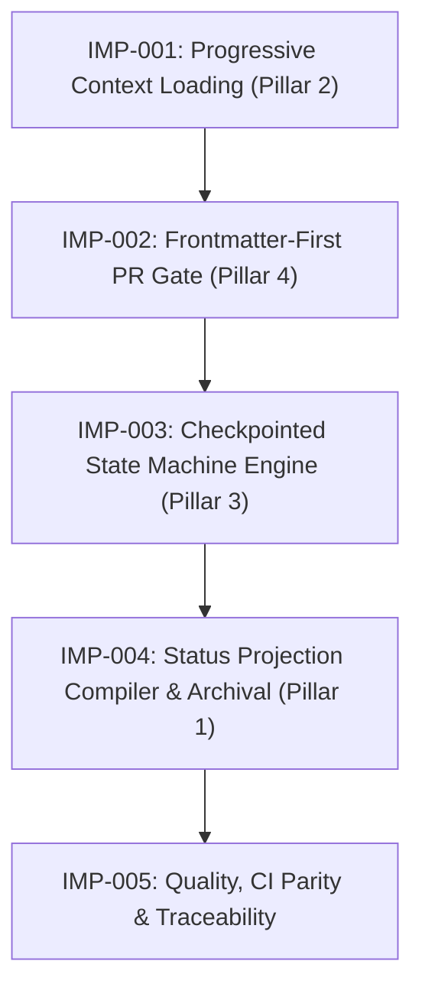

# Implementation Plan: Next-Gen Autonomous Dynamic Workflow Architecture

## 1. Plan Summary

| Item | Detail |
|---|---|
| Work Item | Issue #272 — Next-Gen Autonomous Dynamic Workflow Architecture |
| Change Type | Framework / Meta Change (`framework-meta`) |
| Risk Level | High |
| Owner | Developer Agent (`implementation-planning`) |
| Target Branch / Ticket | `feat/issue-272-next-gen-dynamic-workflow-discovery` / Issue #272 |

### Acceptance Criteria & NFR Restatement Checklist

Before beginning code changes, the following requirements from BA Discovery (`docs/records/requirements/2026-09-11-next-gen-dynamic-workflow-discovery.md`) and SA SDD (`docs/records/sdd/2026-09-11-next-gen-dynamic-workflow-sdd.md`) are locked as non-negotiable verification gates:

- [ ] **AC-001 (Boot Context $\le 3,500$ tokens)**: Core Bootloader Tier 1 (`docs/workflow/core-bootloader.md`) measures $\le 3,500$ tokens (character count / 4) while preserving 100% of safety invariants, golden rules, and human approval gates. Canonical Reference Library (8 files) remains intact as Tier 3 reference library ($\le 30,000$ tokens).
- [ ] **AC-002 (Role Context Injection $\le 1,500$ tokens)**: On-demand role context payload via `scripts/inject-role-context.mjs <role_id>` measures $\le 1,500$ tokens.
- [ ] **AC-003 (Invalid Role Fail-Closed)**: Requesting an unregistered role exits with code `1`, emitting structured JSON error on stderr.
- [ ] **AC-004 (Worktree Sharded Concurrency & Projection)**: Parallel feature branches with independent shards (`docs/records/work-items/{issue_id}/task-state.json`) achieve 0.0% Git merge conflict rate; root `PROJECT_STATUS.md` is compiled post-merge without manual edits.
- [ ] **AC-005 (Checkpointed State Transition)**: Valid transition persists updated task state atomically with timestamp, actor, sequence number, and mandatory evidence references.
- [ ] **AC-006 (Illegal Transition & Evidence Rejection)**: Illegal transition, missing required evidence, or exceeding retry limit ($\le 2$ rework attempts) is rejected with exit code $\ne 0$; file remains untouched.
- [ ] **AC-007 (Frontmatter-First Metadata Extraction)**: PR body with valid YAML frontmatter + complex markdown prose/code blocks parses with 100% deterministic accuracy.
- [ ] **AC-008 (Dual-Compatibility PR Gate)**: Frontmatter PRs parse via safe YAML AST; legacy PRs parse via regex with advisory deprecation warning; malformed frontmatter fails closed immediately.
- [ ] **BR-001 (No Root Status Mutation on Feature Branch)**: Feature branches write only to issue-sharded task files; root `PROJECT_STATUS.md` mutation is blocked by edit guards.
- [ ] **BR-002 (Preserve Human Approval Gates)**: Suspended tasks transition to `blocked` with `stop_reason: "human_review_required"`; autonomous progression without human resume evidence is prohibited.
- [ ] **BR-003 (Zero-Boot Skill Content)**: All 31 skills remain on-demand (0 tokens loaded at session boot).
- [ ] **BR-004 (Contract Polymorphism & Deterministic Schemas)**: All state transitions and PR metadata conform strictly to JSON Schema Draft 2020-12 contracts.

---

## 2. Inputs Reviewed

| Artifact | Status | Notes |
|---|---|---|
| REQUIREMENT_DISCOVERY.md | Available (`docs/records/requirements/2026-09-11-next-gen-dynamic-workflow-discovery.md`) | Authoritative BA requirement specification defining US-001–US-004, AC-001–AC-008, BR-001–BR-004, and R-001–R-004 risk mitigations. |
| SDD.md | Available (`docs/records/sdd/2026-09-11-next-gen-dynamic-workflow-sdd.md`) | Approved SA architectural design document detailing 4-layer architecture, 5-phase SDLC, schemas, APIs, and expand/contract migration strategy. |
| TECHNICAL_DESIGN.md | N/A | Fully subsumed by the approved SDD document. |
| API_CONTRACT.md | Available (SDD §331–§464) | `task-state.schema.json` (v2), `pr-frontmatter.schema.json` (v1), and `durable-task-envelope.schema.json`. |
| TEST_PLAN.md | In progress (QA Agent) | Test strategy and acceptance verification matrices outlined herein to feed QA Agent test plan authoring. |

---

## 3. Affected Areas

| Area | Files / Components | Expected Change |
|---|---|---|
| **Workflow / Docs** | `docs/workflow/core-bootloader.md`<br>`docs/workflow/roles/*.md`<br>`docs/operating-model/CONTEXT_BUDGET.md` | New Tier 1 Core Bootloader ($\le 3,500$ tokens); modular on-demand role context files ($\le 1,500$ tokens each); context budget target updates. |
| **Contracts & Schemas** | `docs/contracts/schemas/pr-frontmatter.schema.json`<br>`docs/contracts/schemas/task-state.schema.json`<br>`docs/contracts/schemas/durable-task-envelope.schema.json` | New PR frontmatter schema (Draft 2020-12); updated v2 task state schema; new durable task envelope schema. |
| **Tooling & Scripts** | `scripts/inject-role-context.mjs`<br>`scripts/validate-context-budget.mjs`<br>`scripts/work-item-readiness.mjs`<br>`scripts/lib/task-state-machine.mjs`<br>`scripts/task-machine-cli.mjs`<br>`scripts/compile-status-projection.mjs`<br>`scripts/validate-edit-guards.mjs` | New role context injector; dual-budget validation mode; frontmatter AST parser with legacy fallback; state machine engine with atomic write/CAS; status projection compiler and archive lifecycle; edit guard preventing root status edits on feature branches. |
| **Templates** | `.github/PULL_REQUEST_TEMPLATE.md`<br>`.gitlab/merge_request_templates/default.md` | Scaffolding YAML frontmatter block added at lines 1-N of PR/MR templates. |
| **Config & CI** | `package.json`<br>`.github/workflows/validate-contracts.yml`<br>`.gitlab-ci.yml` | New npm scripts (`status:compile`, `validate:status-projection`, `inject:role-context`); CI parity updates across GitHub and GitLab pipelines. |
| **Tests** | `test/validate-context-budget.test.mjs`<br>`test/inject-role-context.test.mjs`<br>`test/work-item-readiness.test.mjs`<br>`test/task-state-machine.test.mjs`<br>`test/compile-status-projection.test.mjs`<br>`test/edit-guards.test.mjs`<br>`test/validate-ci-parity.test.mjs` | Unit, schema, and integration tests covering all 5 work packages, dual-compatibility modes, CAS conflicts, atomic writes, and projection accuracy. |

---

## 4. Task Breakdown

The 4 Pillars are organized into 5 ordered, atomic work packages (IMP-001 to IMP-005):



---

### IMP-001: Progressive Context Loading Engine (Pillar 2)

- **Owner**: `developer-agent`
- **Objective**: Author `docs/workflow/core-bootloader.md`, implement `scripts/inject-role-context.mjs`, and add dual-budget validation to `scripts/validate-context-budget.mjs`.
- **Target Metrics**: Core bootloader $\le 3,500$ tokens; role injection $\le 1,500$ tokens; canonical reference library preserved $\le 30,000$ tokens.

#### Detailed Subtasks:
1. **Task 1.1: Author Core Bootloader (`docs/workflow/core-bootloader.md`)**
   - Synthesize essential operational rules from `AGENTS.md` and `docs/workflow/`:
     - Operating Principles & Golden Rules (no direct main pushes, explicit handoffs, atomic commits).
     - Mandatory Human Approval Gates (`AGENT_OPERATING_MODEL.md#human-approval-gates`).
     - Universal Stop Conditions & Boundary Rules.
     - Dispatch & Handoff Contract Index (imperative pointers to `dynamic-routing.md` and `handoff-contract.md`).
     - Role & Skill Manifest: Compact table of 11 roles and 31 skills with 1-sentence descriptions ($\approx 300$ tokens).
   - Strict size constraint: Total character count $\le 14,000$ ($\le 3,500$ tokens via `chars / 4`).
2. **Task 1.2: Author Modular Role Context Files (`docs/workflow/roles/*.md`)**
   - Author individual on-demand context markdown files for registered agents:
     - `ba-agent.md`, `sa-agent.md`, `developer-agent.md`, `qa-agent.md`, `pm-agent.md`, `config-agent.md`, `documentation-agent.md`, `orchestrator-agent.md`, `release-agent.md`, `security-agent.md`, `data-agent.md`.
   - Each role file contains role-specific responsibilities, quality gates, and domain conventions strictly constrained to $\le 1,500$ tokens ($\le 6,000$ characters).
3. **Task 1.3: Implement Role Context Injector (`scripts/inject-role-context.mjs`)**
   - CLI Signature: `node scripts/inject-role-context.mjs <role_id> [--json]`.
   - Implement `ROLE_REGISTRY` enum validation: `['ba-agent', 'sa-agent', 'developer-agent', 'qa-agent', 'pm-agent', 'config-agent', 'documentation-agent', 'orchestrator-agent', 'release-agent', 'security-agent', 'data-agent']`.
   - If `<role_id>` is valid: Read corresponding file from `docs/workflow/roles/{role_id}.md` (or role adapter below frontmatter) and stream to stdout.
   - If `<role_id>` is invalid: Emit structured JSON error to stderr and exit with code `1`:
     ```json
     {
       "status": "ERROR",
       "error_code": "INVALID_ROLE_IDENTIFIER",
       "message": "Role 'xyz' is not registered.",
       "allowed_roles": ["ba-agent", "sa-agent", "developer-agent", "..."]
     }
     ```
4. **Task 1.4: Update Dual-Budget Validator (`scripts/validate-context-budget.mjs`)**
   - Export constants: `BOOTLOADER_TARGET = 3500`, `BOOTLOADER_FILE = 'docs/workflow/core-bootloader.md'`, `ROLE_BUDGET_TARGET = 1500`, `TARGET = 30000`.
   - Implement dual evaluation mode in default run:
     - Tier 1: Validates `docs/workflow/core-bootloader.md` $\le 3,500$ tokens.
     - Tier 2: Validates all files under `docs/workflow/roles/*.md` $\le 1,500$ tokens each.
     - Tier 3: Validates existing 8 files in `CANONICAL_FILES` $\le 30,000$ tokens.
   - Support CLI flags: `--bootloader`, `--canonical`, and `--roles`.
   - Fail closed (exit code `1`) if any tier exceeds its declared threshold.
5. **Task 1.5: Wire npm script & Unit Tests**
   - Add `"inject:role-context": "node scripts/inject-role-context.mjs"` to `package.json`.
   - Author `test/inject-role-context.test.mjs` verifying valid output, budget compliance, and fail-closed error handling for invalid roles.
   - Update `test/validate-context-budget.test.mjs` to test dual-budget validation logic.

---

### IMP-002: Frontmatter-First PR Safety Gate (Pillar 4)

- **Owner**: `developer-agent`
- **Objective**: Author `docs/contracts/schemas/pr-frontmatter.schema.json`, implement dual-compatibility AST parser in `scripts/work-item-readiness.mjs`, and update PR templates.
- **Target Metrics**: 100% deterministic metadata extraction; fail-closed on malformed frontmatter; zero regression on existing 70+ tests.

#### Detailed Subtasks:
1. **Task 2.1: Author Schema (`docs/contracts/schemas/pr-frontmatter.schema.json`)**
   - JSON Schema Draft 2020-12 conforming to SDD §418–§463.
   - Strict configuration: `additionalProperties: false`.
   - Required fields: `schema_version` (const: 1), `work_item` (int >= 1), `governing_workflow` (enum), `closing_action` (enum).
   - Conditional rule: If `closing_action == "advances-only"`, then `advances_issue` is strictly required.
2. **Task 2.2: Implement Dual-Compatibility AST Parser in `scripts/work-item-readiness.mjs`**
   - Import safe `parse` from `yaml` (JSON-compatible schema, disallowing binary tags, code execution, or custom object prototypes).
   - Import `Ajv` and compile `pr-frontmatter.schema.json`.
   - Implement `extractFrontmatter(body)`:
     - Check if line 1 matches `/^---\r?$/`.
     - Find the second `/^---\r?$/` starting on a line.
     - Extract raw frontmatter substring and markdown body below the delimiter.
   - Implement `parseAndValidateFrontmatter(frontmatterStr)`:
     - Parse YAML via AST.
     - Validate object against `pr-frontmatter.schema.json`.
     - Return `{ valid: true, data }` or `{ valid: false, errors }`.
   - Implement Expand/Contract Dual-Mode in `validateReadiness({ body, ... })`:
     - **Mode A (Frontmatter Present)**:
       - Validate frontmatter. If malformed or schema violation, fail closed immediately with exit code `1` and structured diagnostic (AC-008).
       - Extract `work_item`, `governing_workflow`, `closing_action`, `advances_issue`, `qa_evidence`, `documentation_impact`, `plan_only`.
       - Evaluate lifecycle using deterministic frontmatter fields, completely ignoring markdown prose below frontmatter (eliminating regex false positives per AC-007).
     - **Mode B (Frontmatter Absent - Legacy Fallback)**:
       - Output non-fatal advisory: `[ADVISORY] PR body lacks YAML frontmatter; falling back to legacy regex parser.`.
       - Execute existing `evaluateLifecycle()` and `closingKeywordErrors()` regex routines (preserving 100% compatibility with R-004).
3. **Task 2.3: Update PR & MR Scaffolding Templates**
   - Update `.github/PULL_REQUEST_TEMPLATE.md` to prepend default frontmatter:
     ```yaml
     ---
     work_item: 
     governing_workflow: 
     closing_action: 
     advances_issue: 
     qa_evidence: 
     documentation_impact: pending
     plan_only: false
     risk_level: medium
     schema_version: 1
     ---
     ```
   - Update `.gitlab/merge_request_templates/default.md` with identical YAML frontmatter block.
4. **Task 2.4: Author Tests & Verify Backwards Compatibility**
   - Update `test/work-item-readiness.test.mjs` with test cases:
     - PR body with valid frontmatter + nested backticks, quotes, flags (must PASS).
     - Malformed frontmatter syntax (must FAIL CLOSED with descriptive error).
     - Missing required fields or schema violations (must FAIL CLOSED).
     - Body without frontmatter (must fall back to regex with advisory and PASS legacy tests).
     - Run existing 70+ test cases to verify zero test regressions.
   - Update `test/validate-pr-readiness.test.mjs` ensuring hook compatibility.

---

### IMP-003: Checkpointed Asynchronous State Machine Engine (Pillar 3)

- **Owner**: `developer-agent`
- **Objective**: Author `durable-task-envelope.schema.json` and v2 `task-state.schema.json`; implement `scripts/lib/task-state-machine.mjs` with POSIX atomic writes, CAS verification, and transition validation.
- **Target Metrics**: 0.0% mid-write corruption; CAS concurrency protection; 100% human approval gate enforcement.

#### Detailed Subtasks:
1. **Task 3.1: Author Envelope & Task State Schemas**
   - Author `docs/contracts/schemas/durable-task-envelope.schema.json`:
     - Defines universal header structure: `task_id`, `workflow_id`, `contract_version` (2), `sequence_number`, `state_digest`, `history`, `evidence`, `next_route`, `stop_reason`.
   - Update `docs/contracts/schemas/task-state.schema.json` to v2:
     - 11 discrete states: `intake`, `investigating`, `designing`, `planning`, `implementing`, `verifying`, `rework`, `handoff`, `blocked`, `completed`, `cancelled`.
     - Structured `history` array: `[{ from, to, at: date-time, actor, evidence_refs }]`.
     - Polymorphic evidence bag: key-value map linking to URIs, commit SHAs, or files.
     - Maximum rework ceiling: `rework_count <= max_rework_attempts: 2`.
2. **Task 3.2: Implement State Machine Core (`scripts/lib/task-state-machine.mjs`)**
   - **POSIX Atomic File Writer (`atomicWriteJsonSync`)**:
     - Write to `.tmp-{basename}-{pid}-{timestamp}` in same directory.
     - Call `fs.fsyncSync(fd)` before closing file descriptor to ensure flush to physical disk.
     - Call `fs.renameSync(tempPath, targetPath)` for atomic POSIX directory entry replacement.
   - **CAS Concurrency Engine (`verifyCasAndComputeDigest`)**:
     - Canonicalize state payload using RFC 8785 JCS (reusing `scripts/lib/status-jcs.mjs`).
     - Compute SHA-256 digest (`current_digest`).
     - When updating state, compare `expected_digest` against disk file digest.
     - If mismatched, abort write and throw `CAS_CONFLICT` error with diff payload.
   - **Transition & Evidence Gatekeeper (`transitionTaskState`)**:
     - Enforce 11-state transition matrix per SDD §242.
     - Enforce mandatory evidence requirements per transition (e.g. `changed_files` and `validation_plan` for `implementing` $\to$ `verifying`).
     - Check rework ceiling: reject transition to `rework` if `rework_count >= 2`.
   - **Human Approval Gate Invariant (`enforceHumanGate`)**:
     - When entering a state requiring human sign-off (e.g., SDD approval, PR merge), state transitions to `blocked` with `stop_reason: "human_review_required"`.
     - Autonomous transitions out of `blocked` are strictly prohibited unless authenticated human resume evidence (`resume_evidence`, `approver_id`) is provided.
   - **Polymorphic Envelope Resolution**:
     - Cross-check state transitions against domain workflow YAMLs (`docs/contracts/*-workflow.yaml`).
3. **Task 3.3: Implement State Machine CLI Tool (`scripts/task-machine-cli.mjs`)**
   - Provide command-line interface for agents and human maintainers:
     - `init --task-id <id> --workflow <type>`
     - `transition --task-path <path> --to <state> --actor <actor> --evidence <key=val>`
     - `resume --task-path <path> --actor <actor> --evidence <evidence>`
     - `inspect --task-path <path>`
4. **Task 3.4: Author State Machine Test Suite (`test/task-state-machine.test.mjs`)**
   - Test atomic write crash resilience (mock interruption during write).
   - Test CAS concurrency conflict detection (parallel writes with stale digests).
   - Test transition matrix enforcement (allow legal, reject illegal).
   - Test missing mandatory evidence rejection.
   - Test human gate suspension and resume authorization.
   - Test rework attempt limit enforcement ($\le 2$).

---

### IMP-004: Status Projection Compiler & Archival Lifecycle (Pillar 1)

- **Owner**: `developer-agent`
- **Objective**: Implement `scripts/compile-status-projection.mjs`, wire npm scripts, and update edit guards in `scripts/validate-edit-guards.mjs`.
- **Target Metrics**: 0.0% Git merge conflict across parallel worktrees; projection compile $< 300\text{ ms}$; shard archival keeps active count $\le 50$.

#### Detailed Subtasks:
1. **Task 4.1: Implement Projection Compiler (`scripts/compile-status-projection.mjs`)**
   - Shard discovery: Scan `docs/records/work-items/*/task-state.json`, excluding `docs/records/work-items/archive/**`.
   - Validate each shard against `task-state.schema.json`.
   - Deterministic aggregation:
     - Sort shards by `task_id` ascending.
     - Group into `Current Work Items`, `In Progress`, `Active Stages`, and `Completed`.
     - Generate root `PROJECT_STATUS.md` content preserving existing section headers.
     - Compute RFC 8785 JCS canonical digest of the compiled projection.
     - Embed projection digest comment: `<!-- projection-digest: sha256-... -->`.
   - CLI execution modes:
     - `--compile`: Write compiled markdown to root `PROJECT_STATUS.md` (used in post-merge closeout).
     - `--check`: Validation mode for CI (`npm run validate:status-projection`). Compares generated projection against committed `PROJECT_STATUS.md` and fails closed (exit code `1`) if drift is detected.
     - `--archive <issue_id>`: Moves closed work item directory from `docs/records/work-items/{issue_id}/` to `docs/records/work-items/archive/{issue_id}/`.
2. **Task 4.2: Wire npm Scripts in `package.json`**
   - Add `"status:compile": "node scripts/compile-status-projection.mjs"`
   - Add `"validate:status-projection": "node scripts/compile-status-projection.mjs --check"`
3. **Task 4.3: Update Edit Guards (`scripts/validate-edit-guards.mjs`)**
   - Add rule enforcing BR-001:
     - Inspect git branch context via `git rev-parse --abbrev-ref HEAD`.
     - If current branch is NOT `main` and not a labeled `post-merge-closeout` branch, and the modified path is root `PROJECT_STATUS.md`, fail or emit blocking edit-guard refusal.
     - Advise modifying `docs/records/work-items/{issue_id}/task-state.json` instead.
   - Add advisory guard: When editing `docs/records/work-items/*/task-state.json`, recommend running `validate:status-projection`.
4. **Task 4.4: Author Tests & Edge Case Validations**
   - Author `test/compile-status-projection.test.mjs`:
     - Multi-shard aggregation test (mock issues #301 and #302).
     - Deterministic ordering test.
     - `--check` mode drift detection (pass when matching, fail when out of sync).
     - Archival relocation test (verifying directory move to `archive/`).
   - Update `test/edit-guards.test.mjs` verifying edit-guard blocks root status modification on feature branches.

---

### IMP-005: Quality, CI Parity & Traceability

- **Owner**: `developer-agent`
- **Objective**: Mirror CI commands across GitHub/GitLab, execute `npm run validate:ci-parity`, and verify all 725+ tests pass green.
- **Target Metrics**: 100% CI command parity; 0 missing commands; all 725+ tests green.

#### Detailed Subtasks:
1. **Task 5.1: Mirror CI Commands Across Workflows**
   - Update `.github/workflows/validate-contracts.yml`:
     - Add step: `- run: npm run validate:status-projection` under `validate` job.
   - Update `.gitlab-ci.yml`:
     - Add job `validate_status_projection` mirroring the GitHub step:
       ```yaml
       validate_status_projection:
         stage: validate
         cache:
           key:
             files:
               - package-lock.json
           paths:
             - .npm/
         script:
           - npm ci --cache .npm --prefer-offline
           - npm run validate:status-projection
         rules:
           - if: $CI_PIPELINE_SOURCE == "push"
           - if: $CI_PIPELINE_SOURCE == "merge_request_event"
       ```
2. **Task 5.2: Execute & Pass CI Parity Validator**
   - Run `npm run validate:ci-parity`.
   - Confirm `HOST_ONLY_COMMANDS` remains empty and zero command asymmetry exists between GitHub and GitLab.
3. **Task 5.3: Execute Full Workspace Test Suite & Contract Checks**
   - Run `npm test` verifying all 725+ existing unit tests plus all newly introduced tests pass green.
   - Run complete repository validation suite:
     - `npm run validate:contracts`
     - `npm run validate:ci-parity`
     - `npm run validate:project-state`
     - `npm run validate:context-budget`
     - `npm run validate:skill-parity`
     - `npm run validate:adapter-parity`
     - `npm run validate:edit-guards`
     - `git diff --check`
4. **Task 5.4: Generate Acceptance Criteria Traceability Evidence**
   - Produce traceability record verifying AC-001 through AC-008 against executed tests and file diffs.

---

## 5. Test Strategy

| Test Type | Required? | Scope | Owner |
|---|---|---|---|
| **Unit Test** | Yes | Token counters (`countTokens`), AST frontmatter parser (`extractFrontmatter`), CAS verification (`verifyCasAndComputeDigest`), atomic write engine (`atomicWriteJsonSync`), transition matrix validator. | `developer-agent` |
| **Schema Validation** | Yes | `pr-frontmatter.schema.json`, `task-state.schema.json` (v2), and `durable-task-envelope.schema.json` against AJV Draft 2020-12 test fixtures. | `developer-agent` |
| **Dual-Compatibility Test** | Yes | Verification that `scripts/work-item-readiness.mjs` correctly handles both YAML frontmatter PRs and all 70+ historical regex PR fixtures. | `developer-agent` |
| **Concurrency & Atomic Test** | Yes | Simulated multi-process atomic writes, mock write interruptions, and CAS conflict simulations (`CAS_CONFLICT`). | `developer-agent` |
| **CI Parity Contract Test** | Yes | `test/validate-ci-parity.test.mjs` verifying exact symmetry between GitHub Actions and GitLab CI. | `developer-agent` |
| **Regression & Full Suite** | Yes | Full execution of `npm test` (725+ tests) ensuring 0 regressions. | `qa-agent` |
| **Security Review** | Yes | Safe YAML AST parser audit (disallow code execution tags) and path traversal checks on task IDs. | `security-agent` |

---

## 6. Verification Commands

```bash
# ------------------------------------------------------------------------------
# IMP-001: Progressive Context Loading Verification
# ------------------------------------------------------------------------------
# Verify Core Bootloader token budget (Target: <= 3,500 tokens)
node scripts/validate-context-budget.mjs --bootloader

# Verify Role Context Injection (Target: <= 1,500 tokens per role)
node scripts/inject-role-context.mjs developer-agent | wc -c
# Verify Invalid Role fails closed (Exit code: 1, emits JSON error)
node scripts/inject-role-context.mjs invalid-role || echo "Fail-closed verified"

# Run focused budget tests
node --test test/validate-context-budget.test.mjs test/inject-role-context.test.mjs

# ------------------------------------------------------------------------------
# IMP-002: Frontmatter-First PR Safety Gate Verification
# ------------------------------------------------------------------------------
# Validate PR frontmatter schema
node -e 'import Ajv from "ajv"; import fs from "fs"; const ajv = new Ajv(); const s = JSON.parse(fs.readFileSync("docs/contracts/schemas/pr-frontmatter.schema.json")); ajv.compile(s); console.log("Schema valid");'

# Run work-item-readiness tests (Both AST frontmatter and legacy fallback)
node --test test/work-item-readiness.test.mjs test/validate-pr-readiness.test.mjs

# ------------------------------------------------------------------------------
# IMP-003: Checkpointed State Machine Engine Verification
# ------------------------------------------------------------------------------
# Validate task state v2 schema
node -e 'import Ajv from "ajv"; import fs from "fs"; const ajv = new Ajv(); const s = JSON.parse(fs.readFileSync("docs/contracts/schemas/task-state.schema.json")); ajv.compile(s); console.log("Task state schema valid");'

# Run state machine engine unit tests (Atomic writes, CAS conflicts, transitions)
node --test test/task-state-machine.test.mjs

# ------------------------------------------------------------------------------
# IMP-004: Status Projection Compiler & Archival Lifecycle Verification
# ------------------------------------------------------------------------------
# Test projection compilation check (fails on drift)
npm run validate:status-projection

# Run compiler and edit-guard tests
node --test test/compile-status-projection.test.mjs test/edit-guards.test.mjs

# ------------------------------------------------------------------------------
# IMP-005: Quality, CI Parity & Full Suite Verification
# ------------------------------------------------------------------------------
# Validate CI parity across GitHub and GitLab
npm run validate:ci-parity

# Execute entire test suite (725+ tests)
npm test

# Run all canonical workflow contracts and state checks
npm run validate:contracts
npm run validate:project-state
npm run validate:skill-usage
npm run validate:context-budget
npm run validate:edit-guards

# Verify clean git diff
git diff --check
```

---

## 7. Rollback / Fallback Plan

| Scenario | Rollback / Fallback Action | Owner |
|---|---|---|
| **Core Bootloader Context Overrun (IMP-001)** | If `core-bootloader.md` exceeds 3,500 tokens, prune secondary references back into `docs/operating-model/` and preserve only Golden Rules and Human Approval Gates. | `developer-agent` |
| **Legacy PR Breakdown (IMP-002)** | If existing PR bodies fail in CI, activate `--legacy-fallback` mode in `work-item-readiness.mjs` ensuring regex parsing is preserved for bodies without `---` line 1. | `developer-agent` |
| **CAS Deadlock / False Conflicts (IMP-003)** | If task state encounters false CAS rejections, verify JCS key normalization order using `scripts/lib/status-jcs.mjs` and check for uncommitted state overwrites. | `developer-agent` |
| **Status Projection Drift (IMP-004)** | If `validate:status-projection` reports mismatch, run `npm run status:compile` to regenerate root `PROJECT_STATUS.md` from active shards. Shards are authoritative. | `developer-agent` |
| **CI Parity Mismatch (IMP-005)** | If `.gitlab-ci.yml` and `.github/workflows/validate-contracts.yml` drift, add missing job to GitLab CI or align commands. Do not bypass via exemptions without SA approval. | `developer-agent` |

---

## 8. Risks / Blockers

| Risk / Blocker | Impact | Mitigation / Next Action |
|---|---|---|
| **R-001: Context Rule Amnesia** | High | Compressing bootloader might cause agent to miss subtle edge cases. Mitigated by keeping all 8 canonical files in place as the Canonical Reference Library ($\le 30,000$ tokens) and linking them on demand. |
| **R-002: Mid-Write State Corruption** | Medium | Sudden interruption during `task-state.json` write could leave invalid JSON. Mitigated by POSIX atomic writes (`fsync` on temp file followed by atomic rename). |
| **R-003: Shard File Bloat** | Medium | Hundreds of completed issues leave dangling shard files. Mitigated by automated archival lifecycle moving closed shards to `docs/records/work-items/archive/{issue_id}/`. |
| **R-004: Test Suite Breakage (70+ Tests)** | High | Immediate strict frontmatter requirement breaks legacy test suite. Mitigated by 3-phase Expand/Contract strategy supporting dual-mode parsing in Phase 1. |

---

## 9. Handoff

| To | Reason | Required Evidence |
|---|---|---|
| **`qa-agent`** | Verification of Implementation Plan, Test Strategy, and Acceptance Criteria Traceability. | Implementation Plan document (`docs/records/implementation-plan/2026-09-11-next-gen-dynamic-workflow-plan.md`), task breakdown, test matrix, and verification commands. |
| **`human-maintainer`** | Formal sign-off on 5-phase work package breakdown and expand/contract migration strategy before code implementation dispatch. | Implementation Plan artifact and SDD compliance verification. |
