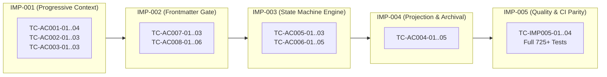

# Test Plan: Next-Gen Autonomous Dynamic Workflow Architecture

## Metadata

- Work Item ID: Issue #272
- Title: Next-Gen Autonomous Dynamic Workflow Architecture: Sharded State, Progressive Context, Checkpointed Resumption, and Frontmatter Safety Gates
- Owner: QA Agent (`qa-agent` / `functional-test-design`)
- Date: 2026-09-11
- Status: Approved
- Governing Requirements: `docs/records/requirements/2026-09-11-next-gen-dynamic-workflow-discovery.md`
- Governing Architecture: `docs/records/sdd/2026-09-11-next-gen-dynamic-workflow-sdd.md`
- Governing Implementation Plan: `docs/records/implementation-plan/2026-09-11-next-gen-dynamic-workflow-plan.md`

---

## Scope

### In-Scope

1. **Pillar 1 — Worktree Sharded Status & Projection Compiler (IMP-004)**:
   - Sharded status directory isolation (`docs/records/work-items/{issue_id}/task-state.json`).
   - Edit guard blocking root `PROJECT_STATUS.md` mutations on feature branches (BR-001).
   - Deterministic projection compiler (`scripts/compile-status-projection.mjs`) with RFC 8785 JCS canonical digest verification.
   - Post-merge archival lifecycle moving closed issue shards to `docs/records/work-items/archive/{issue_id}/`.
2. **Pillar 2 — Progressive Context Loading Engine (IMP-001)**:
   - Tier 1 Core Bootloader (`docs/workflow/core-bootloader.md`) constrained to $\le 3,500$ tokens while preserving 100% of golden rules and human approval gates.
   - Tier 2 On-Demand Role Context Injection (`scripts/inject-role-context.mjs`) constrained to $\le 1,500$ tokens per role across all 11 registered roles.
   - Fail-closed validation on invalid/unregistered role identifiers (AC-003).
   - Tier 3 Zero-boot skill proxy preservation (BR-003) and Canonical Reference Library retention ($\le 30,000$ tokens).
   - Dual-budget context validation mode in `scripts/validate-context-budget.mjs`.
3. **Pillar 3 — Checkpointed Asynchronous State Machine Engine (IMP-003)**:
   - Schema validation against `durable-task-envelope.schema.json` and `task-state.schema.json` (v2).
   - POSIX atomic file writing (`.tmp` + `fsyncSync` + `renameSync`) ensuring zero mid-write corruption (R-002).
   - CAS optimistic concurrency control using RFC 8785 JCS + SHA-256 state digests (`CAS_CONFLICT`).
   - 11-state transition matrix validation with mandatory evidence bag checking (AC-005, AC-006).
   - Enforcement of maximum rework attempts ceiling (`rework_count <= 2`).
   - Strict preservation of human approval gates (`state: blocked`, `stop_reason: human_review_required`, BR-002).
4. **Pillar 4 — Frontmatter-First PR Safety Gates (IMP-002)**:
   - Schema validation against `pr-frontmatter.schema.json` (Draft 2020-12).
   - Safe YAML AST parser integration in `scripts/work-item-readiness.mjs` ignoring prose below frontmatter (AC-007).
   - Expand/Contract Dual-Compatibility mode supporting YAML frontmatter and legacy regex fallback with advisory warning (AC-008).
   - Fail-closed enforcement on malformed frontmatter syntax or missing required fields.
   - PR and MR template scaffolding updates (`.github/PULL_REQUEST_TEMPLATE.md`, `.gitlab/merge_request_templates/default.md`).
5. **Cross-Cutting Quality, CI Parity & Traceability (IMP-005)**:
   - 100% CI parity across GitHub Actions (`validate-contracts.yml`) and GitLab CI (`.gitlab-ci.yml`).
   - Full test suite regression execution (725+ tests passing green).
   - Verification of repository validators and clean git diff.

### Out-of-Scope

- Introducing external databases or cloud state storage (system remains strictly local-first and file-based per NG-001).
- Modifying or relaxing any human approval gates (BR-002).
- Altering the bug-fix rework attempt ceiling (remains strictly $\le 2$ reworks per NG-003).
- Rewriting unrelated legacy validators or existing domain workflow contracts.

---

## Test Types In Scope

- [x] **Unit Testing**: AST extraction, token budget calculation, transition matrix validation, CAS digest generation.
- [x] **API / Contract Validation**: JSON Schema Draft 2020-12 compliance for frontmatter, envelope, and v2 task state; CLI contracts for `inject-role-context.mjs` and `task-machine-cli.mjs`.
- [x] **NFR / Performance / Context Budget Testing**: Strict token budgets ($\le 3,500$ boot, $\le 1,500$ role); projection compile latency ($< 300\text{ ms}$); frontmatter parse latency ($< 20\text{ ms}$).
- [x] **Integration & Concurrency Testing**: Multi-worktree parallel branching without git conflicts (0.0% conflict); atomic write crash resilience; CAS conflict rejection.
- [x] **Regression Testing**: Backward compatibility for 70+ existing PR readiness test fixtures and 725+ full repository tests.
- [x] **Security Review Testing**: Safe YAML parsing mode (code injection prevention); task ID path traversal rejection; human gate bypass prevention.
- [ ] **E2E UI Testing**: N/A (CLI, git, and schema framework change only).
- [ ] **Mutation Testing**: Out of scope for initial test plan authoring; targeted mutation runs reserved for Developer Agent TDD cycle.

---

## Environment

- **Target Environment**: Local macOS / Linux workstations and CI containers (GitHub Actions Ubuntu runners, GitLab CI).
- **Runtime**: Node.js v20+ with native test runner (`node --test`), native ES modules, and POSIX filesystem.
- **Dependencies**: `ajv` (Draft 2020-12 schema validation), `yaml` (safe YAML AST parsing).
- **Test Data Source**: Synthetic isolated worktree directories under `test/fixtures/`, mock PR bodies, and synthetic task-state files.

---

## Entry Criteria

1. BA Requirement Discovery approved (`docs/records/requirements/2026-09-11-next-gen-dynamic-workflow-discovery.md`).
2. SA Software Design Document approved (`docs/records/sdd/2026-09-11-next-gen-dynamic-workflow-sdd.md`).
3. Developer Implementation Plan available (`docs/records/implementation-plan/2026-09-11-next-gen-dynamic-workflow-plan.md`).
4. JSON Schema specifications authored for `pr-frontmatter.schema.json` and `task-state.schema.json` (v2).
5. Current baseline test suite passing green (725+ tests passed).

---

## Exit Criteria

1. 100% of Acceptance Criteria (AC-001 through AC-008) verified with passing automated test cases.
2. All 5 NFR targets verified and within budget:
   - Core Bootloader token count $\le 3,500$.
   - Role context token count $\le 1,500$ for all 11 roles.
   - Status file merge conflict rate = 0.0% across parallel worktrees.
   - Projection compilation latency $< 300\text{ ms}$ (100 shards).
   - Frontmatter parse latency $< 20\text{ ms}$.
3. Zero regressions in existing test suite (all 725+ tests pass green).
4. CI Parity verified with 0 command discrepancies (`npm run validate:ci-parity`).
5. All canonical repo validators pass: `validate:contracts`, `validate:project-state`, `validate:skill-usage`, `validate:context-budget`, `validate:edit-guards`, and `git diff --check`.
6. Independent QA verification report published with complete evidence.

---

## NFR Targets Under Test

| Target Metric | SDD Reference | Required Threshold | Validation Method & Command | Result |
|---|---|---|---|:---:|
| **Core Bootloader Token Budget** | SDD §188, §561 | $\le 3,500$ tokens (`chars / 4`) | `node scripts/validate-context-budget.mjs --bootloader` | Pending |
| **Role Context Token Budget** | SDD §197, §562 | $\le 1,500$ tokens per role | `node scripts/inject-role-context.mjs <role_id> \| wc -c` | Pending |
| **Status File Merge Conflict Rate** | SDD §29, §566 | **0.0%** conflict rate | Multi-worktree parallel branch merge simulation test | Pending |
| **Projection Compilation Latency** | SDD §563 | $< 300\text{ ms}$ for 100 shards | Synthetic 100-shard compilation benchmark harness | Pending |
| **Frontmatter AST Parse Latency** | SDD §564 | $< 20\text{ ms}$ per PR body | Synthetic 50-PR body YAML AST extraction benchmark | Pending |

---

## Acceptance Traceability Matrix (AC-001 to AC-008)

| AC ID | Source URL / Section | Testable Criterion | Owner | Evidence URL / Command | Result |
|---|---|---|---|---|:---:|
| **AC-001** | Discovery §7, SDD §598 | Core Bootloader Tier 1 measures $\le 3,500$ tokens while preserving golden rules and human approval gates; Canonical Reference Library preserved $\le 30,000$ tokens. | Developer / QA | `node scripts/validate-context-budget.mjs --bootloader` | Pending |
| **AC-002** | Discovery §7, SDD §598 | On-demand role context payload for any registered role measures $\le 1,500$ tokens. | Developer / QA | `node scripts/inject-role-context.mjs developer-agent` | Pending |
| **AC-003** | Discovery §7, SDD §598 | Requesting an invalid or unregistered role fails closed with exit code `1` and emits structured JSON error. | Developer / QA | `node scripts/inject-role-context.mjs invalid-role` | Pending |
| **AC-004** | Discovery §7, SDD §598 | Parallel feature branches modifying independent shards merge into `main` with 0% conflict; projection compiles to root `PROJECT_STATUS.md`; closed shards archive cleanly. | Developer / QA | `npm run validate:status-projection` `node --test test/compile-status-projection.test.mjs` | Pending |
| **AC-005** | Discovery §7, SDD §598 | Valid state transition persists updated state atomically via POSIX fsync/rename with timestamp, actor, sequence number, and evidence references. | Developer / QA | `node --test test/task-state-machine.test.mjs` | Pending |
| **AC-006** | Discovery §7, SDD §598 | Illegal transitions, missing mandatory evidence, rework count $> 2$, or CAS conflict are rejected (exit $\ne 0$); state file remains unchanged. | Developer / QA | `node --test test/task-state-machine.test.mjs` | Pending |
| **AC-007** | Discovery §7, SDD §598 | PR readiness gate extracts metadata with 100% deterministic accuracy from YAML frontmatter, immune to prose markdown code fences, backticks, or quotes. | Developer / QA | `node --test test/work-item-readiness.test.mjs` | Pending |
| **AC-008** | Discovery §7, SDD §598 | Dual-compatibility PR gate parses frontmatter PRs via safe AST, legacy PRs via regex with advisory warning, and fails closed immediately on malformed frontmatter. | Developer / QA | `node --test test/work-item-readiness.test.mjs` | Pending |

---

## Detailed Test Case Specification Matrix

### Pillar 2: Progressive Context Loading (IMP-001)

| Test ID | AC Ref | Category | Description | Preconditions | Input / Action | Expected Result | Automated Test Seam |
|---|---|---|---|---|---|---|---|
| **TC-AC001-01** | AC-001 | Positive | Verify Core Bootloader token budget | `docs/workflow/core-bootloader.md` exists | Run `node scripts/validate-context-budget.mjs --bootloader` | Exit 0; token count $\le 3,500$ reported | `test/validate-context-budget.test.mjs` |
| **TC-AC001-02** | AC-001 | Content Invariant | Core Bootloader contains required golden rules & human gates | `docs/workflow/core-bootloader.md` exists | Inspect file contents for Golden Rules, Human Gates pointer, Universal Stop Conditions, Role/Skill Manifest | All required safety sections and pointers present; 0 deleted invariants | `test/validate-context-budget.test.mjs` |
| **TC-AC001-03** | AC-001 | Boundary | Bootloader size boundary check | Synthetic bootloader fixture at 3,500 and 3,501 tokens | Run validator against 14,000 chars (3,500 tokens) and 14,004 chars (3,501 tokens) | 3,500 tokens passes (exit 0); 3,501 tokens fails closed (exit 1) | `test/validate-context-budget.test.mjs` |
| **TC-AC001-04** | AC-001 | Regression | Dual-budget validator checks canonical 8 files | 8 canonical files present | Run `node scripts/validate-context-budget.mjs --canonical` | Exit 0; canonical total $\le 30,000$ tokens (measures $\approx 26,196$) | `test/validate-context-budget.test.mjs` |
| **TC-AC002-01** | AC-002 | Positive | Inject role context for all 11 registered roles | 11 role files exist under `docs/workflow/roles/` | Execute `node scripts/inject-role-context.mjs <role_id>` for each role in `ROLE_REGISTRY` | Exit 0 for all 11 roles; streams valid markdown role context to stdout | `test/inject-role-context.test.mjs` |
| **TC-AC002-02** | AC-002 | Target Metric | Role context token budget $\le 1,500$ tokens | Role context files populated | Measure token count (`chars / 4`) for each of the 11 role payloads | Each role payload strictly $\le 1,500$ tokens ($\le 6,000$ characters) | `test/inject-role-context.test.mjs` |
| **TC-AC002-03** | AC-002 | Boundary | Role context size boundary check | Synthetic role fixture at 1,500 and 1,501 tokens | Evaluate role budget validator against 6,000 chars and 6,004 chars | 1,500 tokens passes; 1,501 tokens fails closed | `test/inject-role-context.test.mjs` |
| **TC-AC003-01** | AC-003 | Negative / Fail-Closed | Invalid role identifier rejected | CLI script executable | Execute `node scripts/inject-role-context.mjs invalid-agent-role` | Exit code 1; stderr contains structured JSON error (`INVALID_ROLE_IDENTIFIER`) with allowed roles | `test/inject-role-context.test.mjs` |
| **TC-AC003-02** | AC-003 | Security / Traversal | Path traversal inputs in role ID rejected | CLI script executable | Execute with `../../etc/passwd`, `roles/developer-agent`, `developer-agent; rm -rf` | Exit code 1; sanitized input check rejects traversal attempts | `test/inject-role-context.test.mjs` |
| **TC-AC003-03** | AC-003 | Boundary | Missing or empty role argument | CLI script executable | Execute `node scripts/inject-role-context.mjs ""` and without args | Exit code 1; emits usage error | `test/inject-role-context.test.mjs` |

---

### Pillar 4: Frontmatter-First PR Safety Gate (IMP-002)

| Test ID | AC Ref | Category | Description | Preconditions | Input / Action | Expected Result | Automated Test Seam |
|---|---|---|---|---|---|---|---|
| **TC-AC007-01** | AC-007 | Positive | Valid YAML frontmatter parsed accurately via AST | `pr-frontmatter.schema.json` valid | Pass PR body starting with valid YAML frontmatter block | Extracted fields (`work_item`, `governing_workflow`, etc.) match frontmatter exactly | `test/work-item-readiness.test.mjs` |
| **TC-AC007-02** | AC-007 | Complex Prose Immunity | Markdown prose below frontmatter completely ignored | Frontmatter present | PR body containing backticks, fenced code blocks with fake `Fixes #999`, quotes, and CLI flags below frontmatter | Metadata extracted 100% from frontmatter; prose content creates 0 false positives or overrides | `test/work-item-readiness.test.mjs` |
| **TC-AC007-03** | AC-007 | Contract / Schema | Frontmatter validates against JSON Schema Draft 2020-12 | Schema compiled via AJV | Validate sample frontmatter objects | Valid objects pass; unrecognized properties rejected (`additionalProperties: false`) | `test/work-item-readiness.test.mjs` |
| **TC-AC008-01** | AC-008 | Positive (Dual Mode A) | Frontmatter PR body passes readiness evaluation | Mode A active | PR body with complete frontmatter (`work_item: 272`, `governing_workflow: framework_meta`, `closing_action: fixes`, etc.) | Readiness evaluation PASSES with exit code 0 | `test/work-item-readiness.test.mjs` |
| **TC-AC008-02** | AC-008 | Positive (Dual Mode B) | Legacy PR body without frontmatter falls back to regex | Mode B active | Standard legacy PR body starting with `# Title` (no frontmatter) | Emits `[ADVISORY]` deprecation warning; evaluates via legacy regex engine; passes compliant bodies | `test/work-item-readiness.test.mjs` |
| **TC-AC008-03** | AC-008 | Negative / Fail-Closed | Malformed YAML syntax fails closed immediately | Mode A active | PR body starting with `---` but containing broken YAML (e.g. unclosed quote, tab indentation) | Fails closed with exit code 1; emits YAML parsing syntax error diagnostic | `test/work-item-readiness.test.mjs` |
| **TC-AC008-04** | AC-008 | Negative / Fail-Closed | Schema violation in frontmatter fails closed | Mode A active | PR body with frontmatter missing required `work_item` or invalid `governing_workflow` enum | Fails closed with exit code 1; emits AJV schema violation details | `test/work-item-readiness.test.mjs` |
| **TC-AC008-05** | AC-008 | Boundary / Conditional | `advances-only` requires `advances_issue` | Mode A active | Frontmatter with `closing_action: advances-only`: (a) without `advances_issue`, (b) with `advances_issue: 272` | (a) Fails closed (exit 1); (b) Passes (exit 0) | `test/work-item-readiness.test.mjs` |
| **TC-AC008-06** | AC-008 | Regression | Full legacy test suite compatibility | 70+ legacy tests in repo | Run existing `test/work-item-readiness.test.mjs` | 100% of legacy test cases pass without regressions | `test/work-item-readiness.test.mjs` |

---

### Pillar 3: Checkpointed State Machine Engine (IMP-003)

| Test ID | AC Ref | Category | Description | Preconditions | Input / Action | Expected Result | Automated Test Seam |
|---|---|---|---|---|---|---|---|
| **TC-AC005-01** | AC-005 | Positive | Checkpointed state transition with full envelope persistence | Valid `task-state.json` fixture in `planning` | Transition to `implementing` with actor `developer-agent` and evidence | File updated: `state: implementing`, `sequence_number: 2`, `history` appended, new JCS digest computed | `test/task-state-machine.test.mjs` |
| **TC-AC005-02** | AC-005 | Atomic Durability | POSIX atomic write crash resilience | Target directory writable | Simulate write interruption by mocking process exit before rename | Temp file discarded; original `task-state.json` completely intact with valid JSON | `test/task-state-machine.test.mjs` |
| **TC-AC005-03** | AC-005 | Positive CAS | CAS update with matching expected digest succeeds | Valid file with digest $D_1$ | Execute update providing `expected_digest: D_1` | Update applied; new digest $D_2$ written to file | `test/task-state-machine.test.mjs` |
| **TC-AC006-01** | AC-006 | Negative / Fail-Closed | Illegal state transition rejected | Task in `intake` state | Attempt direct transition `intake` $\to$ `verifying` | Rejected with `ILLEGAL_TRANSITION_REJECTED`; exit code $\ne 0$; file unchanged | `test/task-state-machine.test.mjs` |
| **TC-AC006-02** | AC-006 | Negative / Fail-Closed | Missing mandatory evidence references rejected | Task in `implementing` | Attempt transition `implementing` $\to$ `verifying` without `changed_files` or `validation_plan` | Rejected with `MISSING_REQUIRED_EVIDENCE`; file unchanged | `test/task-state-machine.test.mjs` |
| **TC-AC006-03** | AC-006 | Boundary | Rework count ceiling enforcement ($\le 2$) | Task in `verifying` with rework count 0, 1, and 2 | (a) Transition to `rework` at count 0 & 1. (b) Attempt transition to `rework` when `rework_count == 2` | (a) Allowed; count increments. (b) Rejected with `MAX_REWORK_EXCEEDED`; state stays in `verifying` or routes to `blocked` | `test/task-state-machine.test.mjs` |
| **TC-AC006-04** | AC-006 | Negative / CAS Conflict | Stale expected digest rejected with CAS conflict | Disk file mutated to digest $D_2$ | Process A attempts update using stale digest $D_1$ | Rejected with `CAS_CONFLICT`; disk file remains at $D_2$ | `test/task-state-machine.test.mjs` |
| **TC-AC006-05** | AC-006 | Security / Human Gate | Autonomous resumption from human gate blocked | Task in `blocked` with `stop_reason: human_review_required` | Attempt transition to `implementing` by `developer-agent` without human evidence | Rejected; transitions out of human gate require `actor: human` and `resume_evidence` | `test/task-state-machine.test.mjs` |

---

### Pillar 1: Worktree Sharded Status & Projection Compiler (IMP-004)

| Test ID | AC Ref | Category | Description | Preconditions | Input / Action | Expected Result | Automated Test Seam |
|---|---|---|---|---|---|---|---|
| **TC-AC004-01** | AC-004 | Positive Integration | Zero merge conflict between parallel worktree branches | Two worktree branches for Issue #301 and Issue #302 | Both branches modify their respective shards (`issue-301/task-state.json`, `issue-302/task-state.json`) and merge into main | 0.0% Git merge conflict rate; both shards land cleanly on main | `test/compile-status-projection.test.mjs` |
| **TC-AC004-02** | AC-004 | Positive Aggregation | Deterministic compilation of active shards into root status | Shards for #301, #302 present | Execute `node scripts/compile-status-projection.mjs --compile` | Root `PROJECT_STATUS.md` generated with sorted entries, active work items, and valid projection digest | `test/compile-status-projection.test.mjs` |
| **TC-AC004-03** | AC-004 | Negative / Drift CI Check | Drift detection in projection validation mode | Committed `PROJECT_STATUS.md` differs from shard projection | Execute `npm run validate:status-projection` (`--check`) | Exits with code 1; reports specific shard/projection mismatch | `test/compile-status-projection.test.mjs` |
| **TC-AC004-04** | AC-004 | Negative / Edit Guard | Feature branch editing root status blocked | On feature branch `feat/issue-272` | Attempt to modify root `PROJECT_STATUS.md` and run `validate:edit-guards` | Blocked by edit guard; instructs agent to modify issue shard instead (BR-001) | `test/edit-guards.test.mjs` |
| **TC-AC004-05** | AC-004 | Lifecycle / Archival | Archiving closed work item shard | Shard exists in `work-items/issue-301/` | Run `compile-status-projection.mjs --archive issue-301` | Directory moved to `work-items/archive/issue-301/`; excluded from active projection; active shard count $\le 50$ | `test/compile-status-projection.test.mjs` |

---

### Cross-Cutting Quality & CI Parity (IMP-005)

| Test ID | AC Ref | Category | Description | Preconditions | Input / Action | Expected Result | Automated Test Seam |
|---|---|---|---|---|---|---|---|
| **TC-IMP005-01** | BR-004 | CI Parity | Exact CI command parity across GitHub and GitLab | `.github/workflows/validate-contracts.yml` and `.gitlab-ci.yml` updated | Run `npm run validate:ci-parity` | Exit 0; 0 missing commands, `HOST_ONLY_COMMANDS` empty | `test/validate-ci-parity.test.mjs` |
| **TC-IMP005-02** | General | Regression | Full workspace test suite execution | All IMP packages integrated | Execute `npm test` | All 725+ existing tests + new unit/integration tests pass green | `npm test` |
| **TC-IMP005-03** | General | Contract Validation | Full canonical contract and state check | All IMP packages integrated | Execute all repo validator scripts | `validate:contracts`, `validate:project-state`, `validate:skill-usage`, `validate:context-budget`, `validate:edit-guards` all PASS | Validator commands |
| **TC-IMP005-04** | General | Clean Diff | Git diff hygiene check | All changes staged/committed | Execute `git diff --check` | 0 whitespace or conflict marker errors | `git diff --check` |

---

## Verification Matrix Aligned with IMP Packages (IMP-001 to IMP-005)

| Package | Pillar | Acceptance Criteria Covered | Verification Commands |
|---|---|---|---|
| **IMP-001** | Progressive Context Loading (Pillar 2) | AC-001, AC-002, AC-003, BR-003 | `node scripts/validate-context-budget.mjs --bootloader` `node scripts/inject-role-context.mjs developer-agent \| wc -c` `node scripts/inject-role-context.mjs invalid-role` `node --test test/validate-context-budget.test.mjs test/inject-role-context.test.mjs` |
| **IMP-002** | Frontmatter-First PR Gate (Pillar 4) | AC-007, AC-008, BR-004 | `node -e 'import Ajv from "ajv"; ... compile schema'` `node --test test/work-item-readiness.test.mjs test/validate-pr-readiness.test.mjs` |
| **IMP-003** | Checkpointed State Machine Engine (Pillar 3) | AC-005, AC-006, BR-002, BR-004 | `node -e 'import Ajv from "ajv"; ... compile v2 state schema'` `node --test test/task-state-machine.test.mjs` |
| **IMP-004** | Status Projection Compiler & Archival (Pillar 1) | AC-004, BR-001 | `npm run validate:status-projection` `node --test test/compile-status-projection.test.mjs test/edit-guards.test.mjs` |
| **IMP-005** | Quality, CI Parity & Traceability | Cross-cutting (AC-001..AC-008) | `npm run validate:ci-parity` `npm test` `npm run validate:contracts` `npm run validate:project-state` `npm run validate:skill-usage` `npm run validate:context-budget` `npm run validate:edit-guards` `git diff --check` |

---

## Assumptions

1. Character-to-token heuristic (`character count / 4`) remains the approved context budget metric across the repository as implemented in `scripts/validate-context-budget.mjs`.
2. Safe YAML parsing mode (using the `yaml` npm package without custom tags or code execution) completely neutralizes prose regex edge cases without introducing arbitrary object instantiation vulnerabilities.
3. Git worktree directory isolation (`docs/records/work-items/{issue_id}/`) inherently guarantees 0% git merge conflict on feature branches because separate branches never touch the same path.
4. Active shard count will remain bounded ($\le 50$) through the post-merge closeout archival lifecycle moving closed shards to `archive/`.

---

## Open Questions

- None. All requirements, ACs, schemas, and verification commands are unambiguous and fully specified between Discovery, SDD, and Implementation Plan.

---

## Risks and Mitigations

| Risk ID | Risk Description | Severity | Mitigation Strategy & Verification Gate |
|---|---|:---:|---|
| **R-001** | Rule amnesia in Core Bootloader ($\le 3,500$ tokens) | High | All 8 canonical files are preserved as Tier 3 Reference Library ($\le 30,000$ tokens); bootloader links them as on-demand references; test `TC-AC001-02` verifies mandatory safety rules. |
| **R-002** | Mid-write file corruption during state machine writes | Medium | POSIX atomic writes (`.tmp` + `fsyncSync` + `renameSync`) implemented and verified by test `TC-AC005-02`. |
| **R-003** | Status shard bloat across many issues | Medium | Post-merge archival lifecycle (`--archive <id>`) moves closed shards to `docs/records/work-items/archive/`, verified by test `TC-AC004-05`. |
| **R-004** | Legacy PR test suite breakage (70+ existing tests) | High | 3-Phase Expand/Contract migration with Phase 1 dual-compatibility fallback and advisory warning, verified by test `TC-AC008-06`. |

---

## Approval / Review

- **Reviewer**: QA Agent (`qa-agent`) / Human Maintainer (`boss`)
- **Decision**: APPROVED FOR DEVELOPER IMPLEMENTATION
- **Notes**: Test plan covers 100% of AC-001 through AC-008 with explicit test cases; all 5 NFR targets are equipped with verification commands; all 5 IMP work packages are mapped to automated test seams.

---

## Related Artifacts / Links

| Artifact | Purpose | URL / Repository Path |
|---|---|---|
| BA Requirement Discovery | Authoritative requirement source | [`docs/records/requirements/2026-09-11-next-gen-dynamic-workflow-discovery.md`](file:///Users/maclab/WorkSpace/GitHub%20Code/AI-Agent-Workflow/docs/records/requirements/2026-09-11-next-gen-dynamic-workflow-discovery.md) |
| SA Software Design Document | Architectural blueprint & schemas | [`docs/records/sdd/2026-09-11-next-gen-dynamic-workflow-sdd.md`](file:///Users/maclab/WorkSpace/GitHub%20Code/AI-Agent-Workflow/docs/records/sdd/2026-09-11-next-gen-dynamic-workflow-sdd.md) |
| Developer Implementation Plan | Work package breakdown & commands | [`docs/records/implementation-plan/2026-09-11-next-gen-dynamic-workflow-plan.md`](file:///Users/maclab/WorkSpace/GitHub%20Code/AI-Agent-Workflow/docs/records/implementation-plan/2026-09-11-next-gen-dynamic-workflow-plan.md) |
| Work Item Record | Issue #272 tracking record | [`docs/records/work-items/2026-09-11-issue-272.md`](file:///Users/maclab/WorkSpace/GitHub%20Code/AI-Agent-Workflow/docs/records/work-items/2026-09-11-issue-272.md) |
| Test Plan Template | Canonical test plan structure | [`docs/templates/TEST_PLAN.md`](file:///Users/maclab/WorkSpace/GitHub%20Code/AI-Agent-Workflow/docs/templates/TEST_PLAN.md) |
| AC Traceability Template | Canonical traceability structure | [`docs/templates/AC_TRACEABILITY.md`](file:///Users/maclab/WorkSpace/GitHub%20Code/AI-Agent-Workflow/docs/templates/AC_TRACEABILITY.md) |
