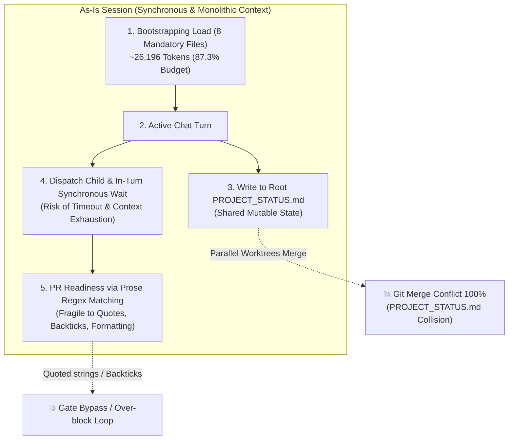
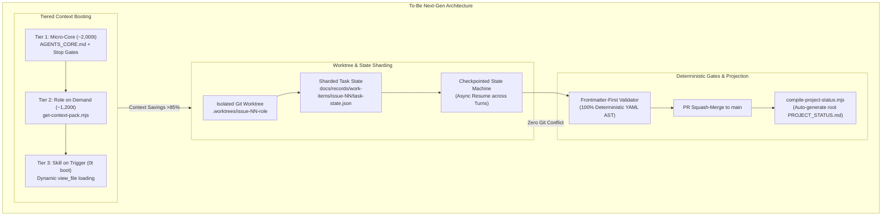

# Requirement Discovery: Next-Gen Autonomous Dynamic Workflow

## 1. Request Summary

| Item | Detail |
|---|---|
| Change Type | Framework / Meta Change |
| Business Goal | อัปเกรด AI Agent Dynamic Workflow จาก Policy & Validation Kit สู่ Autonomous SDLC Engine ที่แก้ปัญหา Context Window Bloat, Concurrency Conflict, In-turn Timeout และ Fragile Regex Gates โดยอ้างอิงบทเรียนจริงใน Repo และ Industry Benchmarks |
| Target Users / Actors | AI Agents (Orchestrator, Dev, QA, SA ฯลฯ) และ Human Maintainer / Boss |
| Business Criticality | High (โครงสร้างพื้นฐานหลักของการพัฒนาทั้ง Workspace) |
| Code Change Required | Yes (Validators, Loaders, CLI Scripts, Hooks, Templates) |
| Security/Data Sensitivity | Medium (แตะต้อง Local Hooks, PR Gates, และ State Machine Enforcement) |

---

## 2. Confirmed Facts (จากประวัติศาสตร์และโค้ดจริงใน Repo)

| # | Fact | Source / Reference |
|---|---|---|
| 1 | **Context Ceiling Pressure:** เอกสารอ่านบังคับ 8 ไฟล์ ปัจจุบันใช้ไป **26,196 / 30,000 Tokens (87.3%)** เหลือพื้นที่ว่างเพียง ~3,800 tokens สำหรับรับคำสั่งงานและอ่านโค้ด | `scripts/validate-context-budget.mjs` (หลัง Issue #237) |
| 2 | **Root Status Merge Conflict:** การแก้ไข `PROJECT_STATUS.md` ที่หน้า Root ใน Parallel Worktrees ทำให้เกิด Git Merge Conflict 100% เมื่อรวมสาขา | Lessons Learned ใน Issue #106/#108, PR #107/#109 |
| 3 | **Fragile Text Regex Gates:** การใช้ Regular Expression ตรวจจับข้อความ Prose ใน PR Template/Body เกิด False Negative/False Positive ซ้ำซากเมื่อเจอ Quoted Strings, Backticks หรือ Argument Flags | Issue #111, #246, #249 (`scripts/validate-pr-readiness.mjs`) |
| 4 | **In-Turn Wait Limitation:** Parent Orchestrator ถูกบังคับให้รอ Terminal Receipt ของ Subagent ภายใน "Chat Turn เดียวกันแบบ Synchronous" หากงานยาวหรือ Timeout จะหลุดเป็นสถานะ Blocked ทันที ไม่สามารถ Resume ข้ามเซสชันได้ | `docs/workflow/dynamic-routing.md` L48-L53, Issue #35, #178 |
| 5 | **Task-State Prototype Exists:** มีการเริ่มทดลองใช้ Sharded Structured State `task-state.json` แล้วในบาง Work Item | `docs/records/work-items/issue-249/task-state.json` |

---

## 3. Assumptions

| # | Assumption | Impact if Wrong | Validation Needed |
|---|---|---|---|
| 1 | AI Client หลัก (Claude Code, Antigravity, Codex) สามารถอ่าน YAML Frontmatter ได้แม่นยำกว่าการสแกน Free-text Prose | หากไม่จริง ตัว Gate จะยังคงซับซ้อน | ทดสอบกับ Parser ใน `scripts/work-item-readiness.mjs` |
| 2 | การแบ่ง Context เป็น Tier 1 (~2k tokens) จะไม่ทำให้ Agent พลาด Stop Conditions หรือ Human Approval Gates | หากตัดทอนผิด กฎความปลอดภัยอาจถูกละเลย | Equivalence Test ระหว่าง Full Context vs Progressive Context |
| 3 | การใช้ Git Worktree แยกโฟลเดอร์สำหรับ Subagent แต่ละตัวสามารถทำได้บน Local Environment โดยไม่กระทบ Storage มากเกินไป | Storage อาจเพิ่มขึ้น | ตรวจสอบด้วย `scripts/housekeeping-worktrees.mjs` |

---

## 4. Open Questions

| # | Question | Owner | Blocks Progress? |
|---|---|---|---|
| 1 | ควรให้ Root `PROJECT_STATUS.md` ถูกสร้างอัตโนมัติเฉพาะบน `main` หลัง Merge หรือสร้างผ่าน Local Pre-push Hook? | SA / Boss | No (สามารถเริ่มที่ Shadow Compilation ก่อน) |
| 2 | การเก็บ Task Checkpoint ควรเป็น JSON หรือ YAML ใน `docs/records/work-items/issue-<NN>/`? | SA / Dev | No (รองรับทั้งสองแบบผ่าน standard parser) |

---

## 5. Scope

### In Scope
- **Pillar 1: Worktree Sharded Status:** แยก `task-state.json` ประจำ Issue เพื่อขจัด Git Conflict และมี Projection Compiler สร้าง `PROJECT_STATUS.md`
- **Pillar 2: Progressive Context Loading:** แยก Tier 1 Boot Core (~2,000 tokens) ออกจาก On-Demand Role/Skill Injections
- **Pillar 3: Checkpointed Asynchronous Loop:** ปรับปรุง State Machine ให้รองรับการ Pause/Resume ข้าม Chat Turn ผ่าน Checkpoint บนไฟล์
- **Pillar 4: YAML Frontmatter Verification:** ปรับ PR Body และ Record Templates ให้ใช้ Structured Frontmatter แทน Regex ในการตรวจ Lifecycle

### Out of Scope
- การแก้ไขกฎ Lifecycle Retry Budget ของ Bug Fix (คงเดิมที่ 2 ครั้ง)
- การยกเลิก Human Approval Gates (Human Gates ยังคงเป็นจุดตัดขาดที่เข้มงวดเช่นเดิม)
- การสร้างคลาวด์เซิร์ฟเวอร์ภายนอก (ยังคงเป็น File-based / Git-native / Local-first)

---

## 6. Architecture & Workflow Comparison: As-Is vs To-Be

### 6.1 As-Is Workflow (สถาปัตยกรรมปัจจุบันที่มีจุดคอขวด)

### 6.2 To-Be Workflow (สถาปัตยกรรมใหม่: Modular, Sharded & Checkpointed)

---

## 7. User Stories

| Story ID | As a | I want | So that | Priority |
|---|---|---|---|---|
| US-001 | AI Agent | บูตเซสชันด้วย Context ก้อนเล็ก (~3,500 tokens) | มีพื้นที่ Context Window เหลือสำหรับอ่านและวิเคราะห์โค้ดได้อย่างเต็มที่ ไม่เกิด Context Rot | High |
| US-002 | Multi-Agent Team | แยกไฟล์สถานะงานเป็น `issue-<NN>/task-state.json` | รันงานบนหลาย Git Worktrees พร้อมกันได้โดยไม่มี Git Merge Conflict เมื่อรวมกิ่ง | High |
| US-003 | Orchestrator | บันทึก Checkpoint สถานะงานลงไฟล์เมื่อจบแต่ละช่วง | สามารถพักรอบหรือส่งต่องานข้ามเซสชันได้โดยไม่ต้องรันแชทแช่ค้างไว้จน Timeout | High |
| US-004 | Human Maintainer | ใช้ YAML Frontmatter ใน PR Body และ Work Item | ตัว Gate ใน CI และ Local Hook มีความแม่นยำ ไม่พังเพราะเรื่อง Regex หรือการจัดหน้า Markdown | Medium |

---

## 8. Acceptance Criteria

| AC ID | Related Story | Given | When | Then | Testable? |
|---|---|---|---|---|---|
| AC-001 | US-001 | มีไฟล์ `AGENTS_CORE.md` | รัน `scripts/validate-context-budget.mjs` ในโหมด Tier 1 | Token รวมของ Tier 1 ต้อง $\le$ 4,000 tokens | Yes |
| AC-002 | US-001 | Agent ได้รับมอบหมายบทบาท SA Agent | รัน `scripts/get-context-pack.mjs --role=sa-agent` | ได้เฉพาะข้อกำหนดของ SA Agent ขนาด $\le$ 1,500 tokens | Yes |
| AC-003 | US-002 | Worktree A ทำ Issue #301 และ Worktree B ทำ Issue #302 | ทั้งคู่แก้ไขสถานะงานของตนเองและ Merge สู่ main ตามลำดับ | เกิด Zero Git Merge Conflict ในไฟล์สถานะ และทั้งสอง Issue ปรากฏใน Status Dashboard | Yes |
| AC-004 | US-003 | Agent ทำงานในขั้นตอน `implementing` สำเร็จ | ทำการ Transition สู่ `verifying` | `task-state.json` ถูกบันทึกประวัติ Actor, Timestamp, Evidence Refs ถูกต้องตาม Schema | Yes |
| AC-005 | US-004 | PR Body มี YAML Frontmatter ระบุ `governing_workflow: bug-fix` | รัน `scripts/validate-pr-readiness.mjs` | ตัวตรวจสอบ Parse ข้อมูลผ่าน YAML Parser ได้ถูกต้อง 100% โดยไม่สนข้อความบรรยายด้านล่าง | Yes |

---

## 9. Business & Operating Rules

| Rule ID | Rule | Source | Impacted Area |
|---|---|---|---|
| BR-001 | **No Root Status Mutation on Feature Branch:** ห้าม Feature Branch แก้ไขไฟล์ `PROJECT_STATUS.md` หน้า Root โดยตรง ต้องแก้ไขเฉพาะ Shard ของตนเองเท่านั้น | Architecture Decision | Git Workflow, Hooks |
| BR-002 | **Preserve All Human Gates:** การทำ Asynchronous Checkpoint ห้ามข้ามขั้นตอน Human Approval Gate เมื่อถึง Gate ต้องตั้ง `state: blocked` พร้อม `stop_reason: human_review_required` | `AGENT_OPERATING_MODEL.md` | State Machine Schema |
| BR-003 | **Zero-Boot Skill Content:** เนื้อหาคำสั่งของ 39 สกิลต้องไม่ถูกนับใน Boot Tier จะต้องโหลดผ่าน `view_file` เมื่อเกิด Trigger เท่านั้น | Context Budget Policy | Skills Architecture |

---

## 10. Risk / Edge Case Notes

| Risk ID | Risk / Edge Case | Impact | Suggested Coverage |
|---|---|---|---|
| R-001 | **Context Degradation ใน Tier 1:** หากย่อ `AGENTS_CORE.md` มากเกินไป Agent อาจลืมกฎสำคัญ | High | สร้าง Behavioral Equivalence Test เทียบผลการตัดสินใจระหว่าง Full vs Tier 1 |
| R-002 | **Orphan Status Shards:** กิ่งถูกลบแต่ไฟล์สถานะใน `docs/records/work-items/` ยังค้างสถานะ active | Medium | เพิ่ม Reconciliation Script ใน CI ตรวจสอบกิ่งที่ปิดไปแล้วและย้ายเข้า archive |
| R-003 | **Hook Environment Missing Parser:** เครื่องผู้ใช้อาจไม่มี YAML Parser ในบาง Node runtime เก่า | Low | ใช้ Node.js 22 built-in หรือ dependency `yaml` ที่มีอยู่แล้วใน `package.json` |

---

## 11. Recommended Next Steps

| Next Agent / Skill | Reason | Required Input |
|---|---|---|
| **Human Maintainer / Boss** | Review & อนุมัติสถาปัตยกรรม To-Be และ Acceptance Criteria ใน Requirement Discovery นี้ | เอกสาร Requirement Discovery และ GitHub Issue |
| **SA Agent** | ออกแบบ System Design Document (SDD) และ JSON Schema สำหรับ `task-state.json` และ Frontmatter Contract | Requirement Discovery ที่ได้รับการอนุมัติ |
| **Developer Agent** | เริ่มลงมือทำตามลำดับ Roadmap 4 Sprints เมื่อได้รับ `status:spec-ready` | Approved SDD & Implementation Plan |
