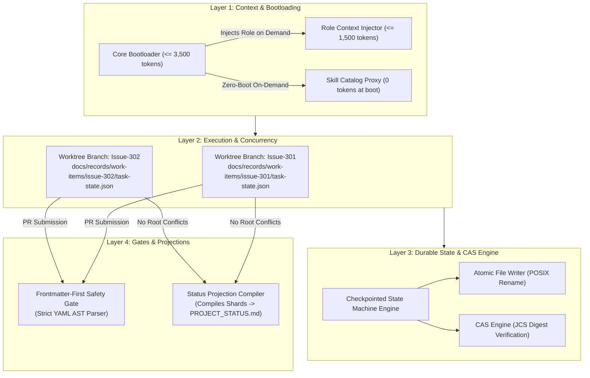
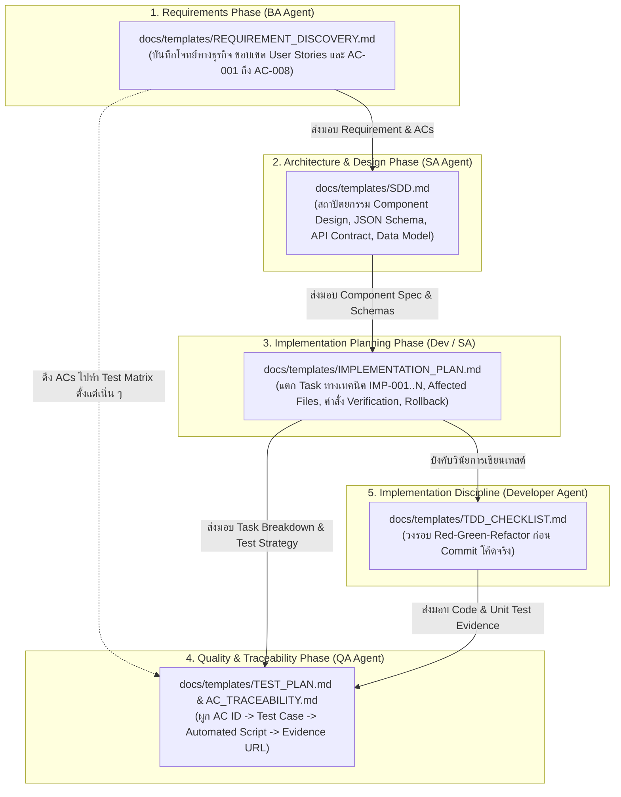
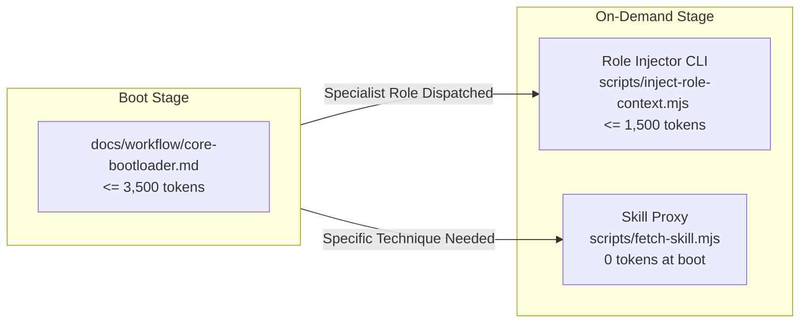
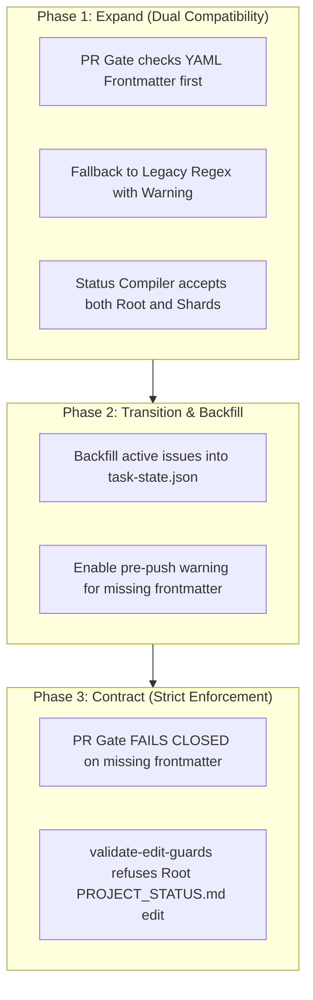

# Software Design Document: Next-Gen Autonomous Dynamic Workflow

## Metadata

- Work Item ID: Issue #272
- Title: Next-Gen Autonomous Dynamic Workflow Architecture
- Owner: SA Agent (`sa-architecture-design`)
- Status: PROPOSED
- Date: 2026-09-11
- Governing Requirements: `docs/records/requirements/2026-09-11-next-gen-dynamic-workflow-discovery.md`

---

## Context

The current AI-Agent-Workflow framework has evolved to a robust stage (Issues #212, #236, #237, #246, #249), but real-world operations have surfaced 4 architectural constraints:
1. **Context Ceiling Pressure**: Reading the 8 mandatory canonical documentation files on session boot consumes **26,196 / 30,000 tokens (87.3%)**, leaving only ~3,800 tokens for user instructions, diffs, and reasoning.
2. **Root Status Merge Conflict**: Parallel Git worktrees mutating root `PROJECT_STATUS.md` experience 100% Git merge conflict rates upon branch reconciliation (Issues #106, #108).
3. **Fragile Regex Safety Gates**: Prose parsing in PR descriptions via regular expressions (`validate-pr-readiness.mjs`, `work-item-readiness.mjs`) repeatedly breaks on quoted arguments, code fences, and backticks (Issues #111, #246, #249).
4. **Synchronous In-Turn Wait Lock-in**: Dynamic routing (`dynamic-routing.md:48-53`) mandates that orchestrators await terminal child receipts within the same synchronous chat turn. Long-running tasks, timeouts, or human approval gates force tasks into blocked state with no durable cross-session resumption capability.

---

## Goals / Non-goals

### Goals
- **G-001**: Reduce initial session boot context to $\le 3,500$ tokens while preserving 100% of safety invariants and stop conditions (AC-001, BR-003).
- **G-002**: Enable on-demand role context injection constrained to $\le 1,500$ tokens with fail-closed validation for nonexistent roles (AC-002, AC-003).
- **G-003**: Shard task status files by worktree/issue (`docs/records/work-items/{issue_id}/task-state.json`) to eliminate branch merge conflicts (0% conflict rate), backed by an automated projection compiler (AC-004, BR-001).
- **G-004**: Establish a durable, checkpointed asynchronous state machine supporting atomic writes, CAS concurrency, and cross-session pause/resume (AC-005, AC-006, BR-002, BR-004).
- **G-005**: Transition PR readiness safety gates from prose regex scraping to deterministic YAML AST frontmatter parsing with fail-closed mechanics (AC-007, AC-008).

### Non-goals
- **NG-001**: Introducing external database infrastructure (PostgreSQL, Redis, DynamoDB). All state remains local-first, file-based, and Git-native.
- **NG-002**: Relaxing or modifying human approval gates. All human gates remain 100% mandatory and blocking (BR-002).
- **NG-003**: Altering bug-fix retry ceilings (remains strictly maximum 2 rework attempts).
- **NG-004**: Rewriting existing core validators in `scripts/` during this design phase.

---

## Architecture Overview

The Next-Gen Dynamic Workflow architecture separates responsibilities across four distinct layers:



### Specification-Driven 5-Phase SDLC Lifecycle



### Asynchronous Checkpointed Lifecycle

```mermaid
sequenceDiagram
    autonumber
    actor User as Human Maintainer / Trigger
    participant Orch as Orchestrator Agent
    participant Disk as Local Worktree Disk
    participant Sub as Specialist Agent (SA/Dev/QA)
    participant Gate as PR / Quality Gate

    User->>Orch: Dispatch Issue #272
    Note over Orch: Loads Core Bootloader (<= 3,500 tokens)
    Orch->>Disk: Initialize task-state.json (state: intake)
    Orch->>Disk: Atomic Transition (intake -> designing, actor: orchestrator)
    Note over Orch: Yields turn cleanly (No synchronous wait)

    Sub->>Disk: Resume task (Reads task-state.json)
    Note over Sub: Loads Role Context on Demand (<= 1,500 tokens)
    Sub->>Disk: Atomic Transition (designing -> blocked, stop_reason: human_review_required)
    Note over Sub: Checkpoint persisted; Session concludes

    User->>Disk: Review & Approve (Resume Trigger CLI)
    Disk->>Disk: Atomic Transition (blocked -> implementing, actor: human)

    Sub->>Disk: Resume implementation in isolated worktree
    Sub->>Disk: Atomic Transition (implementing -> verifying, evidence: [changed_files, plan])
    Sub->>Gate: Create PR with YAML Frontmatter
    Gate->>Gate: AST Parse YAML (Strict fail-closed validation)
    Gate-->>Sub: PASS (100% deterministic)
```

---

## Component Design

### Component 1: Worktree Sharded Status & Projection Compiler (Pillar 1)

#### 1.1 Sharded Task State Isolation (`task-state.json`)
- Each Git worktree / issue branch operates strictly within its designated folder: `docs/records/work-items/{issue_id}/`.
- The task state is stored in `task-state.json` inside that folder.
- **Rule BR-001**: Feature branches MUST NEVER modify root `PROJECT_STATUS.md`. Any PR attempting to touch root status files while on an active feature branch is refused by `validate-edit-guards.mjs`.

#### 1.2 Projection Compiler (`scripts/compile-status-projection.mjs`)
- **Role**: Collects all active shards matching `docs/records/work-items/*/task-state.json`.
- **Validation**: Ensures every shard conforms to `task-state.schema.json`.
- **Aggregation**:
  - Sorts entries deterministically by task ID.
  - Generates the markdown projection for `PROJECT_STATUS.md` (Current Work Items, Completed Items, Active Stages).
  - Emits JCS canonical digest (`projectionDigest`) to guarantee projection integrity.
- **Execution Hook**:
  - Run locally on demand (`npm run status:compile`).
  - Run in CI (`validate-contracts.yml`) to verify that the committed projection matches current shards (`npm run validate:status-projection`).

#### 1.3 Archival Lifecycle & Post-Merge Closeout Integration (Addressing R-003 & Branch Protection)
- **Problem**: Long-term accumulation of shards creates hundreds of stale JSON files, and automated direct pushes to `main` violate GitHub Branch Protection rules.
- **Resolution**:
  1. **Branch Isolation**: Active feature branches write *only* to `docs/records/work-items/{issue_id}/task-state.json`.
  2. **Squash-Merge into `main`**: PR lands on `main` without root status conflicts.
  3. **Documentation Closeout PR**: The existing `documentation-closeout` workflow runs `compile-status-projection.mjs`, recompiles root `PROJECT_STATUS.md`, moves closed shards to `docs/records/work-items/archive/{issue_id}/task-state.json`, and opens an authenticated Closeout PR (or commits via authorized app token).
  4. Active shard count remains bounded ($\le 50$), and branch protection invariants are fully respected.

---

### Component 2: Progressive Context Loading Engine (Pillar 2)



#### 2.1 Tier 1: Core Bootloader (`docs/workflow/core-bootloader.md`)
- **Budget**: Strictly $\le 3,500$ tokens (measured via `chars / 4`).
- **Contents**:
  1. Operating Principles & Golden Rules.
  2. Mandatory Human Approval Gates (`AGENT_OPERATING_MODEL.md#human-approval-gates`).
  3. Universal Stop Conditions & Boundary Rules.
  4. Dispatch & Handoff Contract Index (Pointers to dynamic routing).
  5. Manifest of available roles and skills (names and descriptions only, $\approx 300$ tokens).

#### 2.2 Tier 2: Role Context Injector (`scripts/inject-role-context.mjs`)
- **Budget**: Strictly $\le 1,500$ tokens per role payload.
- **CLI Interface**: `node scripts/inject-role-context.mjs <role_id>`
- **Fail-Closed Behavior (AC-003)**:
  - Input validated against canonical enum: `ROLE_REGISTRY = ['ba-agent', 'sa-agent', 'developer-agent', 'qa-agent', 'pm-agent', 'config-agent', 'documentation-agent', 'orchestrator-agent', 'release-agent', 'security-agent', 'data-agent']`.
  - If `<role_id>` is invalid: Emits JSON error to stderr and exits with `exitCode = 1`.
  ```json
  {
    "status": "ERROR",
    "error_code": "INVALID_ROLE_IDENTIFIER",
    "message": "Role 'invalid-role' is not registered.",
    "allowed_roles": ["ba-agent", "sa-agent", "developer-agent", "qa-agent", "..."]
  }
  ```

#### 2.3 Tier 3: Zero-Boot Skill Layer
- Catalog of 31 skills is NOT injected at boot (BR-003).
- The agent or host invokes skill-specific documentation on demand only when executing that specific skill discipline.

#### 2.4 Reference Library Preservation & Dual-Budget Validation (Addressing R-001 & Codebase Invariants)
- **Problem**: The existing 8 files in `CANONICAL_FILES` contain 26,196 tokens of detailed institutional knowledge, test fixtures, and link anchors. Replacing them or deleting them would break cross-file links, unit tests, and risk AI rule amnesia.
- **Resolution**:
  - The 8 canonical files remain in place as the **Canonical Reference Library** (Tier 3 on-demand library).
  - `docs/workflow/core-bootloader.md` is created as the **Active Execution Bootloader** (Tier 1 $\le 3,500$ tokens).
  - `scripts/validate-context-budget.mjs` is updated with a dual-budget validator:
    - Mode 1: Core Bootloader Budget ($\le 3,500$ tokens)
    - Mode 2: Canonical Reference Library Budget ($\le 30,000$ tokens)

---

### Component 3: Checkpointed Asynchronous State Machine (Pillar 3)

#### 3.1 State Vocabulary & Transition Matrix
The state machine supports 11 discrete states:
- `intake`: Initial task creation.
- `investigating`: Root cause / requirement analysis.
- `designing`: Technical design (SDD / ADR).
- `planning`: Work breakdown (Implementation Plan).
- `implementing`: Code modification.
- `verifying`: Test and QA verification.
- `rework`: Bug fix rework loop (governed by `rework_count <= max_rework_attempts: 2`).
- `handoff`: Terminal phase packaging.
- `blocked`: Suspended waiting for human review or external dependencies.
- `completed`: Terminal success.
- `cancelled`: Explicitly abandoned task.

| Source State | Permitted Destination States | Mandatory Evidence Keys Required | Actor Restriction |
|---|---|---|---|
| `intake` | `investigating`, `designing`, `cancelled` | `requirement_discovery` or `issue_ref` | orchestrator, ba-agent |
| `investigating` | `designing`, `planning`, `blocked`, `cancelled` | `root_cause_analysis` | developer-agent, sa-agent |
| `designing` | `planning`, `blocked`, `cancelled` | `sdd_ref`, `adr_ref` | sa-agent |
| `planning` | `implementing`, `blocked`, `cancelled` | `implementation_plan_ref` | developer-agent |
| `implementing` | `verifying`, `blocked`, `cancelled` | `changed_files`, `validation_plan` | developer-agent |
| `verifying` | `handoff`, `rework`, `blocked`, `cancelled` | `test_evidence`, `qa_report_ref` | qa-agent |
| `rework` | `implementing`, `blocked`, `cancelled` | `rework_plan`, `qa_findings` | developer-agent |
| `handoff` | `completed`, `blocked`, `cancelled` | `terminal_handoff_receipt` | orchestrator, release-agent |
| `blocked` | `{prior_state}`, `cancelled` | `resume_evidence`, `approver_id` | human, orchestrator |

#### 3.2 Human Approval Gate Preservation (BR-002)
- Any state requiring human sign-off (e.g. Design sign-off, PR merge approval) transitions to `blocked` with:
  - `state: "blocked"`
  - `stop_reason: "human_review_required"`
- The transition refuses to transition to any active state unless human resume evidence is registered.

#### 3.3 Atomic Write & CAS Engine (R-002)
- **POSIX Atomic File Writing**:
  ```javascript
  function atomicWriteJsonSync(targetPath, data) {
    const dir = path.dirname(targetPath);
    const tempPath = path.join(dir, `.tmp-${path.basename(targetPath)}-${process.pid}-${Date.now()}`);
    const content = JSON.stringify(data, null, 2) + '\n';
    const fd = fs.openSync(tempPath, 'w');
    fs.writeFileSync(fd, content, 'utf8');
    fs.fsyncSync(fd);
    fs.closeSync(fd);
    fs.renameSync(tempPath, targetPath);
  }
  ```
- **CAS Verification**:
  - Every update carries `expected_digest`.
  - The engine hashes the current file content using RFC 8785 JCS + SHA-256.
  - If current hash $\ne$ `expected_digest`, the write is rejected with `CAS_CONFLICT`.

#### 3.4 Envelope Container Pattern & Polymorphic Contract Validation
- **Problem**: The repository already contains fine-grained domain contracts (`bug-fix-workflow.yaml`, `new-feature-workflow.yaml`, `config-change-workflow.yaml`, `data-change-workflow.yaml`) and schemas (`task-state.schema.json`, `new-feature-state.schema.json`, etc.). Flattening them into a single 11-state enum destroys domain-specific rules (e.g., Bug Fix max 2 reworks vs New Feature max 1 rework, or specialized states like `staging-validation`).
- **Resolution**:
  - `task-state.json` acts as an **Envelope Container**:
    - **Header (Universal)**: `task_id`, `workflow_id`, `contract_version`, `sequence_number`, `state_digest`, `history`, `stop_reason`.
    - **Payload (Polymorphic)**: The allowed `state` enum, allowed transitions, and retry ceilings (`max_rework_attempts`) are resolved dynamically against the respective workflow YAML contract (`docs/contracts/{workflow_id}-workflow.yaml`).
  - This ensures 100% backward compatibility with `validate-contracts.mjs` while unlocking durable state machine checkpointing.

---

### Component 4: Frontmatter-First Safety Gates (Pillar 4)

#### 4.1 Specification
- All PR bodies SHOULD contain a YAML frontmatter block starting on line 1 with `---` and closed by `---`.
- Markdown prose is located strictly below the closing `---`.

```yaml
---
work_item: 272
governing_workflow: framework_meta
closing_action: advances-only
advances_issue: 272
qa_evidence: "https://github.com/chakrits/AI-Agent-Workflow/issues/272#issuecomment-5630763664"
documentation_impact: completed
plan_only: false
risk_level: high
schema_version: 1
---

## Description
Prose content, code blocks, and markdown go here.
```

#### 4.2 Deterministic Parsing Algorithm
1. Verify line 1 is `---`.
2. Find the second `---` at the start of a line.
3. Extract the frontmatter substring.
4. Parse using a strict YAML AST parser (safe mode, no code execution).
5. Validate the parsed object against `pr-frontmatter.schema.json`.
6. The prose below the frontmatter is completely ignored during metadata validation, eliminating 100% of regex collision bugs (AC-007).

#### 4.3 Expand/Contract Dual-Compatibility Migration Strategy (Addressing R-004 & 725 Unit Tests)
- **Problem**: Over 70 unit tests in `test/work-item-readiness.test.mjs` and existing PR templates (`.github/PULL_REQUEST_TEMPLATE.md`) rely on legacy markdown markers (`Governing workflow: Bug Fix`, `<!-- advances-only: ... -->`). Immediately failing closed on missing frontmatter will break existing tests and in-flight PRs.
- **Resolution (3-Phase Rollout)**:
  - **Phase 1 (Expand - Dual Mode)**: `scripts/work-item-readiness.mjs` inspects line 1 for `---`.
    - If frontmatter is present $\implies$ Execute strict AST parser (validates against schema, fail-closed if malformed).
    - If frontmatter is absent $\implies$ Fall back to legacy regex engine with a non-fatal deprecation warning (`ADVISORY: PR body lacks YAML frontmatter; falling back to legacy regex parser`).
  - **Phase 2 (Templates & Parity)**: Update `.github/PULL_REQUEST_TEMPLATE.md` and `.gitlab/merge_request_templates/default.md` to ship with frontmatter scaffolding. Validate with `validate:ci-parity`.
  - **Phase 3 (Contract - Strict Mode)**: After active feature branches land, flip default to strict fail-closed (`--strict-frontmatter`).

---

## API Contract

### 1. `task-state.schema.json` (v2 Specification)

```json
{
  "$schema": "https://json-schema.org/draft/2020-12/schema",
  "$id": "https://github.com/chakrits/AI-Agent-Workflow/docs/contracts/schemas/task-state.schema.json",
  "title": "Durable Task State Schema v2",
  "type": "object",
  "additionalProperties": false,
  "required": [
    "task_id",
    "workflow_id",
    "contract_version",
    "change_type",
    "risk_level",
    "state",
    "rework_count",
    "max_rework_attempts",
    "sequence_number",
    "state_digest",
    "history",
    "evidence",
    "next_route",
    "stop_reason"
  ],
  "properties": {
    "task_id": { "type": "string", "pattern": "^[a-z0-9_-]+$" },
    "workflow_id": { "type": "string", "enum": ["bug-fix", "new-feature", "framework-meta", "config-change", "data-change"] },
    "contract_version": { "type": "integer", "const": 2 },
    "change_type": { "enum": ["bug-fix", "feature", "enhancement", "framework-meta", "config-change", "data-change"] },
    "risk_level": { "enum": ["low", "medium", "high", "critical"] },
    "state": {
      "enum": [
        "intake", "investigating", "designing", "planning", "implementing",
        "verifying", "rework", "handoff", "blocked", "completed", "cancelled"
      ]
    },
    "rework_count": { "type": "integer", "minimum": 0, "maximum": 2 },
    "max_rework_attempts": { "type": "integer", "const": 2 },
    "sequence_number": { "type": "integer", "minimum": 1 },
    "state_digest": { "type": "string", "pattern": "^[a-f0-9]{64}$" },
    "history": {
      "type": "array",
      "items": {
        "type": "object",
        "additionalProperties": false,
        "required": ["from", "to", "at", "actor", "evidence_refs"],
        "properties": {
          "from": { "type": "string" },
          "to": { "type": "string" },
          "at": { "type": "string", "format": "date-time" },
          "actor": { "type": "string", "minLength": 1 },
          "evidence_refs": {
            "type": "array",
            "items": { "type": "string", "minLength": 1 }
          }
        }
      }
    },
    "evidence": {
      "type": "object",
      "additionalProperties": {
        "oneOf": [
          { "type": "string" },
          { "type": "array", "items": { "type": "string" } },
          { "type": "object" }
        ]
      }
    },
    "next_route": { "type": ["string", "null"] },
    "stop_reason": {
      "type": ["string", "null"],
      "enum": [
        null,
        "human_review_required",
        "host_completion_unavailable",
        "max_rework_exceeded",
        "external_dependency_blocked",
        "task_cancelled"
      ]
    }
  }
}
```

### 2. `pr-frontmatter.schema.json` (v1 Specification)

```json
{
  "$schema": "https://json-schema.org/draft/2020-12/schema",
  "$id": "https://github.com/chakrits/AI-Agent-Workflow/docs/contracts/schemas/pr-frontmatter.schema.json",
  "title": "Pull Request Frontmatter Schema v1",
  "type": "object",
  "additionalProperties": false,
  "required": [
    "work_item",
    "governing_workflow",
    "closing_action",
    "schema_version"
  ],
  "properties": {
    "schema_version": { "type": "integer", "const": 1 },
    "work_item": { "type": "integer", "minimum": 1 },
    "governing_workflow": {
      "type": "string",
      "enum": ["bug_fix", "new_feature", "framework_meta", "config_change", "data_change"]
    },
    "closing_action": {
      "type": "string",
      "enum": ["fixes", "closes", "resolves", "advances-only", "none"]
    },
    "advances_issue": { "type": "integer", "minimum": 1 },
    "qa_evidence": { "type": "string", "pattern": "^https?://[^\\s]+$" },
    "documentation_impact": {
      "type": "string",
      "enum": ["completed", "not_applicable"]
    },
    "plan_only": { "type": "boolean", "default": false },
    "risk_level": {
      "type": "string",
      "enum": ["low", "medium", "high", "critical"]
    }
  },
  "allOf": [
    {
      "if": { "properties": { "closing_action": { "const": "advances-only" } } },
      "then": { "required": ["advances_issue"] }
    }
  ]
}
```

---

## Data Model / Data Impact

### Directory & File Structure
```text
docs/
├── contracts/schemas/
│   ├── pr-frontmatter.schema.json       # New frontmatter validation schema
│   └── task-state.schema.json           # Updated v2 durable state schema
├── records/
│   └── work-items/
│       ├── issue-249/
│       │   └── task-state.json          # Existing prototype
│       └── issue-272/
│           └── task-state.json          # Issue 272 sharded state
└── workflow/
    ├── core-bootloader.md               # Tier 1 Context (<= 3,500 tokens)
    └── roles/                           # Tier 2 Role Contexts (<= 1,500 tokens)
        ├── ba-agent.md
        ├── developer-agent.md
        ├── qa-agent.md
        └── sa-agent.md
```

### Migration Strategy (Expand/Contract)



- **Backfill Plan**: Run `scripts/backfill-task-state.mjs` on open work items to seed initial `task-state.json` from git history.
- **Rollback Plan**:
  - The projection compiler is bidirectional: if needed, root `PROJECT_STATUS.md` can be reconstructed at any commit.
  - The PR readiness validator retains the legacy regex engine behind `--legacy-fallback` flag during Phase 1.

---

## Error Handling

### 1. Atomic Write Failure & Mid-Write Corruption (R-002)
- Temp file written with explicit fsync.
- In case of write interruption, temp files are discarded. Target `task-state.json` remains untouched.
- Stale temp files cleaned up by `scripts/housekeeping-worktrees.mjs`.

### 2. CAS Update Conflict (`CAS_CONFLICT`)
- If `observed_digest != expected_digest`, write fails with:
  ```json
  {
    "status": "REJECTED",
    "error_code": "CAS_CONFLICT",
    "current_digest": "a1b2...",
    "expected_digest": "c3d4...",
    "message": "Task state was mutated concurrently. Re-read and retry."
  }
  ```

### 3. Invalid Transition / Missing Evidence (AC-006)
- Attempting illegal transition (e.g. `intake` $\to$ `verifying`) throws `ILLEGAL_TRANSITION_REJECTED`.
- Transition omitting mandatory evidence references throws `MISSING_REQUIRED_EVIDENCE`.

### 4. Malformed Frontmatter / Missing Fields (AC-008)
- Fails closed with `exitCode = 1`.
- Emits structured error indicating exact line, column, and schema violation.

### 5. Invalid Role Context Request (AC-003)
- Requesting invalid role name exits with code 1 and lists valid roles.

---

## Security Considerations

1. **Deterministic Safe YAML Parsing**: YAML parsing in local hooks and CI MUST use safe schemas (e.g., `yaml` parser in JSON-compatible mode). Disallow custom object tags, binary blobs, and function execution to prevent code injection.
2. **Worktree Directory Traversal Protection**: When reading `task-state.json` using `--task-id`, sanitize input (`/^[a-z0-9_-]+$/`). Refuse any path segments containing `..`, slashes, or null bytes.
3. **Preservation of Human Approval Gates (BR-002)**: The state machine strictly prohibits autonomous transitions from `blocked` with `stop_reason: human_review_required` to active states without cryptographic or authenticated human maintainer evidence.
4. **Digest-Backed Audit Lineage**: Each `history` entry includes an SHA-256 digest of preceding history, preventing retroactive record tampering.

---

## NFRs (Non-Functional Requirements)

- **Performance**:
  - Initial core bootloader context: $\le 3,500$ tokens (AC-001).
  - Role context injection: $\le 1,500$ tokens (AC-002).
  - Status projection compilation: $< 300\text{ ms}$ for 100 shards.
  - YAML frontmatter extraction & validation: $< 20\text{ ms}$ per PR body.
- **Reliability**:
  - Parallel worktree merge conflict rate on status files: **0.0%** (AC-004).
  - State corruption from unexpected termination: **0.0%** via atomic writes.
- **Observability**:
  - Full state transition audit trail recorded in `history` array.
  - Machine-readable JSON logs for all CLI and CI gate operations.
- **Scalability**:
  - Supports up to 50 concurrent active worktrees on a single developer workstation without status lock contention.

---

## Alternatives Considered

| Alternative | Description | Pros | Cons / Reason for Rejection |
|---|---|---|---|
| **1. Central SQLite / PostgreSQL DB** | Store all work-item statuses in a shared database | Easy queries, native ACID transactions | Rejected: Violates the local-first, Git-native, zero-cloud architecture invariant. Does not track branch history or Git merges naturally. |
| **2. Custom Git Merge Driver for `PROJECT_STATUS.md`** | Keep monolithic status file and write a 3-way merge driver | Keeps single file layout | Rejected: Merge drivers are fragile, fail on clean clones, require global git config setup on every host, and don't solve the underlying concurrency model. |
| **3. Regex Hardening (ADR-0025 Extension)** | Add more regex tokenizer rules to fix PR parsing | No change to PR format | Rejected: Empirically proven fragile across Issues #111, #246, #249. Markdown syntax is fundamentally irregular; regex cannot solve nested fences and quotes reliably. |
| **4. In-Turn Polling Loops** | Loop with sleep inside orchestrator chat turns | Allows waiting for long tasks | Rejected: Burns token budget, times out on host provider limits, fails if session disconnects. |

---

## Decision

1. **Adopt Worktree Sharded Status (Pillar 1)**: Authorize creation of `docs/records/work-items/{issue_id}/task-state.json` as the single source of truth for issue progress. Implement `scripts/compile-status-projection.mjs`.
2. **Adopt 3-Tier Progressive Context Loading (Pillar 2)**: Create `docs/workflow/core-bootloader.md` ($\le 3,500$ tokens) and `scripts/inject-role-context.mjs` ($\le 1,500$ tokens). Zero-boot for skills.
3. **Adopt Checkpointed Asynchronous State Machine (Pillar 3)**: Formalize `task-state.schema.json` (v2) with atomic writes, CAS digest checks, and explicit pause/resume triggers.
4. **Adopt Frontmatter-First PR Readiness Gate (Pillar 4)**: Implement YAML frontmatter parser in `scripts/work-item-readiness.mjs` with strict fail-closed validation.

---

## Testability Notes & Acceptance Traceability

| Acceptance Criteria | Verification Method | Pass Criteria |
|---|---|---|
| **AC-001** (Boot Token $\le 3,500$) | Run `node scripts/validate-context-budget.mjs --file docs/workflow/core-bootloader.md` | Token count $\le 3,500$ |
| **AC-002** (Role Token $\le 1,500$) | Run `node scripts/inject-role-context.mjs developer-agent \| wc -c` | Output tokens (chars / 4) $\le 1,500$ |
| **AC-003** (Invalid Role Fails Closed) | Run `node scripts/inject-role-context.mjs invalid-role` | Exit code $\ne 0$ (`1`), JSON error emitted |
| **AC-004** (Worktree Concurrency & Compilation) | Create 2 worktree branches (#301, #302) with separate `task-state.json`, merge both into main, run compiler | 0 Git merge conflicts, `PROJECT_STATUS.md` aggregates both |
| **AC-005** (Valid Transition Checkpointing) | Perform valid transition via CLI (`implementing` $\to$ `verifying`) | Updated `task-state.json` contains valid timestamp, actor, evidence |
| **AC-006** (Invalid Transition Rejection) | Attempt illegal transition (`intake` $\to$ `verifying`) or omit evidence | Operation rejected, exit code $\ne 0$, file unchanged |
| **AC-007** (Frontmatter Robustness) | Validate PR body with valid YAML frontmatter + complex markdown with fences and quotes | Exit code 0, 100% metadata extraction accuracy |
| **AC-008** (Malformed Frontmatter Fails Closed) | Validate PR body with broken YAML syntax or missing `work_item` | Exit code 1, structured fail-closed error emitted |

---

## Related Artifacts / Links

| Artifact | Purpose | URL / Repository Path |
|---|---|---|
| Requirement Discovery | Authoritative requirement source | `docs/records/requirements/2026-09-11-next-gen-dynamic-workflow-discovery.md` |
| Task State Prototype | Prototype state machine fixture | `docs/records/work-items/issue-249/task-state.json` |
| Task State Schema | JSON Schema Draft 2020-12 | `docs/contracts/schemas/task-state.schema.json` |
| CAS Request / Decision | Existing status CAS contracts | `docs/contracts/schemas/status-cas-request.schema.json` |
| Context Budget Script | Token counter tool | `scripts/validate-context-budget.mjs` |
| PR Readiness Gate | Existing PR validator | `scripts/validate-pr-readiness.mjs` |
