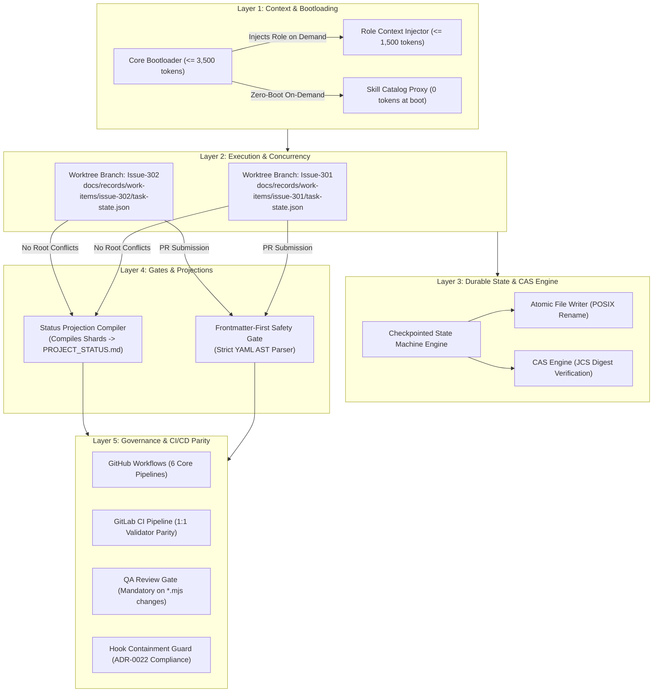
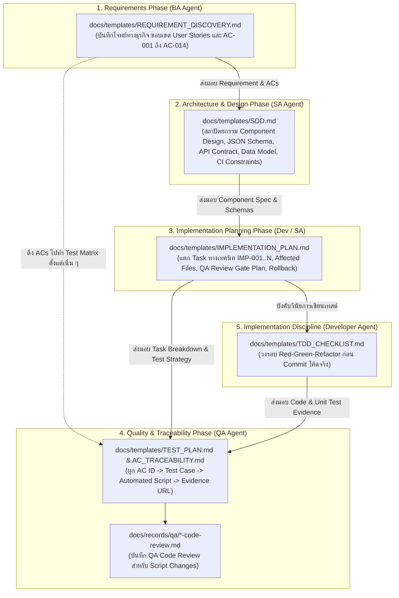
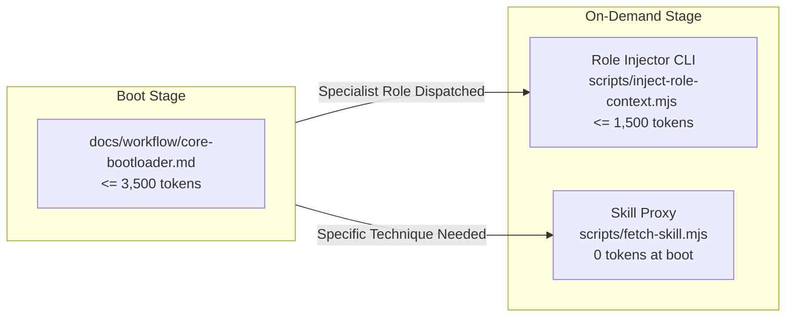
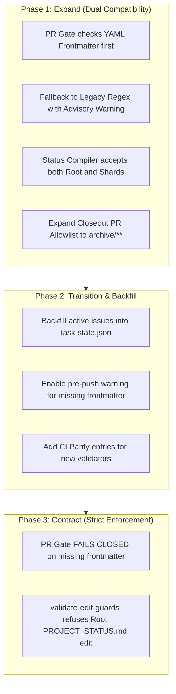

# Software Design Document: Next-Gen Autonomous Dynamic Workflow

## Metadata

- Work Item ID: Issue #272
- Title: Next-Gen Autonomous Dynamic Workflow Architecture
- Owner: SA Agent (`sa-architecture-design`)
- Status: PROPOSED
- Date: 2026-09-11
- Governing Requirements: `docs/records/requirements/2026-09-11-next-gen-dynamic-workflow-discovery.md`

---

## Context

The current AI-Agent-Workflow framework has evolved to a robust stage (Issues #212, #236, #237, #246, #249), but real-world operations have surfaced 4 architectural constraints:
1. **Context Ceiling Pressure**: Reading the 8 mandatory canonical documentation files on session boot consumes **26,196 / 30,000 tokens (87.3%)**, leaving only ~3,800 tokens for user instructions, diffs, and reasoning.
2. **Root Status Merge Conflict**: Parallel Git worktrees mutating root `PROJECT_STATUS.md` experience 100% Git merge conflict rates upon branch reconciliation (Issues #106, #108).
3. **Fragile Regex Safety Gates**: Prose parsing in PR descriptions via regular expressions (`validate-pr-readiness.mjs`, `work-item-readiness.mjs`) repeatedly breaks on quoted arguments, code fences, and backticks (Issues #111, #246, #249).
4. **Synchronous In-Turn Wait Lock-in**: Dynamic routing (`dynamic-routing.md:48-53`) mandates that orchestrators await terminal child receipts within the same synchronous chat turn. Long-running tasks, timeouts, or human approval gates force tasks into blocked state with no durable cross-session resumption capability.

Furthermore, a comprehensive repository audit identified **6 existing GitHub Workflows, Git Hooks, and CI Parity architectural constraints** that any dynamic workflow evolution must strictly integrate with to avoid pipeline breaks or security gate failures.

---

## Goals / Non-goals

### Goals
- **G-001**: Reduce initial session boot context to $\le 3,500$ tokens while preserving 100% of safety invariants and stop conditions (AC-001, BR-003).
- **G-002**: Enable on-demand role context injection constrained to $\le 1,500$ tokens with fail-closed validation for nonexistent roles (AC-002, AC-003).
- **G-003**: Shard task status files by worktree/issue (`docs/records/work-items/{issue_id}/task-state.json`) to eliminate branch merge conflicts (0% conflict rate), backed by an automated projection compiler (AC-004, BR-001).
- **G-004**: Establish a durable, checkpointed asynchronous state machine supporting atomic writes, CAS concurrency, and cross-session pause/resume (AC-005, AC-006, BR-002, BR-004).
- **G-005**: Transition PR readiness safety gates from prose regex scraping to deterministic YAML AST frontmatter parsing with fail-closed mechanics (AC-007, AC-008).
- **G-006**: Ensure 100% compliance with existing repository governance: Closeout PR file allowlists, QA Review Gate enforcement for `.mjs` scripts, Project State stale marker restrictions, ADR-0022 hook containment, dual-host CI parity, and contract schema naming invariants.

### Non-goals
- **NG-001**: Introducing external database infrastructure (PostgreSQL, Redis, DynamoDB). All state remains local-first, file-based, and Git-native.
- **NG-002**: Relaxing or modifying human approval gates. All human gates remain 100% mandatory and blocking (BR-002).
- **NG-003**: Altering bug-fix retry ceilings (remains strictly maximum 2 rework attempts).
- **NG-004**: Rewriting existing core validators in `scripts/` during this design phase.

---

## Architecture Overview

The Next-Gen Dynamic Workflow architecture separates responsibilities across five distinct layers:



### Specification-Driven 5-Phase SDLC Lifecycle



### Asynchronous Checkpointed Lifecycle

```mermaid
sequenceDiagram
    autonumber
    actor User as Human Maintainer / Trigger
    participant Orch as Orchestrator Agent
    participant Disk as Local Worktree Disk
    participant Sub as Specialist Agent (SA/Dev/QA)
    participant Gate as PR / Quality Gate (CI & Hooks)

    User->>Orch: Dispatch Issue #272
    Note over Orch: Loads Core Bootloader (<= 3,500 tokens)
    Orch->>Disk: Initialize task-state.json (state: intake)
    Orch->>Disk: Atomic Transition (intake -> designing, actor: orchestrator)
    Note over Orch: Yields turn cleanly (No synchronous wait)

    Sub->>Disk: Resume task (Reads task-state.json)
    Note over Sub: Loads Role Context on Demand (<= 1,500 tokens)
    Sub->>Disk: Atomic Transition (designing -> blocked, stop_reason: human_review_required)
    Note over Sub: Checkpoint persisted; Session concludes

    User->>Disk: Review & Approve (Resume Trigger CLI)
    Disk->>Disk: Atomic Transition (blocked -> implementing, actor: human)

    Sub->>Disk: Resume implementation in isolated worktree
    Sub->>Disk: Atomic Transition (implementing -> verifying, evidence: [changed_files, plan])
    Sub->>Gate: Create PR with YAML Frontmatter + QA Review Record (if .mjs touched)
    Gate->>Gate: AST Parse YAML + Review Gate + CI Parity Check
    Gate-->>Sub: PASS (100% deterministic)
```

---

## Component Design

### Component 1: Worktree Sharded Status & Projection Compiler (Pillar 1)

#### 1.1 Sharded Task State Isolation (`task-state.json`)
- Each Git worktree / issue branch operates strictly within its designated folder: `docs/records/work-items/{issue_id}/`.
- The task state is stored in `task-state.json` inside that folder.
- **Rule BR-001**: Feature branches MUST NEVER modify root `PROJECT_STATUS.md`. Any PR attempting to touch root status files while on an active feature branch is refused by `validate-edit-guards.mjs`.

#### 1.2 Projection Compiler (`scripts/compile-status-projection.mjs`) & Stale Marker Guard
- **Role**: Collects all active shards matching `docs/records/work-items/*/task-state.json`.
- **Validation**: Ensures every shard conforms to `task-state.schema.json`.
- **Aggregation**:
  - Sorts entries deterministically by task ID.
  - Generates the markdown projection for `PROJECT_STATUS.md` (Current Work Items, Completed Items, Active Stages).
  - Emits JCS canonical digest (`projectionDigest`) to guarantee projection integrity.
- **Project State Stale Markers Invariant (`scripts/validate-project-state.mjs`)**:
  - `scripts/validate-project-state.mjs` runs on pushes to `main` in `documentation-sync.yml` and `.gitlab-ci.yml`.
  - It inspects all lines matching `/^\s*-\s+Status:\s*/i` in `PROJECT_STATUS.md` and fails closed if any line contains forbidden merge-state markers: `'uncommitted'`, `'pending review'`, or `'pending merge'`.
  - **Formatting Contract**: `compile-status-projection.mjs` MUST format work-item progress tables using standard Markdown tables (e.g. `| Issue | Title | State | Rework Count | Next Route |`) where status values reside in table cells rather than matching the `/^\s*-\s+Status:\s*/i` bullet regex.
  - If bullet points are emitted, lines matching `/^\s*-\s+Status:\s*/i` MUST strictly use valid state vocabulary (e.g., `intake`, `investigating`, `designing`, `planning`, `implementing`, `verifying`, `rework`, `handoff`, `blocked`, `completed`, `cancelled`) and NEVER output forbidden stale substrings.
- **Execution Hook**:
  - Run locally on demand (`npm run status:compile`).
  - Run in CI (`validate-contracts.yml` & `.gitlab-ci.yml`) to verify that the committed projection matches current shards (`npm run validate:status-projection`).

#### 1.3 Archival Lifecycle & Closeout PR File Allowlist Integration
- **Problem**: Long-term accumulation of shards creates hundreds of stale JSON files. Direct automated pushes to `main` violate GitHub Branch Protection rules.
- **Closeout PR File Allowlist Constraint (`scripts/work-item-readiness.mjs:153-162`)**:
  - The repository's closeout validator (`evaluateLifecycle()`) strictly inspects files changed by closeout PRs:
    ```javascript
    const allowed = (name) =>
      ['PROJECT_STATUS.md', 'TASK_LOG.md', 'CHANGELOG.md'].includes(name) ||
      /^docs\/records\/HANDOFF-POST-MERGE-CLOSEOUT-[^/]+\.md$/.test(name);
    if (!changedFiles.length || !changedFiles.every(allowed)) errors.push('closeout files are not authorized');
    ```
  - When the shard archival lifecycle moves closed task state files from `docs/records/work-items/{issue_id}/task-state.json` to `docs/records/work-items/archive/{issue_id}/task-state.json`, any closeout PR containing these files will FAIL CLOSED with `'closeout files are not authorized'`.
- **Architectural Resolution**:
  1. Active feature branches write *only* to `docs/records/work-items/{issue_id}/task-state.json`.
  2. Feature PR squash-merges into `main` without root status conflicts.
  3. The post-merge closeout workflow runs `compile-status-projection.mjs`, recompiles root `PROJECT_STATUS.md`, moves the terminal shard to `docs/records/work-items/archive/{issue_id}/task-state.json`, and opens an authenticated Closeout PR.
  4. **Allowlist Expansion**: The closeout allowlist in `scripts/work-item-readiness.mjs` is explicitly expanded to authorize archived shard files:
     ```javascript
     const allowed = (name) =>
       ['PROJECT_STATUS.md', 'TASK_LOG.md', 'CHANGELOG.md'].includes(name) ||
       /^docs\/records\/HANDOFF-POST-MERGE-CLOSEOUT-[^/]+\.md$/.test(name) ||
       /^docs\/records\/work-items\/archive\/[^/]+\/task-state\.json$/.test(name);
     ```
  5. Active shard count remains bounded ($\le 50$), archive integrity is preserved, and branch protection invariants are fully respected.

---

### Component 2: Progressive Context Loading Engine (Pillar 2)



#### 2.1 Tier 1: Core Bootloader (`docs/workflow/core-bootloader.md`)
- **Budget**: Strictly $\le 3,500$ tokens (measured via `chars / 4`).
- **Contents**:
  1. Operating Principles & Golden Rules.
  2. Mandatory Human Approval Gates (`AGENT_OPERATING_MODEL.md#human-approval-gates`).
  3. Universal Stop Conditions & Boundary Rules.
  4. Dispatch & Handoff Contract Index (Pointers to dynamic routing).
  5. Manifest of available roles and skills (names and descriptions only, $\approx 300$ tokens).

#### 2.2 Tier 2: Role Context Injector (`scripts/inject-role-context.mjs`)
- **Budget**: Strictly $\le 1,500$ tokens per role payload.
- **CLI Interface**: `node scripts/inject-role-context.mjs <role_id>`
- **Fail-Closed Behavior (AC-003)**:
  - Input validated against canonical enum: `ROLE_REGISTRY = ['ba-agent', 'sa-agent', 'developer-agent', 'qa-agent', 'pm-agent', 'config-agent', 'documentation-agent', 'orchestrator-agent', 'release-agent', 'security-agent', 'data-agent']`.
  - If `<role_id>` is invalid: Emits JSON error to stderr and exits with `exitCode = 1`.
  ```json
  {
    "status": "ERROR",
    "error_code": "INVALID_ROLE_IDENTIFIER",
    "message": "Role 'invalid-role' is not registered.",
    "allowed_roles": ["ba-agent", "sa-agent", "developer-agent", "qa-agent", "..."]
  }
  ```

#### 2.3 Tier 3: Zero-Boot Skill Layer
- Catalog of 31 skills is NOT injected at boot (BR-003).
- The agent or host invokes skill-specific documentation on demand only when executing that specific skill discipline.

#### 2.4 Reference Library Preservation & Dual-Budget Validation (Addressing R-001)
- The 8 canonical files remain in place as the **Canonical Reference Library** (Tier 3 on-demand library).
- `docs/workflow/core-bootloader.md` is created as the **Active Execution Bootloader** (Tier 1 $\le 3,500$ tokens).
- `scripts/validate-context-budget.mjs` is updated with a dual-budget validator:
  - Mode 1: Core Bootloader Budget ($\le 3,500$ tokens).
  - Mode 2: Canonical Reference Library Budget ($\le 30,000$ tokens).

---

### Component 3: Checkpointed Asynchronous State Machine (Pillar 3)

#### 3.1 State Vocabulary & Transition Matrix
The state machine supports 11 discrete states:
- `intake`: Initial task creation.
- `investigating`: Root cause / requirement analysis.
- `designing`: Technical design (SDD / ADR).
- `planning`: Work breakdown (Implementation Plan).
- `implementing`: Code modification.
- `verifying`: Test and QA verification.
- `rework`: Bug fix rework loop (governed by `rework_count <= max_rework_attempts: 2`).
- `handoff`: Terminal phase packaging.
- `blocked`: Suspended waiting for human review or external dependencies.
- `completed`: Terminal success.
- `cancelled`: Explicitly abandoned task.

| Source State | Permitted Destination States | Mandatory Evidence Keys Required | Actor Restriction |
|---|---|---|---|
| `intake` | `investigating`, `designing`, `cancelled` | `requirement_discovery` or `issue_ref` | orchestrator, ba-agent |
| `investigating` | `designing`, `planning`, `blocked`, `cancelled` | `root_cause_analysis` | developer-agent, sa-agent |
| `designing` | `planning`, `blocked`, `cancelled` | `sdd_ref`, `adr_ref` | sa-agent |
| `planning` | `implementing`, `blocked`, `cancelled` | `implementation_plan_ref` | developer-agent |
| `implementing` | `verifying`, `blocked`, `cancelled` | `changed_files`, `validation_plan` | developer-agent |
| `verifying` | `handoff`, `rework`, `blocked`, `cancelled` | `test_evidence`, `qa_report_ref` | qa-agent |
| `rework` | `implementing`, `blocked`, `cancelled` | `rework_plan`, `qa_findings` | developer-agent |
| `handoff` | `completed`, `blocked`, `cancelled` | `terminal_handoff_receipt` | orchestrator, release-agent |
| `blocked` | `{prior_state}`, `cancelled` | `resume_evidence`, `approver_id` | human, orchestrator |

#### 3.2 Human Approval Gate Preservation (BR-002)
- Any state requiring human sign-off transitions to `blocked` with `stop_reason: "human_review_required"`.
- The transition engine strictly refuses autonomous transitions out of `blocked` without human evidence.

#### 3.3 Atomic Write & CAS Engine (R-002)
- **POSIX Atomic File Writing**: Uses dedicated temp file write, `fsyncSync()`, and atomic `renameSync()`.
- **CAS Verification**: Hashes current state using RFC 8785 JCS + SHA-256; writes fail with `CAS_CONFLICT` if `current_digest != expected_digest`.

#### 3.4 Envelope Container Pattern & Contract Schema Naming Invariant
- **Contract Schema Naming Invariant (`scripts/validate-contracts.mjs`)**:
  - `scripts/validate-contracts.mjs` scans all schema files in `docs/contracts/schemas/` matching `*-state.schema.json`.
  - It derives the workflow identifier via:
    ```javascript
    const basename = path.basename(file, '-state.schema.json');
    const workflowId = basename === 'task' ? 'bug-fix' : basename;
    schemas[workflowId] = schema;
    ```
  - It then looks up the matching policy in `docs/contracts/{workflow_id}-workflow.yaml`.
  - **Constraint**: Any schema ending in `-state.schema.json` without a matching `*-workflow.yaml` policy causes contract validation to FAIL CLOSED.
  - **Schema Architecture**:
    1. Workflow-specific state schemas retain their strict 1:1 binding (`task-state.schema.json` $\to$ `bug-fix`, `new-feature-state.schema.json` $\to$ `new-feature`, etc.).
    2. Envelope schemas, PR frontmatter schemas, and CAS schemas MUST use non-colliding filenames that do NOT end in `-state.schema.json` (e.g. `pr-frontmatter.schema.json`, `status-cas-request.schema.json`, `durable-task-envelope.schema.json`).
    3. The v2 envelope format in `task-state.json` wraps domain payloads cleanly, validating the envelope header universally while delegating payload state transitions to the respective domain workflow contract.

---

### Component 4: Frontmatter-First Safety Gates (Pillar 4)

#### 4.1 Specification
- All PR bodies SHOULD contain a YAML frontmatter block starting on line 1 with `---` and closed by `---`.
- Markdown prose is located strictly below the closing `---`.

```yaml
---
work_item: 272
governing_workflow: framework_meta
closing_action: advances-only
advances_issue: 272
qa_evidence: "https://github.com/chakrits/AI-Agent-Workflow/issues/272#issuecomment-5630763664"
documentation_impact: completed
plan_only: false
risk_level: high
schema_version: 1
---

## Description
Prose content, code blocks, and markdown go here.
```

#### 4.2 Deterministic Parsing Algorithm
1. Verify line 1 is `---`.
2. Find the second `---` at the start of a line.
3. Extract the frontmatter substring and parse using a safe YAML AST parser.
4. Validate against `pr-frontmatter.schema.json`.
5. Prose below frontmatter is ignored for metadata extraction, eliminating 100% of regex collision bugs (AC-007).

#### 4.3 Expand/Contract Dual-Compatibility Migration Strategy
- **Phase 1 (Expand - Dual Mode)**: Inspect line 1 for `---`. If present, run strict AST parser. If absent, fall back to legacy regex engine with advisory deprecation warning.
- **Phase 2 (Templates & Parity)**: Update PR templates (`.github/PULL_REQUEST_TEMPLATE.md` & `.gitlab/merge_request_templates/default.md`).
- **Phase 3 (Contract - Strict Mode)**: Enforce strict fail-closed frontmatter validation via `--strict-frontmatter`.

#### 4.4 QA Review Gate Enforcement Integration (`scripts/validate-review-gate.mjs`)
- `scripts/validate-review-gate.mjs` runs on all PRs in `validate-contracts.yml` and `.gitlab-ci.yml`.
- **Constraint**: If a PR modifies or adds any file with `.mjs` or `.js` extension (`hasScriptChanges()`), the gate requires `hasReviewRecord(addedFiles)` to be true: diff MUST include a newly added file under `docs/records/qa/` matching `*-code-review.md`.
- PRs modifying or adding workflow scripts (`scripts/work-item-readiness.mjs`, `scripts/compile-status-projection.mjs`, `scripts/inject-role-context.mjs`, etc.) MUST include a valid QA code review record in the same PR diff, referenced by `qa_evidence` in the frontmatter.

---

### Component 5: Git Hooks, CI Parity, and Workflow Orchestration (Pillar 5)

#### 5.1 The 6 GitHub Workflows Ecosystem
The repository's autonomous governance relies on 6 dedicated GitHub Action workflows:
1. **`validate-contracts.yml`** (Triggers: `push`, `pull_request`):
   Runs the full verification suite (`npm test`, `validate:contracts`, `validate:dispatch-receipts`, `validate:workflow-evidence`, `housekeeping:worktrees`, `validate:skill-parity`, `validate:adapter-parity`, `adr:audit`, `validate:risk-register`, `validate:review-gate`, `validate:clearable-refs`, `validate:skill-usage`, `validate:metrics`, `validate:context-budget`, `validate:ci-parity`).
2. **`documentation-sync.yml`** (Triggers: `push` to `main`):
   Executes `validate:project-state` to ensure root documentation is in sync. Automatically files a `documentation-sync` tracking issue if stale markers or synchronization errors are detected.
3. **`dispatch-receipt-notify.yml`** (Triggers: `workflow_dispatch`, `issue_comment`):
   Delivers asynchronous audit receipts and dispatches notifications for multi-agent handoffs.
4. **`documentation-impact-gate.yml`** (Triggers: `pull_request`):
   Validates documentation impact declarations on PRs.
5. **`status-runtime-matrix.yml`** (Triggers: `schedule`, `push`):
   Validates runtime script execution across target Node.js engine versions.
6. **`work-item-readiness-refresh.yml`** (Triggers: PR lifecycle events):
   Executes `scripts/work-item-readiness.mjs` to dynamically label PRs and enforce work-item linking.

#### 5.2 CI Parity Guard Invariant (`scripts/validate-ci-parity.mjs`)
- `scripts/validate-ci-parity.mjs` enforces strict 1:1 parity between `.github/workflows/validate-contracts.yml` (job `validate`) and `.gitlab-ci.yml`.
- All validator commands (`npm run validate:*`, `node scripts/*`, `npx *`) run in GitHub Actions must also be present in `.gitlab-ci.yml`.
- **Constraint**: When adding new validators (e.g. `validate:status-projection`, `validate:pr-frontmatter`), developers MUST update both `.github/workflows/validate-contracts.yml` AND `.gitlab-ci.yml` simultaneously.
- Any deliberate host asymmetry must be explicitly recorded with an architectural rationale in `HOST_ONLY_COMMANDS` in `scripts/validate-ci-parity.mjs`; undeclared asymmetries fail CI closed.

#### 5.3 Hook Containment Guard & ADR-0022 Compliance (`test/hook-containment.test.mjs`)
- Governed by ADR-0022 and enforced via `test/hook-containment.test.mjs`.
- **Rule 1 (Claude Settings Reachability)**: Every `npm run <script>` rule referenced in `.claude/settings.json` MUST be reachable from a `.githooks/` hook or a CI workflow. Claude settings can never originate untracked rules.
- **Rule 2 (Script Registration Invariant)**: Every script in `scripts/` named `validate-*.mjs` must have a corresponding `"validate:<name>"` entry in `package.json` (or be declared in `testOnly`).
- **Rule 3 (Zero-Drift Execution)**: New scripts (`compile-status-projection.mjs`, `inject-role-context.mjs`) must be registered in `package.json` (`status:compile`, `role:context`) and adhere strictly to containment rules.

#### 5.4 Pre-push & Post-merge Hook Integration
- **`.githooks/pre-push`**:
  A thin caller wrapping `validate:pr-readiness` and `validate:edit-guards`. When `PR_BODY_FILE` is set, pre-flights PR frontmatter locally before pushing to remote.
- **`.githooks/post-merge`**:
  Triggers local status projection recompilation (`npm run status:compile`) when upstream branches are merged.

---

## API Contract

### 1. `task-state.schema.json` (v2 Specification)

```json
{
  "$schema": "https://json-schema.org/draft/2020-12/schema",
  "$id": "https://github.com/chakrits/AI-Agent-Workflow/docs/contracts/schemas/task-state.schema.json",
  "title": "Durable Task State Schema v2",
  "type": "object",
  "additionalProperties": false,
  "required": [
    "task_id",
    "workflow_id",
    "contract_version",
    "change_type",
    "risk_level",
    "state",
    "rework_count",
    "max_rework_attempts",
    "sequence_number",
    "state_digest",
    "history",
    "evidence",
    "next_route",
    "stop_reason"
  ],
  "properties": {
    "task_id": { "type": "string", "pattern": "^[a-z0-9_-]+$" },
    "workflow_id": { "type": "string", "enum": ["bug-fix", "new-feature", "framework-meta", "config-change", "data-change"] },
    "contract_version": { "type": "integer", "const": 2 },
    "change_type": { "enum": ["bug-fix", "feature", "enhancement", "framework-meta", "config-change", "data-change"] },
    "risk_level": { "enum": ["low", "medium", "high", "critical"] },
    "state": {
      "enum": [
        "intake", "investigating", "designing", "planning", "implementing",
        "verifying", "rework", "handoff", "blocked", "completed", "cancelled"
      ]
    },
    "rework_count": { "type": "integer", "minimum": 0, "maximum": 2 },
    "max_rework_attempts": { "type": "integer", "const": 2 },
    "sequence_number": { "type": "integer", "minimum": 1 },
    "state_digest": { "type": "string", "pattern": "^[a-f0-9]{64}$" },
    "history": {
      "type": "array",
      "items": {
        "type": "object",
        "additionalProperties": false,
        "required": ["from", "to", "at", "actor", "evidence_refs"],
        "properties": {
          "from": { "type": "string" },
          "to": { "type": "string" },
          "at": { "type": "string", "format": "date-time" },
          "actor": { "type": "string", "minLength": 1 },
          "evidence_refs": {
            "type": "array",
            "items": { "type": "string", "minLength": 1 }
          }
        }
      }
    },
    "evidence": {
      "type": "object",
      "additionalProperties": {
        "oneOf": [
          { "type": "string" },
          { "type": "array", "items": { "type": "string" } },
          { "type": "object" }
        ]
      }
    },
    "next_route": { "type": ["string", "null"] },
    "stop_reason": {
      "type": ["string", "null"],
      "enum": [
        null,
        "human_review_required",
        "host_completion_unavailable",
        "max_rework_exceeded",
        "external_dependency_blocked",
        "task_cancelled"
      ]
    }
  }
}
```

### 2. `pr-frontmatter.schema.json` (v1 Specification)

```json
{
  "$schema": "https://json-schema.org/draft/2020-12/schema",
  "$id": "https://github.com/chakrits/AI-Agent-Workflow/docs/contracts/schemas/pr-frontmatter.schema.json",
  "title": "Pull Request Frontmatter Schema v1",
  "type": "object",
  "additionalProperties": false,
  "required": [
    "work_item",
    "governing_workflow",
    "closing_action",
    "schema_version"
  ],
  "properties": {
    "schema_version": { "type": "integer", "const": 1 },
    "work_item": { "type": "integer", "minimum": 1 },
    "governing_workflow": {
      "type": "string",
      "enum": ["bug_fix", "new_feature", "framework_meta", "config_change", "data_change"]
    },
    "closing_action": {
      "type": "string",
      "enum": ["fixes", "closes", "resolves", "advances-only", "none"]
    },
    "advances_issue": { "type": "integer", "minimum": 1 },
    "qa_evidence": { "type": "string", "pattern": "^https?://[^\\s]+$" },
    "documentation_impact": {
      "type": "string",
      "enum": ["completed", "not_applicable"]
    },
    "plan_only": { "type": "boolean", "default": false },
    "risk_level": {
      "type": "string",
      "enum": ["low", "medium", "high", "critical"]
    }
  },
  "allOf": [
    {
      "if": { "properties": { "closing_action": { "const": "advances-only" } } },
      "then": { "required": ["advances_issue"] }
    }
  ]
}
```

---

## Data Model / Data Impact

### Directory & File Structure
```text
docs/
├── contracts/schemas/
│   ├── pr-frontmatter.schema.json       # Frontmatter validation schema (non-colliding name)
│   └── task-state.schema.json           # v2 durable state schema (mapped to bug-fix in validator)
├── records/
│   └── work-items/
│       ├── archive/                     # Archived terminal shards
│       │   └── issue-249/
│       │       └── task-state.json
│       ├── issue-249/                   # Active shard prototype
│       │   └── task-state.json
│       └── issue-272/                   # Active Issue 272 shard
│           └── task-state.json
└── workflow/
    ├── core-bootloader.md               # Tier 1 Context (<= 3,500 tokens)
    └── roles/                           # Tier 2 Role Contexts (<= 1,500 tokens)
        ├── ba-agent.md
        ├── developer-agent.md
        ├── qa-agent.md
        └── sa-agent.md
```

### Migration Strategy (Expand/Contract)



- **Backfill Plan**: Run `scripts/backfill-task-state.mjs` on open work items to seed initial `task-state.json` from git history.
- **Rollback Plan**:
  - The projection compiler is bidirectional: root `PROJECT_STATUS.md` can be reconstructed at any commit.
  - The PR readiness validator retains the legacy regex engine behind `--legacy-fallback` flag during Phase 1.

---

## Error Handling

### 1. Atomic Write Failure & Mid-Write Corruption (R-002)
- Temp file written with explicit fsync; interrupted writes leave `task-state.json` untouched.
- Stale temp files cleaned up by `scripts/housekeeping-worktrees.mjs`.

### 2. CAS Update Conflict (`CAS_CONFLICT`)
- If `observed_digest != expected_digest`, write fails with structured rejection:
  ```json
  {
    "status": "REJECTED",
    "error_code": "CAS_CONFLICT",
    "current_digest": "a1b2...",
    "expected_digest": "c3d4...",
    "message": "Task state was mutated concurrently. Re-read and retry."
  }
  ```

### 3. Invalid Transition / Missing Evidence (AC-006)
- Attempting illegal transition throws `ILLEGAL_TRANSITION_REJECTED`.
- Omitting mandatory evidence throws `MISSING_REQUIRED_EVIDENCE`.

### 4. Malformed Frontmatter / Missing Fields (AC-008)
- Fails closed with `exitCode = 1` and structured JSON error showing line and column.

### 5. Invalid Role Context Request (AC-003)
- Requesting invalid role name exits with code 1 and lists valid roles.

### 6. Closeout File Authorization Failure (`CLOSEOUT_FILES_NOT_AUTHORIZED`)
- Closeout PR containing files outside the allowlist fails closed with `closeout files are not authorized`.

### 7. Missing QA Code Review Record (`MISSING_CODE_REVIEW_RECORD`)
- PR modifying `.mjs` files without a corresponding `docs/records/qa/*-code-review.md` record fails closed at `validate:review-gate`.

---

## 8. Security Considerations & Architectural Constraints

1. **Deterministic Safe YAML Parsing**: YAML parsing in local hooks and CI MUST use safe schemas (JSON-compatible mode). Disallow custom object tags, binary blobs, and function execution.
2. **Worktree Directory Traversal Protection**: When reading `task-state.json` using `--task-id`, sanitize input (`/^[a-z0-9_-]+$/`). Refuse any path segments containing `..`, slashes, or null bytes.
3. **Preservation of Human Approval Gates (BR-002)**: The state machine strictly prohibits autonomous transitions from `blocked` with `stop_reason: human_review_required` to active states without authenticated human maintainer evidence.
4. **Digest-Backed Audit Lineage**: Each `history` entry includes an SHA-256 digest of preceding history, preventing retroactive record tampering.
5. **Constraint 1 (Shard Archival Allowlist Invariant)**: `scripts/work-item-readiness.mjs` must authorize `docs/records/work-items/archive/**` to enable post-merge closeout without failing closed.
6. **Constraint 2 (QA Review Gate Enforcement)**: Any PR adding or modifying `.mjs` scripts is blocked unless a new file matching `docs/records/qa/*-code-review.md` is included in the PR diff.
7. **Constraint 3 (Project State Stale Marker Prevention)**: `compile-status-projection.mjs` must ensure lines matching `/^\s*-\s+Status:\s*/i` never emit forbidden stale markers (`uncommitted`, `pending review`, `pending merge`).
8. **Constraint 4 (ADR-0022 Hook Containment Mandate)**: Every npm rule in `.claude/settings.json` must be reachable from `.githooks/` or CI; every validator in `scripts/` must be registered in `package.json`.
9. **Constraint 5 (Dual-Host CI Parity Invariant)**: 1:1 validator parity enforced between `.github/workflows/validate-contracts.yml` and `.gitlab-ci.yml`.
10. **Constraint 6 (Contract Schema Naming Invariant)**: Schemas ending in `*-state.schema.json` must strictly have matching `*-workflow.yaml` policies; envelope schemas must use non-colliding names.

---

## NFRs (Non-Functional Requirements)

- **Performance**:
  - Initial core bootloader context: $\le 3,500$ tokens (AC-001).
  - Role context injection: $\le 1,500$ tokens (AC-002).
  - Status projection compilation: $< 300\text{ ms}$ for 100 shards.
  - YAML frontmatter extraction & validation: $< 20\text{ ms}$ per PR body.
- **Reliability**:
  - Parallel worktree merge conflict rate on status files: **0.0%** (AC-004).
  - State corruption from unexpected termination: **0.0%** via atomic writes.
- **Observability**:
  - Full state transition audit trail recorded in `history` array.
  - Machine-readable JSON logs for all CLI and CI gate operations.
- **Scalability**:
  - Supports up to 50 concurrent active worktrees on a single developer workstation without status lock contention.

---

## 11. Operational Safety & Lifecycle Invariants

The operational lifecycle of the AI-Agent-Workflow framework is structured across five sequential safety phases:

1. **Phase 1: Local Development & Worktree Isolation**:
   - Developers and agents operate in isolated Git worktrees, writing progress solely to `docs/records/work-items/{issue_id}/task-state.json`.
   - `validate-edit-guards.mjs` prevents edits to root status files during feature branch execution.
   - `.githooks/pre-push` pre-flights PR frontmatter locally if `PR_BODY_FILE` is set.
2. **Phase 2: PR Submission & Review Gate Enforcement**:
   - `work-item-readiness-refresh.yml` validates YAML frontmatter and linked issues.
   - `scripts/validate-review-gate.mjs` inspects PR diffs; any script changes (`.mjs`/`.js`) require an accompanying QA code review record under `docs/records/qa/`.
3. **Phase 3: Multi-Host CI Verification & Parity**:
   - GitHub Actions (`validate-contracts.yml`) and GitLab CI (`.gitlab-ci.yml`) execute the validation test suite in parallel.
   - `scripts/validate-ci-parity.mjs` guarantees zero drift between both host platforms.
   - Contract validator verifies schema integrity without false positives on envelope schemas.
4. **Phase 4: Post-Merge Closeout & Shard Archival**:
   - Squash-merging a PR into `main` triggers `documentation-sync.yml` and the documentation closeout job.
   - `compile-status-projection.mjs` regenerates `PROJECT_STATUS.md` without emitting forbidden stale markers.
   - Completed shards are moved to `docs/records/work-items/archive/{issue_id}/task-state.json`.
   - The closeout PR succeeds cleanly because `work-item-readiness.mjs` authorizes archive shard files.
5. **Phase 5: Crash Resilience & Conflict Resolution**:
   - State machine updates use POSIX atomic rename (`.tmp-...` $\to$ target), preventing half-written states upon abrupt process termination.
   - Concurrent update collisions are detected via JCS SHA-256 digests and safely rejected with `CAS_CONFLICT`.

---

## Alternatives Considered

| Alternative | Description | Pros | Cons / Reason for Rejection |
|---|---|---|---|
| **1. Central SQLite / PostgreSQL DB** | Store all work-item statuses in a shared database | Easy queries, native ACID transactions | Rejected: Violates the local-first, Git-native, zero-cloud architecture invariant. Does not track branch history or Git merges naturally. |
| **2. Custom Git Merge Driver for `PROJECT_STATUS.md`** | Keep monolithic status file and write a 3-way merge driver | Keeps single file layout | Rejected: Merge drivers are fragile, fail on clean clones, require global git config setup on every host, and don't solve the underlying concurrency model. |
| **3. Regex Hardening (ADR-0025 Extension)** | Add more regex tokenizer rules to fix PR parsing | No change to PR format | Rejected: Empirically proven fragile across Issues #111, #246, #249. Markdown syntax is fundamentally irregular; regex cannot solve nested fences and quotes reliably. |
| **4. In-Turn Polling Loops** | Loop with sleep inside orchestrator chat turns | Allows waiting for long tasks | Rejected: Burns token budget, times out on host provider limits, fails if session disconnects. |

---

## Decision

1. **Adopt Worktree Sharded Status (Pillar 1)**: Authorize creation of `docs/records/work-items/{issue_id}/task-state.json` as the single source of truth for issue progress. Implement `scripts/compile-status-projection.mjs`.
2. **Adopt 3-Tier Progressive Context Loading (Pillar 2)**: Create `docs/workflow/core-bootloader.md` ($\le 3,500$ tokens) and `scripts/inject-role-context.mjs` ($\le 1,500$ tokens). Zero-boot for skills.
3. **Adopt Checkpointed Asynchronous State Machine (Pillar 3)**: Formalize `task-state.schema.json` (v2) with atomic writes, CAS digest checks, and explicit pause/resume triggers.
4. **Adopt Frontmatter-First PR Readiness Gate (Pillar 4)**: Implement YAML frontmatter parser in `scripts/work-item-readiness.mjs` with strict fail-closed validation.
5. **Enforce Hook Containment & CI Parity (Pillar 5)**: Integrate the 6 GitHub Workflows, uphold ADR-0022 hook containment, enforce 1:1 GitLab CI parity, enforce Review Gate on `.mjs` changes, and expand closeout allowlists for shard archival.

---

## Testability Notes & Acceptance Traceability

| Acceptance Criteria | Verification Method | Pass Criteria |
|---|---|---|
| **AC-001** (Boot Token $\le 3,500$) | Run `node scripts/validate-context-budget.mjs --file docs/workflow/core-bootloader.md` | Token count $\le 3,500$ |
| **AC-002** (Role Token $\le 1,500$) | Run `node scripts/inject-role-context.mjs developer-agent \| wc -c` | Output tokens (chars / 4) $\le 1,500$ |
| **AC-003** (Invalid Role Fails Closed) | Run `node scripts/inject-role-context.mjs invalid-role` | Exit code $\ne 0$ (`1`), JSON error emitted |
| **AC-004** (Worktree Concurrency & Compilation) | Create 2 worktree branches (#301, #302) with separate `task-state.json`, merge both into main, run compiler | 0 Git merge conflicts, `PROJECT_STATUS.md` aggregates both |
| **AC-005** (Valid Transition Checkpointing) | Perform valid transition via CLI (`implementing` $\to$ `verifying`) | Updated `task-state.json` contains valid timestamp, actor, evidence |
| **AC-006** (Invalid Transition Rejection) | Attempt illegal transition (`intake` $\to$ `verifying`) or omit evidence | Operation rejected, exit code $\ne 0$, file unchanged |
| **AC-007** (Frontmatter Robustness) | Validate PR body with valid YAML frontmatter + complex markdown with fences and quotes | Exit code 0, 100% metadata extraction accuracy |
| **AC-008** (Malformed Frontmatter Fails Closed) | Validate PR body with broken YAML syntax or missing `work_item` | Exit code 1, structured fail-closed error emitted |
| **AC-009** (Closeout Allowlist Archival) | Test closeout validation with archived shard in changed files | `scripts/work-item-readiness.mjs` passes without `closeout files are not authorized` error |
| **AC-010** (Review Gate Script Enforcement) | Run `validate-review-gate.mjs` with script diff and missing review record | Fails closed with exit code 1; passes when `docs/records/qa/*-code-review.md` added |
| **AC-011** (Project State Stale Marker Filter) | Compile projection and run `scripts/validate-project-state.mjs` | Passes without detecting stale markers (`uncommitted`, `pending review`, `pending merge`) |
| **AC-012** (Hook Containment Invariant) | Run `node --test test/hook-containment.test.mjs` | All npm rules reachable from hooks/CI, all validators registered |
| **AC-013** (CI Parity Enforcement) | Run `node scripts/validate-ci-parity.mjs` | 1:1 command parity between GitHub Actions and GitLab CI |
| **AC-014** (Contract Schema Naming Invariant) | Run `node scripts/validate-contracts.mjs` | All `*-state.schema.json` match policies; no collisions on envelope schemas |

---

## Related Artifacts / Links

| Artifact | Purpose | URL / Repository Path |
|---|---|---|
| Requirement Discovery | Authoritative requirement source | `docs/records/requirements/2026-09-11-next-gen-dynamic-workflow-discovery.md` |
| Task State Prototype | Prototype state machine fixture | `docs/records/work-items/issue-249/task-state.json` |
| Task State Schema | JSON Schema Draft 2020-12 | `docs/contracts/schemas/task-state.schema.json` |
| Frontmatter Schema | PR Frontmatter Schema v1 | `docs/contracts/schemas/pr-frontmatter.schema.json` |
| CAS Request Schema | Status CAS request schema | `docs/contracts/schemas/status-cas-request.schema.json` |
| Context Budget Script | Token counter tool | `scripts/validate-context-budget.mjs` |
| Work-Item Readiness Gate | PR readiness validator & closeout allowlist | `scripts/work-item-readiness.mjs` |
| Review Gate Validator | QA review record gate for script changes | `scripts/validate-review-gate.mjs` |
| Project State Validator | Root status stale marker validator | `scripts/validate-project-state.mjs` |
| CI Parity Validator | Dual-host validator parity enforcer | `scripts/validate-ci-parity.mjs` |
| Hook Containment Test | ADR-0022 compliance test suite | `test/hook-containment.test.mjs` |
| GitHub Actions Workflows | 6 core CI/CD workflows | `.github/workflows/` |
| GitLab CI Configuration | GitLab CI pipeline definition | `.gitlab-ci.yml` |
