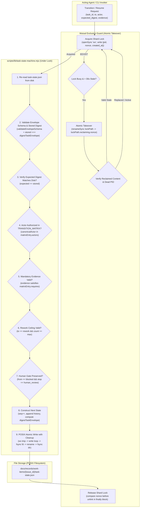

# Software Design Document: Control-Plane State Integrity & Architecture Remediation

## Metadata

- Work Item ID: Issue #277
- Title: Control-Plane State Integrity & Architecture Remediation (Package 1)
- Owner: SA Agent (`sa-architecture-design`)
- Status: Draft (Rework Round 3 — Addressing Maintainer Review #5644384860)
- Date: 2026-09-12
- Governing Requirements: `docs/records/requirements/2026-09-12-control-plane-state-integrity-discovery.md` (AC-001..AC-008, BR-001..BR-004)

---

## Context

During production audits and rigorous review rounds (#5644141824, #5644271486, #5644384860), five critical architectural vulnerabilities and design gaps were identified in control-plane state management:
1. **Contract & Schema Authority Discrepancy (F-01 / Round 3 Gap 1):** Two conflicting schemas existed in `docs/contracts/schemas/`. The authority is resolved by establishing `durable-task-envelope.schema.json` as the sole canonical authority with `contract_version: 2` (11-state model, multi-workflow), while `TRANSITION_MATRIX` in `scripts/lib/task-state-machine.mjs` is explicitly defined with allowed actors for all 11 states and 5 supported workflows.
2. **Actor Authorization Policy (F-02):** In `scripts/lib/task-state-machine.mjs`, transitions were executed without checking actor permissions against `TRANSITION_MATRIX.actors`.
3. **Digest Self-Reference & Stored Integrity Verification (F-03 / Round 3 Gap 1):** Computing JCS digests over the entire envelope including `state_digest` produces circularity. A dedicated envelope hasher `digestTaskEnvelope(envelope)` is required to exclude `state_digest` explicitly, and integrity verification (`stored === computed`) must be enforced on load.
4. **Lock Ownership & Atomic Stale-Takeover Protocol (Round 3 Gap 2):** Simple read-nonce-then-unlink is a TOCTOU race where a second reclaimer can delete a newly acquired replacement lock. An atomic rename takeover protocol (`fs.renameSync(lockPath, reclamationPath)`) is required to eliminate ABA lock deletion.
5. **Crash-Durable Atomic Writer & Preflight Archival Reconciliation (F-10 / Round 3 Gap 3 & 5):** Atomic writing requires write-completion loops, temp file unlinking on failure, and parent directory fsync. Archival must call `updateProjectStatusFile()`, compensate on exception, and execute mandatory preflight reconciliation (`reconcileArchivedShards()`) to eliminate post-crash drift.

---

## Goals / Non-goals

### Goals
- **G-001 (Unified Durable Task Envelope v2 Authority - ADR-0026):** Establish `docs/contracts/schemas/durable-task-envelope.schema.json` as the sole canonical contract authority for durable task states with `contract_version: 2`, integer `sequence_number >= 1`, and 11-state lifecycle.
- **G-002 (Explicit Transition Matrix & Actor Policy Enforcement - AC-003, AC-004):** Formally define permitted `actors` in `TRANSITION_MATRIX` for all states. Canonicalize actor strings to lowercase kebab-case against `ROLE_REGISTRY`. Reject unauthorized transitions with `UNAUTHORIZED_ACTOR`.
- **G-003 (Self-Exclusion JCS Digest & Integrity Verification - ADR-0028):** Implement `digestTaskEnvelope(envelope)` which creates a shallow copy, deletes top-level `state_digest`, and invokes RFC 8785 `digestJcs()`. Implement mandatory digest verification (`stored === computed`) across `load`, `transition`, and `resume`.
- **G-004 (Atomic Stale-Lock Takeover & Concurrency Isolation - ADR-0027):** Require mandatory `--expected-digest`. Implement per-shard mutual exclusion file locking (`.lock` via `openSync('wx')`) storing `{pid, nonce, created_at}`. To eliminate TOCTOU/ABA lock races during stale cleanup, reclaim stale locks via atomic rename (`fs.renameSync(lockPath, reclamationPath)`) verifying content before deletion.
- **G-005 (Crash-Durable Atomic Writer with Cleanup):** Implement `atomicWriteFileSync` with collision-safe `wx` temp files, full write completion loops, failure cleanup (`unlinkSync`), `fsyncSync` data flush, atomic rename, and directory sync.
- **G-006 (Transactional Archival & Preflight Drift Reconciliation - ADR-0029):** Wire `archiveWorkItem` to call `updateProjectStatusFile()`, compensate on exception, and execute mandatory preflight drift reconciliation (`reconcileArchivedShards()`) on projection compiler and archival runs.

### Non-goals
- **NG-001:** Cryptographic agent identity authentication (caller-declared role policy validation only; cryptographic process signing deferred).
- **NG-002:** Unbacked numeric NFR targets (governed strictly by deterministic functional invariants).
- **NG-003:** External database engines or distributed consensus mechanisms.

---

## Architecture Overview

### 1. Hardened State Mutation Lifecycle with Atomic Stale Takeover & Atomic CAS



---

## Component Design

### Component 1: Unified Contract Authority & Actor Transition Matrix (ADR-0026)
- **Files:** `docs/contracts/schemas/durable-task-envelope.schema.json`, `scripts/lib/task-state-machine.mjs`, `scripts/validate-contracts.mjs`
- **Architectural Responsibilities:**
  - **Single Canonical Envelope Authority:**
    `durable-task-envelope.schema.json` is the sole canonical schema with `contract_version: 2` (const: 2). Legacy `task-state.schema.json` is retained solely for historical audit.
  - **Explicit Actor Transition Matrix:**
    `TRANSITION_MATRIX` in `scripts/lib/task-state-machine.mjs` defines required evidence and permitted actors for all 11 states:
    ```javascript
    export const TRANSITION_MATRIX = {
      intake: {
        destinations: ['investigating', 'designing', 'cancelled'],
        requires: [['requirement_discovery', 'issue_ref']],
        actors: ['orchestrator', 'ba-agent']
      },
      investigating: {
        destinations: ['designing', 'planning', 'blocked', 'cancelled'],
        requires: ['root_cause_analysis'],
        actors: ['developer-agent', 'sa-agent']
      },
      designing: {
        destinations: ['planning', 'blocked', 'cancelled'],
        requires: ['sdd_ref', 'adr_ref'],
        actors: ['sa-agent']
      },
      planning: {
        destinations: ['implementing', 'blocked', 'cancelled'],
        requires: ['implementation_plan_ref'],
        actors: ['developer-agent']
      },
      implementing: {
        destinations: ['verifying', 'blocked', 'cancelled'],
        requires: ['changed_files', 'validation_plan'],
        actors: ['developer-agent']
      },
      verifying: {
        destinations: ['handoff', 'rework', 'blocked', 'cancelled'],
        requires: ['test_evidence', 'qa_report_ref'],
        actors: ['qa-agent']
      },
      rework: {
        destinations: ['implementing', 'blocked', 'cancelled'],
        requires: ['rework_plan', 'qa_findings'],
        actors: ['developer-agent']
      },
      handoff: {
        destinations: ['completed', 'blocked', 'cancelled'],
        requires: ['terminal_handoff_receipt'],
        actors: ['orchestrator', 'release-agent']
      },
      blocked: {
        destinations: STATES,
        requires: ['resume_evidence', 'approver_id'],
        actors: ['human', 'orchestrator']
      }
    };
    ```

### Component 2: Self-Excluding Task Envelope Hasher & Integrity Verification (ADR-0028)
- **Files:** `scripts/lib/task-state-machine.mjs`, `scripts/lib/status-jcs.mjs`
- **Architectural Responsibilities:**
  - **Dedicated Hasher `digestTaskEnvelope(envelope)`:**
    ```javascript
    export function digestTaskEnvelope(envelope) {
      if (!envelope || typeof envelope !== 'object') {
        throw new Error('Invalid envelope object for digestion');
      }
      // Shallow copy and delete top-level state_digest to prevent circular hashing
      const normalized = { ...envelope };
      delete normalized.state_digest;
      return digestJcs(normalized);
    }
    ```
  - **Universal Validation Seam with Digest Equality:**
    `validateEnvelopeSchema(data)`:
    1. Validates JSON schema structure against `durable-task-envelope.schema.json`.
    2. Computes `expected = digestTaskEnvelope(data)`.
    3. Verifies `data.state_digest === expected`. Throws `DIGEST_INTEGRITY_MISMATCH` if corrupted or tampered.

### Component 3: Nonce-Based Per-Shard Lock & Atomic Takeover Protocol (ADR-0027)
- **Files:** `scripts/lib/task-state-machine.mjs`, `scripts/task-machine-cli.mjs`
- **Architectural Responsibilities:**
  - **Lock File Content:** `{ "pid": 12345, "nonce": "uuid-v4", "created_at": 1789188000000 }`
  - **Acquisition & Atomic Takeover Protocol:**
    1. Try `openSync(lockPath, 'wx')`. If success, write payload and return `nonce`.
    2. If `EEXIST`: read `.lock`. If `now - created_at > 30000` and `process.kill(pid, 0)` throws `ESRCH`:
       - Perform **Atomic Rename Takeover**: `const reclaimPath = `${lockPath}.reclaim.${process.pid}.${Date.now()}`; fs.renameSync(lockPath, reclaimPath);`
       - Read `reclaimPath`: verify recorded nonce matches the stale observation. If matches, `fs.unlinkSync(reclaimPath)`.
       - If rename fails (`ENOENT`), another process already reclaimed or released it.
       - Retry acquisition loop.
    3. Retries with randomized backoff up to 5 seconds before throwing `LOCK_ACQUISITION_TIMEOUT`.
  - **Release Protocol:**
    - Reads existing `.lock`. If `parsed.nonce === myNonce`, unlinks `.lock`. Never deletes a replacement lock.

### Component 4: Crash-Durable POSIX Atomic Writer with Cleanup
- **Files:** `scripts/lib/task-state-machine.mjs`, `scripts/compile-status-projection.mjs`
- **Architectural Responsibilities:**
  - **POSIX Atomic Writer `atomicWriteFileSync(targetPath, content)`:**
    ```javascript
    export function atomicWriteFileSync(targetPath, content) {
      const resolved = path.resolve(targetPath);
      const dir = path.dirname(resolved);
      if (!fs.existsSync(dir)) fs.mkdirSync(dir, { recursive: true });
      const baseName = path.basename(resolved);
      const tmpPath = path.join(dir, `.tmp-${baseName}-${process.pid}-${Date.now()}-${Math.random().toString(36).slice(2, 8)}`);
      
      let fd;
      try {
        fd = fs.openSync(tmpPath, 'wx');
        const buffer = Buffer.from(content, 'utf8');
        let written = 0;
        while (written < buffer.length) {
          written += fs.writeSync(fd, buffer, written, buffer.length - written);
        }
        fs.fsyncSync(fd);
      } catch (err) {
        if (fd !== undefined) {
          try { fs.closeSync(fd); } catch {}
        }
        try { fs.unlinkSync(tmpPath); } catch {}
        throw err;
      } finally {
        if (fd !== undefined) {
          try { fs.closeSync(fd); } catch {}
        }
      }

      try {
        fs.renameSync(tmpPath, resolved);
      } catch (err) {
        try { fs.unlinkSync(tmpPath); } catch {}
        throw err;
      }

      let dirFd;
      try {
        dirFd = fs.openSync(dir, 'r');
        fs.fsyncSync(dirFd);
      } finally {
        if (dirFd !== undefined) {
          try { fs.closeSync(dirFd); } catch {}
        }
      }
    }
    ```

### Component 5: Transactional Archival & Mandatory Preflight Drift Reconciliation (ADR-0029)
- **Files:** `scripts/archive-work-item.mjs`, `scripts/compile-status-projection.mjs`
- **Architectural Responsibilities:**
  - **Explicit Writer Call & Compensation:**
    `archiveWorkItem(issueId)` moves shard directory to `archive/{issueId}`, then explicitly executes `updateProjectStatusFile()`. If update throws, compensating rollback moves shard back to `work-items/{issueId}` and throws `ARCHIVE_RECONCILIATION_FAILED`.
  - **Mandatory Preflight Drift Reconciliation:**
    `reconcileArchivedShards(rootDir)`:
    - Scans all shards in `archive/*` and `work-items/*`.
    - Detects if any shard in `archive/` is still referenced in `PROJECT_STATUS.md` or if any terminal shard in `work-items/` awaits reconciliation.
    - Runs automatically as a mandatory preflight check inside `archiveWorkItem()` and `compileStatusProjection()`, guaranteeing that post-crash drift (SIGKILL between rename and write) is reconciled deterministically before any new operation proceeds.

---

## Architectural Decisions (ADRs)

- **ADR-0026: Unified Contract Authority under Durable Task Envelope v2**
  - *Context:* Discrepancy existed between 7-state legacy and 11-state multi-workflow schemas.
  - *Decision:* Unify around `durable-task-envelope.schema.json` with `contract_version: 2` as canonical envelope authority, with explicit `TRANSITION_MATRIX.actors` in `task-state-machine.mjs`.
  - *Status:* Proposed (Pending Maintainer Approval).
- **ADR-0027: Nonce-Based Shard Locking with Atomic Stale Takeover Protocol**
  - *Context:* Read-then-unlink stale lock cleanup has a TOCTOU race that can delete a valid replacement lock.
  - *Decision:* Per-shard lock file with `{pid, nonce, created_at}`; stale takeover executed via atomic rename `fs.renameSync(lockPath, reclaimPath)`.
  - *Status:* Proposed (Pending Maintainer Approval).
- **ADR-0028: Self-Excluding RFC 8785 JCS Task Envelope Hashing**
  - *Context:* Hashing envelope including `state_digest` produces circularity.
  - *Decision:* Implement `digestTaskEnvelope()` excluding top-level `state_digest` before calling `digestJcs()`. Validate stored digest equality on load.
  - *Status:* Proposed (Pending Maintainer Approval).
- **ADR-0029: Archival Compensation and Mandatory Preflight Reconciliation**
  - *Context:* Directory rename without projection update creates ghost records; crashes mid-operation cause drift.
  - *Decision:* Wire `updateProjectStatusFile()`, compensate on exception, and execute mandatory preflight reconciliation on projection/archival runs.
  - *Status:* Proposed (Pending Maintainer Approval).
