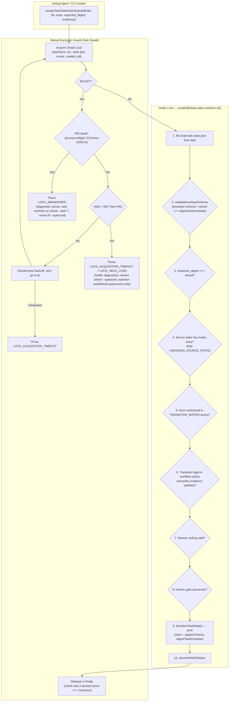
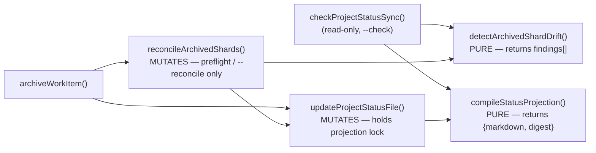

# Software Design Document: Control-Plane State Integrity & Architecture Remediation

## Metadata

- Work Item ID: Issue #277
- Title: Control-Plane State Integrity & Architecture Remediation (Package 1)
- Owner: SA Agent (`sa-architecture-design`)
- Status: Draft (Rework Round 5 — Addressing Maintainer Review #5644601391)
- Date: 2026-09-12
- Governing Requirements: `docs/records/requirements/2026-09-12-control-plane-state-integrity-discovery.md` (AC-001..AC-010, BR-001..BR-005)

---

## Context

Rounds 1–3 established the integrity problems (schema discrepancy, actor bypass, optional CAS, fail-open
projection, non-atomic writes, archival drift). Round 4 (#5644452415) rejected four elements of the
Round 3 design as unsound. This revision replaces them:

1. **Stale-lock takeover was unsound (Round 4 Blocker 1).** The atomic-rename takeover cannot make the
   takeover *conditional on the lock that was observed*. `renameSync(lockPath, reclaimPath)` moves
   whatever occupies the pathname at the instant it runs, so a second reclaimer can move a *replacement*
   owner's live lock out of the canonical path. No `fs`-level primitive available to this runtime gives
   compare-and-remove-by-identity. **Decision: abandon takeover entirely and fail closed** (ADR-0027).
2. **Sole-authority contract model conflicted with canonical policy (Round 4 Blocker 2).** `AGENTS.md`
   and the four `*-workflow.yaml` policies own allowed transitions, evidence and retry budget; the
   Round 3 design declared the envelope the *sole* authority, which both contradicts the Requirement's
   own "decouple domain workflow policies from storage envelope" statement and breaks
   `scripts/validate-contracts.mjs`'s `contract_version` cross-check. **Decision: explicit two-layer
   model** (ADR-0026). The matrix also omitted `completed`/`cancelled`, and the engine skips validation
   entirely when a source-state entry is absent — a silent hole. **Decision: define terminal entries and
   fail closed on unknown source state.**
3. **Repair inside the projection compiler broke the read-only boundary (Round 4 Blocker 3).**
   `checkProjectStatusSync()` calls `compileStatusProjection()`; a repairing compiler makes
   `validate:status-projection` mutate the repository and hide the drift it exists to detect, and
   `updateProjectStatusFile()` → `compileStatusProjection()` → repair → `updateProjectStatusFile()`
   recurses. **Decision: separate pure detection from explicit mutation** (ADR-0029).
4. **Atomic replacement does not serialize the root projection (Round 4 Blocker 4).** Writer atomicity
   prevents torn bytes, not lost updates: a compiler may read shards, pause across an archive, then
   overwrite the newer projection with its own atomically-complete stale content. **Decision: a
   projection-level mutation lock with a declared total lock order** (ADR-0030).

Round 5 (#5644601391) rejected two further elements. This revision replaces them:

5. **The durable envelope advertised workflows it cannot represent (Round 5 Blocker 1).** The envelope
   offers five `workflow_id` values but one fixed 11-state vocabulary, while `new-feature`,
   `config-change` and `data-change` each require states outside it, and no
   `framework-meta-workflow.yaml` exists at all. **Decision: take the review's option 1 — narrow
   Package 1's durable envelope and active-shard enforcement to `bug-fix` only** (ADR-0031). The
   authority rule is simultaneously collapsed to a single statement with no fallback and no
   envelope-only exception.
6. **The shard lock travelled with the directory being archived (Round 5 Blocker 2).**
   `archiveWorkItem()` renames the whole shard directory, so a lock stored inside it moves to
   `archive/{id}`; a release against the original path cannot remove it and the original pathname stops
   serializing anyone. **Decision: move shard locks to a stable, never-renamed namespace,
   `docs/records/work-items/.locks/{task_id}.lock`** (ADR-0027, amended).

---

## Goals / Non-goals

### Goals
- **G-001 (Two-Layer Contract Model — ADR-0026):** `durable-task-envelope.schema.json`
  (`contract_version: 2`) is the sole authority for the **storage envelope**. The four
  `docs/contracts/*-workflow.yaml` policies remain the sole authority for **workflow behaviour**
  (allowed transitions, required evidence, retry budget). Neither layer is deleted; the binding between
  them is made explicit and machine-checked.
- **G-002 (Actor Policy Enforcement & Terminal Closure — AC-003, AC-004, AC-009):** `TRANSITION_MATRIX`
  defines permitted `actors` for all 11 states including terminal `completed`/`cancelled` with empty
  destination sets, and the engine fails closed when a source state has no matrix entry.
- **G-003 (Self-Exclusion JCS Digest & Integrity Verification — ADR-0028):** `digestTaskEnvelope(envelope)`
  copies, deletes top-level `state_digest`, and calls RFC 8785 `digestJcs()`. `stored === computed` is
  enforced on load, transition and resume.
- **G-004 (Fail-Closed Shard Locking — ADR-0027):** One lock per task at the stable path
  `docs/records/work-items/.locks/{task_id}.lock` — never inside the shard directory — via `openSync('wx')` holding
  `{pid, nonce, created_at}`. **No automatic takeover.** An abandoned lock is a refusal with a named
  recovery command, not something the engine clears on its own.
- **G-005 (Crash-Durable Atomic Writer with Cleanup):** `atomicWriteFileSync` with collision-safe `wx`
  temp files, write-completion loops, failure cleanup, `fsyncSync`, atomic rename, directory sync.
- **G-006 (Pure Projection, Explicit Repair — ADR-0029):** `compileStatusProjection()` and
  `detectArchivedShardDrift()` are pure. Repair lives only in `reconcileArchivedShards()`, reachable
  only from archival preflight and an explicit `--reconcile` flag. `--check` writes zero bytes.
- **G-007 (Projection Transaction — ADR-0030):** `PROJECT_STATUS.md` mutation is serialized by a
  projection-level lock; active shards are re-read *after* the lock is held. Total lock order is
  shard lock → projection lock, never inverted.

### Non-goals
- **NG-001:** Cryptographic agent identity authentication (caller-declared role policy only).
- **NG-002:** Unbacked numeric NFR targets.
- **NG-003:** External database engines or distributed consensus.
- **NG-004:** Automatic recovery from abandoned locks (explicitly rejected — see ADR-0027).

---

## Architecture Overview

### 1. Hardened State Mutation Lifecycle (Fail-Closed Locking)



### 2. Projection Call Graph (Acyclic, One-Directional)



**Invariant:** no node reachable from `compileStatusProjection()` or `detectArchivedShardDrift()`
writes to the filesystem. `reconcileArchivedShards()` calls `updateProjectStatusFile()` exactly once and
`updateProjectStatusFile()` never calls back into reconciliation — the graph has no cycle.

---

## Component Design

### Component 1: Two-Layer Contract Model (ADR-0026)

- **Files:** `docs/contracts/schemas/durable-task-envelope.schema.json`, `docs/contracts/*-workflow.yaml`,
  `scripts/lib/task-state-machine.mjs`, `scripts/validate-contracts.mjs`, `AGENTS.md`.

| Layer | Authority | Owns | Version field |
|---|---|---|---|
| **Storage envelope** | `docs/contracts/schemas/durable-task-envelope.schema.json` | File shape: `task_id`, `workflow_id` (**narrowed to `bug-fix` only** — see ADR-0031), a `state` enum that is a **superset** of the `bug-fix` policy's states (it retains `designing`/`planning`, which that policy does not use; the intersection rule, not the enum, does the narrowing), `sequence_number >= 1`, 64-hex `state_digest`, history record shape | `contract_version: 2` (const) |
| **Actor policy** | `TRANSITION_MATRIX.actors` in `scripts/lib/task-state-machine.mjs`, against `ROLE_REGISTRY` | Which declared role may act from a given source state (repo-wide, workflow-independent) | n/a — code, covered by parity test |
| **Workflow behaviour** | `docs/contracts/{bug-fix,new-feature,config-change,data-change}-workflow.yaml` | Which transitions are legal *for this workflow*, required evidence per transition, `max_rework_attempts`, terminal requirements | `contract_version: 1` (unchanged) |

- **Explicit binding.** The envelope gains one new required integer property,
  `policy_contract_version`, recording which policy version the shard was written against.
  `scripts/validate-contracts.mjs:243` stops comparing `state.contract_version` against
  `policy.contract_version` — those now version two different things — and compares
  `state.policy_contract_version` instead. This is the minimum validator change that lets a shard be
  `contract_version: 2` while its governing policy remains `contract_version: 1`.
- **The authority rule (stated once, no exceptions).** A transition is permitted **if and only if** the
  destination appears in **both** `TRANSITION_MATRIX[from].destinations` **and** the workflow policy's
  `transitions` list for the shard's `workflow_id`, and the evidence keys listed on **that policy row**
  are all present. There is no matrix fallback for policy-silent transitions, no envelope-only
  allowlist, and no exception contract. The matrix's `requires` is a design-time authoring aid only and
  is never consulted at validation time; if the matrix and a policy disagree, the narrower of the two
  wins by construction, because legality is an intersection. An unknown `workflow_id`, an unknown source
  state, or a policy-silent transition all fail closed. *This sentence is the sole statement of the rule
  in the artifact set; QA's TC-024 must be brought into line with it by its owner.*
- **Policy amendment required (additive, no version bump).** `bug-fix-workflow.yaml` today has neither
  a `completed` state nor a `handoff -> completed` transition, so Task 9a's migration of issue-249 /
  issue-275 is illegal under the current policy. The policy gains `completed` and `cancelled` to its
  `states` list and a `handoff -> completed` transition requiring `closeout_evidence`. This is purely
  additive: every existing example under `docs/contracts/examples/` stays valid and `contract_version`
  stays `1`, so no fixture migration is triggered. *Rejected alternative:* bumping every policy to
  `contract_version: 2`, which would force migration of every example fixture in that lane for no
  behavioural gain.
- **`cancelled` has no ingress in Package 1 — stated deliberately.** Under the authority rule above, a
  transition is legal only if the policy enumerates it, and `bug-fix-workflow.yaml` enumerates no
  `-> cancelled` row. `cancelled` is therefore a valid *storage* state and a declared terminal in the
  matrix, but is **unreachable by transition** in Package 1. No wildcard (`<any> -> cancelled`) is
  introduced, because the validator performs exact `from -> to` lookup and has no wildcard semantics;
  inventing one is out of Package 1's scope. Any future cancellation path must be added as enumerated
  source rows in the policy, each carrying `cancellation_reason` in its `requires`.
- **Package 1 composable scope: `bug-fix` only (ADR-0031).** The envelope's `workflow_id` enum is
  narrowed from five values to `["bug-fix"]`, and `change_type` correspondingly to `["bug-fix"]`, so the
  envelope advertises exactly the one workflow whose state vocabulary it can represent. Both live active
  shards (`issue-249`, `issue-275`) are already `bug-fix`, so the narrowing migrates nothing. Task 8b's
  strict active-shard validation lane consequently enforces `bug-fix` alone. **Consequence, stated so
  nobody rediscovers it as a bug:** `new-feature`, `config-change`, `data-change` and `framework-meta`
  have **no durable shard** in Package 1 — including Issue #277 itself, which is `framework-meta`. They
  continue to be governed by their `*-workflow.yaml` policies and the existing example lane, and any
  attempt to write a durable envelope for them hits the fail-closed unknown-`workflow_id` path by
  design, not by accident. Extending the envelope to a second workflow is a separate package whose
  entry condition is a canonical policy for that workflow (`framework-meta` has none today) plus a
  policy-aware state vocabulary.
  - *Rejected alternative:* make state validation policy-aware and author a canonical policy for all
    five advertised workflows. Rejected because it requires inventing a `framework-meta-workflow.yaml`
    that no approved requirement derives, it replaces one fixed vocabulary with a per-workflow one
    across the engine, the schema and the validator inside a package already carrying four blockers, and
    it widens the blast radius of every remaining control to four workflows that have no durable shard
    to protect. Package 1's job is integrity of what exists, not reach.
  - **Test surface.** The active-envelope composition lane is `bug-fix` only and must exercise the real
    active-shard path, not the `docs/contracts/examples/` lane — `loadSchemas()` in
    `scripts/validate-contracts.mjs` deliberately keeps durable envelopes out of that lane, so example
    fixtures cannot detect a composition failure. A negative case must assert that every non-`bug-fix`
    `workflow_id` is rejected by the envelope schema.
- **AGENTS.md** gains a clarifying sentence next to the Bug Fix policy paragraph (L274-276) stating that
  the policy owns transitions, evidence and retry budget while the durable envelope owns storage shape,
  so the two statements can no longer be read as competing claims of sole authority.

### Component 2: Actor Matrix Completion & Fail-Closed Source State (AC-009)

- `TRANSITION_MATRIX` gains the two missing terminal entries:

```javascript
completed:  { destinations: [], requires: [], actors: [] },
cancelled:  { destinations: [], requires: [], actors: [] }
```

- **`investigating.destinations` gains `implementing` — the matrix is what gives.**
  `TRANSITION_MATRIX.investigating.destinations` is today
  `['designing', 'planning', 'blocked', 'cancelled']` (`scripts/lib/task-state-machine.mjs:49-53`), while
  `bug-fix-workflow.yaml:7` carries `{ from: investigating, to: implementing }`. Under the authority
  rule the intersection at that hop is **empty**, which severs the bug-fix happy path at its second
  transition — a defect the Round 5 review did not name and which strict intersection *created*, not
  revealed. The matrix entry becomes
  `['implementing', 'designing', 'planning', 'blocked', 'cancelled']`.
  *Why the matrix and not the policy:* `AGENTS.md` names the `*-workflow.yaml` policy canonical for
  workflow behaviour, and Component 1 already defines the matrix/envelope layer as a **superset** that
  the policy intersection narrows. A superset that omits a state the canonical policy requires is simply
  wrong as a superset; widening it changes no workflow's legality except where a policy already
  authorized the hop. *Rejected alternative 1:* amend `bug-fix-workflow.yaml` to route
  `investigating -> designing -> planning -> implementing`. Rejected because it rewrites canonical
  workflow behaviour to accommodate an implementation detail, and would force existing
  `docs/contracts/examples/bug-fix-*.yaml` fixtures through a migration for no behavioural gain.
  *Rejected alternative 2:* weaken the intersection — make the policy solely authoritative for legality
  and demote the matrix to actors only. Rejected because the matrix is the only repo-wide, workflow-
  independent floor on reachability, and because Round 5 Blocker 1 required exactly one authority rule
  stated once; relaxing it here would reintroduce the per-hop exception the blocker rejected.
- **Guard against silent recurrence.** Task 3 must include a test that enumerates **every** row of every
  `*-workflow.yaml` in scope and asserts the matrix ∩ policy intersection is non-empty for each source
  state and contains each policy destination. An empty intersection is a build failure, not a runtime
  surprise; this is the only check that would have caught the `investigating` hop before implementation.
- `blocked.destinations` is written out explicitly as every state except `blocked` itself, replacing the
  `STATES` reference, so that a future state added to `STATES` is not silently reachable from `blocked`.
- The engine's `if (matrixEntry) { ... }` guard (currently `scripts/lib/task-state-machine.mjs:260-294`)
  is inverted to fail closed:

```javascript
const matrixEntry = TRANSITION_MATRIX[fromState];
if (!matrixEntry) {
  const error = new Error(`No transition rule defined for source state '${fromState}'.`);
  error.code = 'UNKNOWN_SOURCE_STATE';
  error.status = 'REJECTED';
  throw error;
}
```

  With empty `destinations`, any outgoing transition from `completed` or `cancelled` now fails
  `ILLEGAL_TRANSITION_REJECTED` rather than skipping matrix validation entirely.
- The existing evidence bypass `if (to !== 'blocked' && to !== 'cancelled' && matrixEntry.requires)`
  is **deleted outright** rather than narrowed. Evidence is sourced from the policy row per the
  authority rule, and `bug-fix-workflow.yaml` already carries `requires: [stop_reason]` on every
  `-> blocked` row, so `blocked` is covered by the ordinary path with no special case. `cancelled` has
  no policy row and so cannot be reached at all (see Component 1); there is no terminal that can be
  entered with no evidence.

### Component 3: Self-Excluding Task Envelope Hasher (ADR-0028)

- **Files:** `scripts/lib/task-state-machine.mjs`, `scripts/lib/status-jcs.mjs`

```javascript
export function digestTaskEnvelope(envelope) {
  if (!envelope || typeof envelope !== 'object') {
    throw new Error('Invalid envelope object for digestion');
  }
  const normalized = { ...envelope };
  delete normalized.state_digest;
  return digestJcs(normalized);
}
```

- `validateEnvelopeSchema(data)`: (1) Ajv-validate against the envelope schema; (2) compute
  `expected = digestTaskEnvelope(data)`; (3) require `data.state_digest === expected`, else throw
  `DIGEST_INTEGRITY_MISMATCH` carrying both `stored_digest` and `recomputed_digest`. The caller's object
  is never mutated.

### Component 4: Fail-Closed Per-Shard Lock (ADR-0027)

- **Files:** `scripts/lib/task-state-machine.mjs`, `scripts/task-machine-cli.mjs`,
  `scripts/compile-status-projection.mjs`
- **Lock location — a stable namespace, never inside the shard (ADR-0027, amended).** The shard lock is
  `docs/records/work-items/.locks/{task_id}.lock`, created with `mkdirSync(recursive)` on first use.
  It is deliberately **not** `work-items/{task_id}/.lock`: `archiveWorkItem()` renames the entire shard
  directory, which would carry a live lock into `archive/{task_id}` where the owner's release against
  the original path cannot remove it, and would free the original pathname to be reacquired mid-archive.
  Every surface — `acquire`, `release`, `inspect`, `unlock`, and cleanup — addresses this one namespace,
  and the lock pathname is therefore invariant across the archive transaction.
- **Explicit projection exclusion.** `discoverActiveShards()` in `scripts/compile-status-projection.mjs`
  enumerates `docs/records/work-items/*`. Before Task 8b's strict active-shard lane can reject any
  directory lacking a valid `task-state.json`, that enumeration **must** skip every entry whose name
  begins with `.`, and must do so *before* the shard-validity check, not as part of it. This is
  provably non-lossy rather than a heuristic: the envelope schema constrains `task_id` to
  `^[a-z0-9_-]+$`, so no legitimate shard directory can ever be dot-prefixed. The same single rule
  covers `.locks/`, the existing `.gitkeep`, and ADR-0030's `.projection.lock`. The two locks do not
  collide: the projection lock is a **file** at `docs/records/work-items/.projection.lock`, the shard
  locks are files **inside** the `docs/records/work-items/.locks/` **directory**; `.locks` is a reserved
  name that no `task_id` can produce, and neither path is ever a shard.
- **Lock content:** `{ "pid": 12345, "nonce": "<uuid-v4>", "created_at": 1789188000000 }`
- **Acquisition:**
  1. `openSync(lockPath, 'wx')`. On success write the payload and return `nonce`.
  2. On `EEXIST`, read the lock and classify the holder. The classification has **three** outcomes, not
     two, and liveness dominates age (Round 5 Blocker 4):
     - **Young and live** (`created_at` within 30 s and `process.kill(pid, 0)` succeeds): back off with
       randomized jitter and retry for up to 5 s, then throw `LOCK_ACQUISITION_TIMEOUT`.
     - **Old but live** (older than 30 s, `process.kill(pid, 0)` succeeds): throw
       `LOCK_ACQUISITION_TIMEOUT` **with holder diagnostics** (`pid`, `nonce`, `created_at`, age) and a
       `LOCK_HELD_LONG` advisory in the message. The message still names the recovery command
       `node scripts/task-machine-cli.mjs unlock --task <task_id> --nonce <observed-nonce> --quiesced`,
       explicitly marked as available only once the operator can establish quiescence — this tier is the
       permanent-wedge case (a holder that died off-host whose PID number is coincidentally live here),
       so it must never be a dead end. Age alone is **not** an abandonment classifier: a live slow
       holder must never be *automatically* routed into a destructive path (see *Recovery surface*).
     - **Dead PID** (`process.kill(pid, 0)` throws `ESRCH`), at any age: **do not touch it.** Throw
       `LOCK_ABANDONED`, carrying the holder's `pid`, `nonce` and `created_at`, and a message naming the
       exact recovery command:
       `node scripts/task-machine-cli.mjs unlock --task <task_id> --nonce <observed-nonce> --quiesced`.
  3. The asymmetry is deliberate and conservative. A live PID is **not** proof the original holder is
     alive (PID reuse), but treating a live PID as "not abandoned" can only ever *withhold* recovery,
     never authorize a wrong removal — it narrows what enters the destructive path and so cannot
     introduce a new integrity case. Conversely `ESRCH` on a local-first, single-host workspace is
     strong evidence the holder is gone. A lock written by a process that died elsewhere and whose PID
     is coincidentally live locally is therefore never auto-classified as abandoned; it surfaces
     permanently as `LOCK_ACQUISITION_TIMEOUT` + `LOCK_HELD_LONG`, which is the diagnostic tier that
     still names `unlock` for an operator who can establish quiescence. Availability cost, not a
     correctness gap (SEC-003).
- **Recovery surface — `unlock` is a maintenance-only operation requiring explicit quiescence
  (ADR-0027, amended Round 5).** `unlock` is the only path other than owner release that removes a
  lock, and it is **not race-safe**. It reads the lock, compares the operator-supplied nonce, and
  unlinks; nothing in Node's `fs` API makes that unlink conditional on the bytes just read, so a holder
  that releases and a new holder that acquires between the read and the unlink will have the
  *replacement* lock removed. The `wx` sentinel asserted in Round 4 is withdrawn: it was never given a
  pathname, no acquire or release path was ever required to honour it, and a sentinel that every path
  must honour is itself an unreclaimable lock — the same problem one level down (see *Why not a
  sentinel*).
  - `unlock` therefore requires an explicit `--quiesced` flag. The operator asserts that no agent, CLI
    invocation or CI job is mutating the named task. The CLI prints the holder record and the
    consequence of a wrong assertion before acting, and the refusal that names `unlock` says
    "maintenance command — run only when the task is quiesced."
  - Nonce verification is retained as a **mistake filter, not a safety property**: `unlock` refuses with
    `LOCK_NONCE_MISMATCH` when the supplied nonce does not match the lock on disk, which catches the
    common operator error of acting on a stale `inspect` reading. It does not close the check/unlink
    window and is not claimed to.
  - **Why this is acceptable.** The CAS check is unconditional and lock-independent: step 5 of
    `mutateTaskStateOnDisk` (Component 9) compares `expected_digest` against the freshly-read
    `state_digest` inside the critical section regardless of how the lock was obtained. A wrong
    quiescence judgement therefore degrades to a detected `CAS_CONFLICT` (or `DIGEST_INTEGRITY_MISMATCH`
    on a torn read) in the process whose lock was removed — a loud, rejected mutation — rather than a
    silent lost update. `unlock` can cost availability and an aborted transition; it cannot silently
    corrupt a shard.
  - `inspect` prints the holder and the shard's current digest without mutating anything, and is the
    supported read-only path; it carries no quiescence requirement.
- **Why not a sentinel (rejected route).** The alternative was a lock-management sentinel — a second
  `wx` file that `acquire`, `release` and `unlock` all take before touching the primary lock — which
  would genuinely close the check/unlink window. It was rejected: the sentinel has the identical
  abandonment problem as the lock it protects (a SIGKILL between sentinel acquire and release wedges the
  lock-management path itself, with no recovery command that is not recursive), it puts a second
  mandatory `wx` round-trip in the hot path of every ordinary transition to protect a rare manual
  operation, and it expands Package 1's concurrency implementation surface at the exact point Round 4
  showed reasoning about `fs` interleavings to be error-prone. Maintenance-only `unlock` obtains the
  same integrity outcome by removing the claim rather than the window, and leans on the unconditional
  CAS that already exists.
- **Release:** read `.locks/{task_id}.lock`; unlink only when `parsed.nonce === myNonce`. Always in a
  `finally`. Because the pathname never moves, the release in `finally` refers to the same file the
  acquisition created, including on the archive path where the shard directory itself has been renamed.
- **Why not takeover.** Every automatic-reclaim variant reachable from Node's `fs` API — rename, unlink,
  hardlink-and-compare — leaves a window between deciding the observed lock is stale and removing it,
  during which a different process may have become the legitimate owner of that pathname. Round 4's
  interleaving is one instance of a class, not a bug in one sequence. Refusing is the only formulation
  where "a live lock is never removed by another *engine* process" holds by construction. That property
  is scoped to engine paths only: the operator `unlock` of ADR-0027's amended recovery surface **is** a
  reclaim path and is **not** race-safe. The unqualified Round 4 phrasing is withdrawn.
- **Blast radius (accepted, documented).** A SIGKILL inside the critical section leaves that one work
  item unable to transition until an operator runs `unlock`. The critical section is
  read → validate → compute → write with no network and no waits, typically single-digit milliseconds,
  so the exposure window is small and the failure is loud, diagnosed, and local to one shard.

### Component 5: Crash-Durable POSIX Atomic Writer

- **Files:** `scripts/lib/task-state-machine.mjs`, `scripts/compile-status-projection.mjs`

```javascript
export function atomicWriteFileSync(targetPath, content) {
  // A zero-return from writeSync makes no progress; looping on it spins forever.
  // It is a fault, not a retry condition — throw and let the catch block clean up the temp file.
  const resolved = path.resolve(targetPath);
  const dir = path.dirname(resolved);
  if (!fs.existsSync(dir)) fs.mkdirSync(dir, { recursive: true });
  const baseName = path.basename(resolved);
  const tmpPath = path.join(dir, `.tmp-${baseName}-${process.pid}-${Date.now()}-${Math.random().toString(36).slice(2, 8)}`);

  let fd;
  try {
    fd = fs.openSync(tmpPath, 'wx');
    const buffer = Buffer.from(content, 'utf8');
    let written = 0;
    while (written < buffer.length) {
      const n = fs.writeSync(fd, buffer, written, buffer.length - written);
      if (n <= 0) {
        const err = new Error(`Zero-progress write to ${tmpPath} after ${written}/${buffer.length} bytes.`);
        err.code = 'ATOMIC_WRITE_NO_PROGRESS';
        throw err;
      }
      written += n;
    }
    fs.fsyncSync(fd);
  } catch (err) {
    if (fd !== undefined) { try { fs.closeSync(fd); } catch {} }
    try { fs.unlinkSync(tmpPath); } catch {}
    throw err;
  } finally {
    if (fd !== undefined) { try { fs.closeSync(fd); } catch {} }
  }

  try {
    fs.renameSync(tmpPath, resolved);
  } catch (err) {
    try { fs.unlinkSync(tmpPath); } catch {}
    throw err;
  }

  let dirFd;
  try {
    dirFd = fs.openSync(dir, 'r');
    fs.fsyncSync(dirFd);
  } finally {
    if (dirFd !== undefined) { try { fs.closeSync(dirFd); } catch {} }
  }
}
```

### Component 6: Pure Projection, Explicit Repair (ADR-0029)

- **Files:** `scripts/compile-status-projection.mjs`, `scripts/archive-work-item.mjs`

| Function | Purity | Callers |
|---|---|---|
| `compileStatusProjection(rootDir)` | **Pure.** Reads shards through `validateEnvelopeSchema`, returns `{markdown, digest}`. Throws `MALFORMED_SHARD` on any invalid shard. Writes nothing. | `updateProjectStatusFile`, `checkProjectStatusSync` |
| `detectArchivedShardDrift(rootDir)` | **Pure.** Returns `{ drifted: boolean, findings: [...] }` — archived shards still named in `PROJECT_STATUS.md`, terminal shards still in `work-items/`. Writes nothing. | `checkProjectStatusSync`, `reconcileArchivedShards` |
| `reconcileArchivedShards(rootDir)` | **Mutating.** Calls `detectArchivedShardDrift`, then `updateProjectStatusFile` once. | `archiveWorkItem` preflight, and `compile-status-projection.mjs --reconcile` only |
| `updateProjectStatusFile(rootDir)` | **Mutating.** Holds the projection lock, compiles fresh under it, atomic-writes. Never calls reconciliation. | above |

- **Sequencing: the operational migration precedes this component (affirmed).** `compileStatusProjection()`
  reads every active shard through `validateEnvelopeSchema` and throws `MALFORMED_SHARD` on any invalid
  one, and `npm run validate:status-projection` runs `--check` against the real
  `docs/records/work-items/*/task-state.json`, both of which are `contract_version: 1` today with no
  `policy_contract_version` and no `sequence_number`. This component's own verification therefore
  **cannot** pass before the shards are migrated. I affirm the Developer Agent's reordering: the backfill
  tool and the operational backfill + terminal hops (plan steps 8a, then 9a) run **before** this
  component; the archival step (9b) still follows the projection lock and archival compensation, because
  compensation does not exist until then; the strict active-shard lane (8b) is enabled last. Making the
  compiler lenient toward v1 shards to preserve the original task order was considered and rejected: a
  fail-open compiler is the defect AC-008 and ADR-0029 exist to remove, and a temporary leniency flag
  would have to be removed by a later task with no test able to prove it was.
- **`--check` is read-only by contract.** `checkProjectStatusSync()` calls only the two pure functions.
  On drift it returns `inSync: false` with a `recovery` field naming
  `npm run compile:status-projection -- --reconcile`, and the CLI exits 1. It must never repair, because
  a repairing check hides exactly the drift CI exists to catch.

### Component 7: Projection Transaction & Lock Order (ADR-0030)

- **Files:** `scripts/compile-status-projection.mjs`, `scripts/archive-work-item.mjs`

- **Problem.** Atomic replacement stops torn bytes, not lost updates. Compiler C reads active shards,
  archiver A then moves a shard and rewrites `PROJECT_STATUS.md`, and C finally writes its stale but
  atomically-complete content — recreating the ghost entry AC-008 exists to eliminate.
- **Control.** A repository-level projection lock at `docs/records/work-items/.projection.lock`, using
  the same `{pid, nonce, created_at}` payload and the same fail-closed policy as the shard lock.
  `updateProjectStatusFile()` becomes: acquire projection lock → **then** `compileStatusProjection()`,
  re-reading shards fresh → `atomicWriteFileSync` → release in `finally`. Compiling before acquiring is
  precisely the defect, so the ordering is normative, not incidental.
- **Total lock order:** **shard lock → projection lock.** No code path may acquire a shard lock while
  holding the projection lock. `archiveWorkItem()` therefore: acquires the shard lock, reconciles and
  moves the shard directory, then acquires the projection lock inside `updateProjectStatusFile()`,
  releases the projection lock, and releases the shard lock last. Because acquisition is strictly
  ordered and each lock has a bounded timeout, no cycle of waiters can form. Releasing the shard lock
  last is only meaningful because the shard lock lives at `work-items/.locks/{task_id}.lock` and the
  archive rename therefore does not move it (Component 4); with an in-shard lock the final release would
  target a pathname whose file had already been carried into `archive/{task_id}`.
- **Same fail-closed policy, wider blast radius — stated deliberately.** An abandoned projection lock
  blocks every status update including CI, not one work item. It gets the same policy because an
  automatic clear here is the same unsound primitive as in ADR-0027, and a wrong automatic clear here
  corrupts the repository-wide projection rather than one shard. The compensations are that the
  projection critical section is shorter than a shard transition (compile + one write, no user input),
  that `LOCK_ABANDONED` from the projection lock names
  `task-machine-cli unlock --projection --nonce <observed-nonce> --quiesced`, and that
  the diagnostic is emitted by every validator that touches the projection, so it cannot go unnoticed.

### Component 8: Transactional Archival (ADR-0029)

- `archiveWorkItem(issueId)`: preflight `reconcileArchivedShards()` → move `work-items/{id}` to
  `archive/{id}` → call `updateProjectStatusFile()`. If the update throws, a compensating rename moves
  the shard back to `work-items/{id}` and the call throws `ARCHIVE_RECONCILIATION_FAILED`. If the
  compensating rename itself fails, the original error is rethrown with `compensation_failed: true` so
  the operator is told the repository needs manual reconciliation rather than being told a clean lie.
- **Lock invariant across the transaction.** `renameSync(work-items/{id}, archive/{id})` moves no lock,
  because no lock is stored under either path. The success path, the compensating-rename path, and the
  compensation-failure path all end with exactly one release, of
  `work-items/.locks/{id}.lock`, and must leave no file at that path, at `work-items/{id}/.lock`, or at
  `archive/{id}/.lock`. Barrier tests must prove that a mutation and an archive of the same shard cannot
  overlap, and must assert all three pathnames are absent on each of the three exit paths.

### Component 9: Disk-Bound Mutation Wrapper

- **Files:** `scripts/lib/task-state-machine.mjs`, `scripts/task-machine-cli.mjs`
- `transitionTaskState(currentState, ...)` is and stays **pure** — it has no path and cannot re-read a
  shard. The disk-bound critical section is a distinct exported function:

```javascript
export function mutateTaskStateOnDisk(shardPath, { to, actor, expected_digest, evidence, mode = 'transition' }) {
  // 0. task_id = read from the shard envelope, NOT derived from shardPath
  // 1. acquireShardLock(rootDir, task_id)      -> nonce | LOCK_ABANDONED | LOCK_ACQUISITION_TIMEOUT
  //    resolves to rootDir/docs/records/work-items/.locks/{task_id}.lock
  // 2. read shardPath from disk                 (inside try)
  // 3. validateEnvelopeSchema(current)          -> MALFORMED_SHARD | DIGEST_INTEGRITY_MISMATCH
  // 4. require non-empty expected_digest        -> MISSING_EXPECTED_DIGEST
  // 5. expected_digest === current.state_digest -> CAS_CONFLICT {current_digest, expected_digest}
  // 6. next = mode === 'resume' ? resumeTaskState(current, ...) : transitionTaskState(current, ...)
  // 7. atomicWriteFileSync(shardPath, JSON.stringify(next, null, 2) + '\n')
  // 8. finally releaseShardLock(rootDir, task_id, nonce)
}
```

  CLI `transition` and `resume` call **only** this wrapper; no CLI path reaches the pure functions
  directly. Steps 2–7 are the entire critical section.
- **The lock API is keyed by `task_id`, never by a directory path.** `acquireShardLock`,
  `releaseShardLock`, `inspect` and `unlock` all take `(rootDir, task_id)`. Deriving the lock path from
  `shardDir` would reintroduce Round 5 Blocker 2 at the API seam: on the archive path `shardDir` has
  already been renamed to `archive/{task_id}`, so a path-derived release would compute a different file
  from the one acquisition created.

---

## Architectural Decisions (ADRs)

- **ADR-0026: Two-Layer Contract Model — Durable Envelope v2 over Workflow Policy v1**
  - *Context:* The envelope schema and the `*-workflow.yaml` policies both claimed authority; `AGENTS.md`
    names the policy canonical for states, transitions, evidence and retry budget, while
    `validate-contracts.mjs` cross-checks a single `contract_version` across both.
  - *Decision:* Layer them. The envelope owns storage shape at `contract_version: 2`; the policies keep
    owning workflow behaviour at `contract_version: 1`; the envelope records `policy_contract_version`
    and the validator cross-checks that field instead. Legality is the intersection of matrix and policy;
    evidence comes from the policy. `AGENTS.md` is amended to state the split.
  - *Status:* Proposed (Pending Maintainer Approval).
- **ADR-0027: Fail-Closed Shard Locking with Explicit Operator Recovery**
  - *Context:* Automatic stale-lock reclamation cannot be made conditional on the observed lock with the
    primitives available; Round 4 demonstrated an interleaving where a reclaimer moves a live
    replacement lock out of the canonical path.
  - *Decision:* Never reclaim automatically. Staleness and dead PIDs become diagnostics. An abandoned
    lock raises `LOCK_ABANDONED` naming an explicit `unlock` command that verifies the nonce. Supersedes
    the Round 3 atomic-rename takeover design in full.
  - *Amendment (Round 5, Blocker 2):* shard locks live at `docs/records/work-items/.locks/{task_id}.lock`,
    a stable namespace outside the shard directory, so the archive rename cannot move a live lock; and
    `discoverActiveShards()` must skip dot-prefixed entries before any shard-validity check, which is
    non-lossy because `task_id` is constrained to `^[a-z0-9_-]+$`.
  - *Amendment (Round 5, Blocker 4 — lock-recovery protocol):* two changes, owned by Security Reviewer.
    (a) **Abandonment is classified by dead PID only.** The previous predicate — old **or** dead PID —
    routed a live but slow holder into a destructive recovery path. Age becomes a diagnostic tier
    (`LOCK_ACQUISITION_TIMEOUT` + `LOCK_HELD_LONG`) and never a classifier. (b) **`unlock` is defined as
    a maintenance-only operation requiring explicit operator quiescence (`--quiesced`)**, and the Round 4
    claim that nonce verification makes it race-safe — including the undefined "`wx` sentinel" — is
    **withdrawn in full, not softened**. Nonce verification is retained only as an operator-mistake
    filter. The rejected alternative was a lock-management sentinel honoured by every acquire, release
    and unlock path; it was rejected because the sentinel reproduces the abandonment problem one level
    down, taxes every ordinary transition to protect a rare manual operation, and enlarges the
    concurrency surface. Integrity is preserved not by the lock but by the unconditional CAS in
    Component 9, which turns a wrong quiescence judgement into a detected `CAS_CONFLICT` rather than a
    lost update.
  - *Status:* Proposed (Pending Maintainer Approval).
- **ADR-0028: Self-Excluding RFC 8785 JCS Task Envelope Hashing**
  - *Context:* Hashing an envelope including `state_digest` is circular.
  - *Decision:* `digestTaskEnvelope()` excludes the top-level `state_digest` before `digestJcs()`;
    `stored === computed` is verified on load, transition and resume.
  - *Status:* Proposed (Pending Maintainer Approval).
- **ADR-0029: Pure Projection with Explicit Repair and Compensated Archival**
  - *Context:* Putting repair inside `compileStatusProjection()` makes `validate:status-projection`
    mutate the repository, hides drift, and recurses through `updateProjectStatusFile()`.
  - *Decision:* `compileStatusProjection()` and `detectArchivedShardDrift()` are pure; repair lives only
    in `reconcileArchivedShards()`, reachable from archival preflight and `--reconcile`. `--check` writes
    zero bytes and exits 1 with a named recovery command. Archival compensates on failure.
  - *Status:* Proposed (Pending Maintainer Approval).
- **ADR-0030: Projection Mutation Lock and Total Lock Order**
  - *Context:* Atomic replacement of `PROJECT_STATUS.md` does not serialize read-compile-write, so a
    slow compiler can overwrite a newer post-archive projection with stale content.
  - *Decision:* Serialize projection mutation behind `.projection.lock`; recompile shards only after the
    lock is held; declare the total order shard lock → projection lock and forbid inversion; apply the
    ADR-0027 fail-closed abandonment policy with its wider blast radius stated and justified.
  - *Status:* Proposed (Pending Maintainer Approval).
- **ADR-0031: Package 1 Durable Envelope Scoped to `bug-fix`, Single Authority Rule**
  - *Context:* The envelope advertised five `workflow_id` values against one fixed 11-state vocabulary
    that three of them contradict, and a fifth (`framework-meta`) has no canonical policy at all. The
    authority rule was simultaneously stated three ways — strict intersection, a matrix fallback for
    policy-silent transitions, and an envelope-only allowlist in QA TC-024 — which are mutually
    unreachable.
  - *Decision:* Narrow the durable envelope and the active-shard enforcement lane to `bug-fix` for
    Package 1, and state the authority rule exactly once as a strict intersection of matrix and policy
    with policy-sourced evidence, no fallback and no exception contract. A policy-aware vocabulary over
    all five workflows is deferred to a later package with a canonical policy per workflow as its entry
    condition.
  - *Status:* Proposed (Pending Maintainer Approval).
