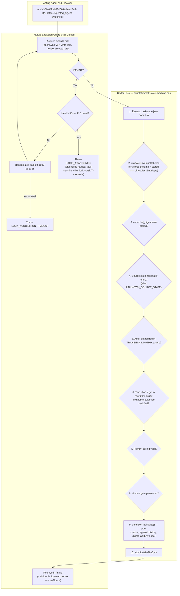
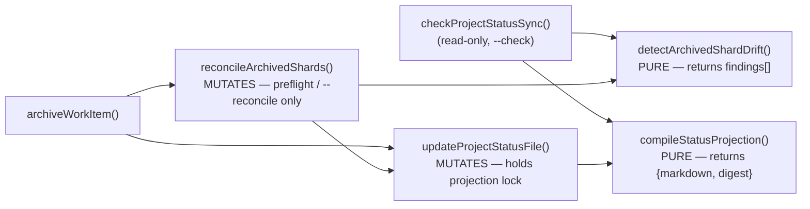

# Software Design Document: Control-Plane State Integrity & Architecture Remediation

## Metadata

- Work Item ID: Issue #277
- Title: Control-Plane State Integrity & Architecture Remediation (Package 1)
- Owner: SA Agent (`sa-architecture-design`)
- Status: Draft (Rework Round 4 — Addressing Maintainer Review #5644452415)
- Date: 2026-09-12
- Governing Requirements: `docs/records/requirements/2026-09-12-control-plane-state-integrity-discovery.md` (AC-001..AC-010, BR-001..BR-005)

---

## Context

Rounds 1–3 established the integrity problems (schema discrepancy, actor bypass, optional CAS, fail-open
projection, non-atomic writes, archival drift). Round 4 (#5644452415) rejected four elements of the
Round 3 design as unsound. This revision replaces them:

1. **Stale-lock takeover was unsound (Round 4 Blocker 1).** The atomic-rename takeover cannot make the
   takeover *conditional on the lock that was observed*. `renameSync(lockPath, reclaimPath)` moves
   whatever occupies the pathname at the instant it runs, so a second reclaimer can move a *replacement*
   owner's live lock out of the canonical path. No `fs`-level primitive available to this runtime gives
   compare-and-remove-by-identity. **Decision: abandon takeover entirely and fail closed** (ADR-0027).
2. **Sole-authority contract model conflicted with canonical policy (Round 4 Blocker 2).** `AGENTS.md`
   and the four `*-workflow.yaml` policies own allowed transitions, evidence and retry budget; the
   Round 3 design declared the envelope the *sole* authority, which both contradicts the Requirement's
   own "decouple domain workflow policies from storage envelope" statement and breaks
   `scripts/validate-contracts.mjs`'s `contract_version` cross-check. **Decision: explicit two-layer
   model** (ADR-0026). The matrix also omitted `completed`/`cancelled`, and the engine skips validation
   entirely when a source-state entry is absent — a silent hole. **Decision: define terminal entries and
   fail closed on unknown source state.**
3. **Repair inside the projection compiler broke the read-only boundary (Round 4 Blocker 3).**
   `checkProjectStatusSync()` calls `compileStatusProjection()`; a repairing compiler makes
   `validate:status-projection` mutate the repository and hide the drift it exists to detect, and
   `updateProjectStatusFile()` → `compileStatusProjection()` → repair → `updateProjectStatusFile()`
   recurses. **Decision: separate pure detection from explicit mutation** (ADR-0029).
4. **Atomic replacement does not serialize the root projection (Round 4 Blocker 4).** Writer atomicity
   prevents torn bytes, not lost updates: a compiler may read shards, pause across an archive, then
   overwrite the newer projection with its own atomically-complete stale content. **Decision: a
   projection-level mutation lock with a declared total lock order** (ADR-0030).

---

## Goals / Non-goals

### Goals
- **G-001 (Two-Layer Contract Model — ADR-0026):** `durable-task-envelope.schema.json`
  (`contract_version: 2`) is the sole authority for the **storage envelope**. The four
  `docs/contracts/*-workflow.yaml` policies remain the sole authority for **workflow behaviour**
  (allowed transitions, required evidence, retry budget). Neither layer is deleted; the binding between
  them is made explicit and machine-checked.
- **G-002 (Actor Policy Enforcement & Terminal Closure — AC-003, AC-004, AC-009):** `TRANSITION_MATRIX`
  defines permitted `actors` for all 11 states including terminal `completed`/`cancelled` with empty
  destination sets, and the engine fails closed when a source state has no matrix entry.
- **G-003 (Self-Exclusion JCS Digest & Integrity Verification — ADR-0028):** `digestTaskEnvelope(envelope)`
  copies, deletes top-level `state_digest`, and calls RFC 8785 `digestJcs()`. `stored === computed` is
  enforced on load, transition and resume.
- **G-004 (Fail-Closed Shard Locking — ADR-0027):** Per-shard `.lock` via `openSync('wx')` holding
  `{pid, nonce, created_at}`. **No automatic takeover.** An abandoned lock is a refusal with a named
  recovery command, not something the engine clears on its own.
- **G-005 (Crash-Durable Atomic Writer with Cleanup):** `atomicWriteFileSync` with collision-safe `wx`
  temp files, write-completion loops, failure cleanup, `fsyncSync`, atomic rename, directory sync.
- **G-006 (Pure Projection, Explicit Repair — ADR-0029):** `compileStatusProjection()` and
  `detectArchivedShardDrift()` are pure. Repair lives only in `reconcileArchivedShards()`, reachable
  only from archival preflight and an explicit `--reconcile` flag. `--check` writes zero bytes.
- **G-007 (Projection Transaction — ADR-0030):** `PROJECT_STATUS.md` mutation is serialized by a
  projection-level lock; active shards are re-read *after* the lock is held. Total lock order is
  shard lock → projection lock, never inverted.

### Non-goals
- **NG-001:** Cryptographic agent identity authentication (caller-declared role policy only).
- **NG-002:** Unbacked numeric NFR targets.
- **NG-003:** External database engines or distributed consensus.
- **NG-004:** Automatic recovery from abandoned locks (explicitly rejected — see ADR-0027).

---

## Architecture Overview

### 1. Hardened State Mutation Lifecycle (Fail-Closed Locking)



### 2. Projection Call Graph (Acyclic, One-Directional)



**Invariant:** no node reachable from `compileStatusProjection()` or `detectArchivedShardDrift()`
writes to the filesystem. `reconcileArchivedShards()` calls `updateProjectStatusFile()` exactly once and
`updateProjectStatusFile()` never calls back into reconciliation — the graph has no cycle.

---

## Component Design

### Component 1: Two-Layer Contract Model (ADR-0026)

- **Files:** `docs/contracts/schemas/durable-task-envelope.schema.json`, `docs/contracts/*-workflow.yaml`,
  `scripts/lib/task-state-machine.mjs`, `scripts/validate-contracts.mjs`, `AGENTS.md`.

| Layer | Authority | Owns | Version field |
|---|---|---|---|
| **Storage envelope** | `docs/contracts/schemas/durable-task-envelope.schema.json` | File shape: `task_id`, `workflow_id`, 11-state `state` enum, `sequence_number >= 1`, 64-hex `state_digest`, history record shape | `contract_version: 2` (const) |
| **Actor policy** | `TRANSITION_MATRIX.actors` in `scripts/lib/task-state-machine.mjs`, against `ROLE_REGISTRY` | Which declared role may act from a given source state (repo-wide, workflow-independent) | n/a — code, covered by parity test |
| **Workflow behaviour** | `docs/contracts/{bug-fix,new-feature,config-change,data-change}-workflow.yaml` | Which transitions are legal *for this workflow*, required evidence per transition, `max_rework_attempts`, terminal requirements | `contract_version: 1` (unchanged) |

- **Explicit binding.** The envelope gains one new required integer property,
  `policy_contract_version`, recording which policy version the shard was written against.
  `scripts/validate-contracts.mjs:243` stops comparing `state.contract_version` against
  `policy.contract_version` — those now version two different things — and compares
  `state.policy_contract_version` instead. This is the minimum validator change that lets a shard be
  `contract_version: 2` while its governing policy remains `contract_version: 1`.
- **Effective legality is the intersection.** A transition is permitted only if the destination appears
  in **both** `TRANSITION_MATRIX[from].destinations` **and** the workflow policy's `transitions` list.
  Required evidence comes from the **policy** row, not the matrix; the matrix's `requires` is retained
  only as the envelope-level default for states a policy does not mention. An unknown `workflow_id`
  fails closed.
- **Policy amendment required (additive, no version bump).** `bug-fix-workflow.yaml` today has neither
  a `completed` state nor a `handoff -> completed` transition, so Task 7's migration of issue-249 /
  issue-275 is illegal under the current policy. The policy gains `completed` and `cancelled` states and
  a `handoff -> completed` transition requiring `closeout_evidence`. This is purely additive: every
  existing example in `docs/contracts/examples/` stays valid and `contract_version` stays `1`, so no
  fixture migration is triggered. *Rejected alternative:* bumping every policy to `contract_version: 2`,
  which would force migration of all eleven example fixtures for no behavioural gain.
- **AGENTS.md** gains a clarifying sentence next to the Bug Fix policy paragraph (L274-276) stating that
  the policy owns transitions, evidence and retry budget while the durable envelope owns storage shape,
  so the two statements can no longer be read as competing claims of sole authority.

### Component 2: Actor Matrix Completion & Fail-Closed Source State (AC-009)

- `TRANSITION_MATRIX` gains the two missing terminal entries:

```javascript
completed:  { destinations: [], requires: [], actors: [] },
cancelled:  { destinations: [], requires: [], actors: [] }
```

- `blocked.destinations` is written out explicitly as every state except `blocked` itself, replacing the
  `STATES` reference, so that a future state added to `STATES` is not silently reachable from `blocked`.
- The engine's `if (matrixEntry) { ... }` guard (currently `scripts/lib/task-state-machine.mjs:260-294`)
  is inverted to fail closed:

```javascript
const matrixEntry = TRANSITION_MATRIX[fromState];
if (!matrixEntry) {
  const error = new Error(`No transition rule defined for source state '${fromState}'.`);
  error.code = 'UNKNOWN_SOURCE_STATE';
  error.status = 'REJECTED';
  throw error;
}
```

  With empty `destinations`, any outgoing transition from `completed` or `cancelled` now fails
  `ILLEGAL_TRANSITION_REJECTED` rather than skipping matrix validation entirely.
- The existing evidence bypass `if (to !== 'blocked' && to !== 'cancelled' && matrixEntry.requires)`
  is narrowed: transitions to `cancelled` must supply `cancellation_reason`, and transitions to
  `blocked` must supply `stop_reason`. The bypass previously let both terminals be reached with no
  evidence at all.

### Component 3: Self-Excluding Task Envelope Hasher (ADR-0028)

- **Files:** `scripts/lib/task-state-machine.mjs`, `scripts/lib/status-jcs.mjs`

```javascript
export function digestTaskEnvelope(envelope) {
  if (!envelope || typeof envelope !== 'object') {
    throw new Error('Invalid envelope object for digestion');
  }
  const normalized = { ...envelope };
  delete normalized.state_digest;
  return digestJcs(normalized);
}
```

- `validateEnvelopeSchema(data)`: (1) Ajv-validate against the envelope schema; (2) compute
  `expected = digestTaskEnvelope(data)`; (3) require `data.state_digest === expected`, else throw
  `DIGEST_INTEGRITY_MISMATCH` carrying both `stored_digest` and `recomputed_digest`. The caller's object
  is never mutated.

### Component 4: Fail-Closed Per-Shard Lock (ADR-0027)

- **Files:** `scripts/lib/task-state-machine.mjs`, `scripts/task-machine-cli.mjs`
- **Lock content:** `{ "pid": 12345, "nonce": "<uuid-v4>", "created_at": 1789188000000 }`
- **Acquisition:**
  1. `openSync(lockPath, 'wx')`. On success write the payload and return `nonce`.
  2. On `EEXIST`, read the lock. If it is younger than 30 s and its PID is live, back off with
     randomized jitter and retry for up to 5 s, then throw `LOCK_ACQUISITION_TIMEOUT`.
  3. If it is older than 30 s **or** `process.kill(pid, 0)` throws `ESRCH`, **do not touch it.** Throw
     `LOCK_ABANDONED`, carrying the holder's `pid`, `nonce` and `created_at`, and a message naming the
     exact recovery command:
     `node scripts/task-machine-cli.mjs unlock --task <task_id> --nonce <observed-nonce>`.
- **Recovery surface.** `unlock` is the only path other than owner release that removes a lock. It
  requires the operator to pass the nonce they just observed, so it cannot remove a lock that was
  replaced between inspection and recovery: `unlock` re-reads the lock under its own `wx` sentinel and
  refuses with `LOCK_NONCE_MISMATCH` if the nonce has changed. `inspect` prints the holder and the
  shard's current digest without mutating anything.
- **Release:** read `.lock`; unlink only when `parsed.nonce === myNonce`. Always in a `finally`.
- **Why not takeover.** Every automatic-reclaim variant reachable from Node's `fs` API — rename, unlink,
  hardlink-and-compare — leaves a window between deciding the observed lock is stale and removing it,
  during which a different process may have become the legitimate owner of that pathname. Round 4's
  interleaving is one instance of a class, not a bug in one sequence. Refusing is the only formulation
  where "a live lock never leaves the canonical path" holds by construction.
- **Blast radius (accepted, documented).** A SIGKILL inside the critical section leaves that one work
  item unable to transition until an operator runs `unlock`. The critical section is
  read → validate → compute → write with no network and no waits, typically single-digit milliseconds,
  so the exposure window is small and the failure is loud, diagnosed, and local to one shard.

### Component 5: Crash-Durable POSIX Atomic Writer

- **Files:** `scripts/lib/task-state-machine.mjs`, `scripts/compile-status-projection.mjs`

```javascript
export function atomicWriteFileSync(targetPath, content) {
  const resolved = path.resolve(targetPath);
  const dir = path.dirname(resolved);
  if (!fs.existsSync(dir)) fs.mkdirSync(dir, { recursive: true });
  const baseName = path.basename(resolved);
  const tmpPath = path.join(dir, `.tmp-${baseName}-${process.pid}-${Date.now()}-${Math.random().toString(36).slice(2, 8)}`);

  let fd;
  try {
    fd = fs.openSync(tmpPath, 'wx');
    const buffer = Buffer.from(content, 'utf8');
    let written = 0;
    while (written < buffer.length) {
      written += fs.writeSync(fd, buffer, written, buffer.length - written);
    }
    fs.fsyncSync(fd);
  } catch (err) {
    if (fd !== undefined) { try { fs.closeSync(fd); } catch {} }
    try { fs.unlinkSync(tmpPath); } catch {}
    throw err;
  } finally {
    if (fd !== undefined) { try { fs.closeSync(fd); } catch {} }
  }

  try {
    fs.renameSync(tmpPath, resolved);
  } catch (err) {
    try { fs.unlinkSync(tmpPath); } catch {}
    throw err;
  }

  let dirFd;
  try {
    dirFd = fs.openSync(dir, 'r');
    fs.fsyncSync(dirFd);
  } finally {
    if (dirFd !== undefined) { try { fs.closeSync(dirFd); } catch {} }
  }
}
```

### Component 6: Pure Projection, Explicit Repair (ADR-0029)

- **Files:** `scripts/compile-status-projection.mjs`, `scripts/archive-work-item.mjs`

| Function | Purity | Callers |
|---|---|---|
| `compileStatusProjection(rootDir)` | **Pure.** Reads shards through `validateEnvelopeSchema`, returns `{markdown, digest}`. Throws `MALFORMED_SHARD` on any invalid shard. Writes nothing. | `updateProjectStatusFile`, `checkProjectStatusSync` |
| `detectArchivedShardDrift(rootDir)` | **Pure.** Returns `{ drifted: boolean, findings: [...] }` — archived shards still named in `PROJECT_STATUS.md`, terminal shards still in `work-items/`. Writes nothing. | `checkProjectStatusSync`, `reconcileArchivedShards` |
| `reconcileArchivedShards(rootDir)` | **Mutating.** Calls `detectArchivedShardDrift`, then `updateProjectStatusFile` once. | `archiveWorkItem` preflight, and `compile-status-projection.mjs --reconcile` only |
| `updateProjectStatusFile(rootDir)` | **Mutating.** Holds the projection lock, compiles fresh under it, atomic-writes. Never calls reconciliation. | above |

- **`--check` is read-only by contract.** `checkProjectStatusSync()` calls only the two pure functions.
  On drift it returns `inSync: false` with a `recovery` field naming
  `npm run compile:status-projection -- --reconcile`, and the CLI exits 1. It must never repair, because
  a repairing check hides exactly the drift CI exists to catch.

### Component 7: Projection Transaction & Lock Order (ADR-0030)

- **Files:** `scripts/compile-status-projection.mjs`, `scripts/archive-work-item.mjs`

- **Problem.** Atomic replacement stops torn bytes, not lost updates. Compiler C reads active shards,
  archiver A then moves a shard and rewrites `PROJECT_STATUS.md`, and C finally writes its stale but
  atomically-complete content — recreating the ghost entry AC-008 exists to eliminate.
- **Control.** A repository-level projection lock at `docs/records/work-items/.projection.lock`, using
  the same `{pid, nonce, created_at}` payload and the same fail-closed policy as the shard lock.
  `updateProjectStatusFile()` becomes: acquire projection lock → **then** `compileStatusProjection()`,
  re-reading shards fresh → `atomicWriteFileSync` → release in `finally`. Compiling before acquiring is
  precisely the defect, so the ordering is normative, not incidental.
- **Total lock order:** **shard lock → projection lock.** No code path may acquire a shard lock while
  holding the projection lock. `archiveWorkItem()` therefore: acquires the shard lock, reconciles and
  moves the shard directory, then acquires the projection lock inside `updateProjectStatusFile()`,
  releases the projection lock, and releases the shard lock last. Because acquisition is strictly
  ordered and each lock has a bounded timeout, no cycle of waiters can form.
- **Same fail-closed policy, wider blast radius — stated deliberately.** An abandoned projection lock
  blocks every status update including CI, not one work item. It gets the same policy because an
  automatic clear here is the same unsound primitive as in ADR-0027, and a wrong automatic clear here
  corrupts the repository-wide projection rather than one shard. The compensations are that the
  projection critical section is shorter than a shard transition (compile + one write, no user input),
  that `LOCK_ABANDONED` from the projection lock names `task-machine-cli unlock --projection`, and that
  the diagnostic is emitted by every validator that touches the projection, so it cannot go unnoticed.

### Component 8: Transactional Archival (ADR-0029)

- `archiveWorkItem(issueId)`: preflight `reconcileArchivedShards()` → move `work-items/{id}` to
  `archive/{id}` → call `updateProjectStatusFile()`. If the update throws, a compensating rename moves
  the shard back to `work-items/{id}` and the call throws `ARCHIVE_RECONCILIATION_FAILED`. If the
  compensating rename itself fails, the original error is rethrown with `compensation_failed: true` so
  the operator is told the repository needs manual reconciliation rather than being told a clean lie.

### Component 9: Disk-Bound Mutation Wrapper

- **Files:** `scripts/lib/task-state-machine.mjs`, `scripts/task-machine-cli.mjs`
- `transitionTaskState(currentState, ...)` is and stays **pure** — it has no path and cannot re-read a
  shard. The disk-bound critical section is a distinct exported function:

```javascript
export function mutateTaskStateOnDisk(shardPath, { to, actor, expected_digest, evidence, mode = 'transition' }) {
  // 1. acquireShardLock(shardDir)               -> nonce | LOCK_ABANDONED | LOCK_ACQUISITION_TIMEOUT
  // 2. read shardPath from disk                 (inside try)
  // 3. validateEnvelopeSchema(current)          -> MALFORMED_SHARD | DIGEST_INTEGRITY_MISMATCH
  // 4. require non-empty expected_digest        -> MISSING_EXPECTED_DIGEST
  // 5. expected_digest === current.state_digest -> CAS_CONFLICT {current_digest, expected_digest}
  // 6. next = mode === 'resume' ? resumeTaskState(current, ...) : transitionTaskState(current, ...)
  // 7. atomicWriteFileSync(shardPath, JSON.stringify(next, null, 2) + '\n')
  // 8. finally releaseShardLock(shardDir, nonce)
}
```

  CLI `transition` and `resume` call **only** this wrapper; no CLI path reaches the pure functions
  directly. Steps 2–7 are the entire critical section.

---

## Architectural Decisions (ADRs)

- **ADR-0026: Two-Layer Contract Model — Durable Envelope v2 over Workflow Policy v1**
  - *Context:* The envelope schema and the `*-workflow.yaml` policies both claimed authority; `AGENTS.md`
    names the policy canonical for states, transitions, evidence and retry budget, while
    `validate-contracts.mjs` cross-checks a single `contract_version` across both.
  - *Decision:* Layer them. The envelope owns storage shape at `contract_version: 2`; the policies keep
    owning workflow behaviour at `contract_version: 1`; the envelope records `policy_contract_version`
    and the validator cross-checks that field instead. Legality is the intersection of matrix and policy;
    evidence comes from the policy. `AGENTS.md` is amended to state the split.
  - *Status:* Proposed (Pending Maintainer Approval).
- **ADR-0027: Fail-Closed Shard Locking with Explicit Operator Recovery**
  - *Context:* Automatic stale-lock reclamation cannot be made conditional on the observed lock with the
    primitives available; Round 4 demonstrated an interleaving where a reclaimer moves a live
    replacement lock out of the canonical path.
  - *Decision:* Never reclaim automatically. Staleness and dead PIDs become diagnostics. An abandoned
    lock raises `LOCK_ABANDONED` naming an explicit `unlock` command that verifies the nonce. Supersedes
    the Round 3 atomic-rename takeover design in full.
  - *Status:* Proposed (Pending Maintainer Approval).
- **ADR-0028: Self-Excluding RFC 8785 JCS Task Envelope Hashing**
  - *Context:* Hashing an envelope including `state_digest` is circular.
  - *Decision:* `digestTaskEnvelope()` excludes the top-level `state_digest` before `digestJcs()`;
    `stored === computed` is verified on load, transition and resume.
  - *Status:* Proposed (Pending Maintainer Approval).
- **ADR-0029: Pure Projection with Explicit Repair and Compensated Archival**
  - *Context:* Putting repair inside `compileStatusProjection()` makes `validate:status-projection`
    mutate the repository, hides drift, and recurses through `updateProjectStatusFile()`.
  - *Decision:* `compileStatusProjection()` and `detectArchivedShardDrift()` are pure; repair lives only
    in `reconcileArchivedShards()`, reachable from archival preflight and `--reconcile`. `--check` writes
    zero bytes and exits 1 with a named recovery command. Archival compensates on failure.
  - *Status:* Proposed (Pending Maintainer Approval).
- **ADR-0030: Projection Mutation Lock and Total Lock Order**
  - *Context:* Atomic replacement of `PROJECT_STATUS.md` does not serialize read-compile-write, so a
    slow compiler can overwrite a newer post-archive projection with stale content.
  - *Decision:* Serialize projection mutation behind `.projection.lock`; recompile shards only after the
    lock is held; declare the total order shard lock → projection lock and forbid inversion; apply the
    ADR-0027 fail-closed abandonment policy with its wider blast radius stated and justified.
  - *Status:* Proposed (Pending Maintainer Approval).
