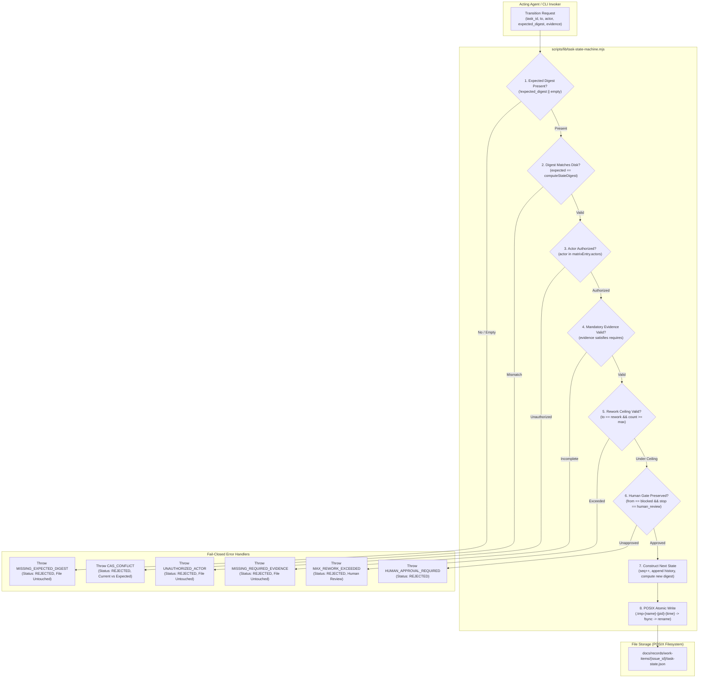
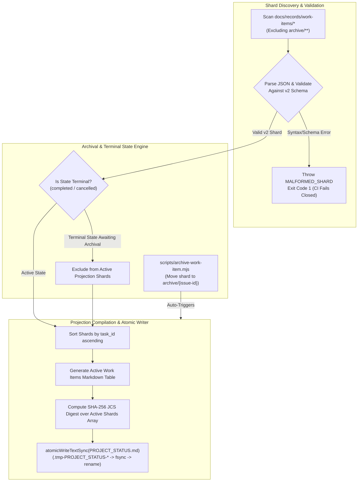

# Software Design Document: Control-Plane State Integrity & Architecture Remediation

## Metadata

- Work Item ID: Issue #277
- Title: Control-Plane State Integrity & Architecture Remediation (Package 1)
- Owner: SA Agent (`sa-architecture-design`)
- Status: Draft
- Date: 2026-09-12
- Governing Requirements: `docs/records/requirements/2026-09-12-control-plane-state-integrity-discovery.md` (AC-001..AC-008, BR-001..BR-004)

---

## Context

During the production deployment and dynamic workflow state audits (Issues #249, #272, #275), five critical architectural vulnerabilities and discrepancies were identified in the control-plane state management system:
1. **Schema Discrepancy (F-01):** Two conflicting schemas exist in `docs/contracts/schemas/`. Legacy `task-state.schema.json` enforces a 7-state model (`intake`, `investigating`, `implementing`, `verifying`, `rework`, `handoff`, `blocked`) restricted to `bug-fix`, while `durable-task-envelope.schema.json` defines the canonical v2 11-state model (`intake`, `investigating`, `designing`, `planning`, `implementing`, `verifying`, `rework`, `handoff`, `blocked`, `completed`, `cancelled`) supporting 5 workflow types (`bug-fix`, `new-feature`, `framework-meta`, `config-change`, `data-change`). Active shards (`issue-249`, `issue-275`) still declare legacy `contract_version: 1`.
2. **Actor Authorization Bypass (F-02):** In `scripts/lib/task-state-machine.mjs`, `TRANSITION_MATRIX` defines permitted `actors` per state, but `transitionTaskState()` never validates the incoming `actor` parameter against `matrixEntry.actors`. Any role or unauthenticated string can trigger state transitions without authorization.
3. **Optional CAS Bypass (F-03):** In `scripts/lib/task-state-machine.mjs` (line 232) and CLI `scripts/task-machine-cli.mjs` (lines 102, 120), CAS digest verification is purely optional (`if (expected_digest !== undefined)`). Any caller omitting `--expected-digest` bypasses CAS checks entirely, permitting silent concurrent state overwrites.
4. **Projection Shard Fail-Open (W1):** In `scripts/compile-status-projection.mjs` (`discoverActiveShards`), unparseable or schema-violating shards are caught by a `try/catch` block that logs a console warning and skips the shard. This fails open, dropping corrupt tasks from `PROJECT_STATUS.md` without failing CI or compilation.
5. **Non-Atomic Root Projection Writes & Archival Desynchronization (F-10):** In `scripts/compile-status-projection.mjs` (`updateProjectStatusFile`), `PROJECT_STATUS.md` is updated using non-atomic `fs.writeFileSync`. A process interruption mid-write corrupts `PROJECT_STATUS.md`. Furthermore, `compile-status-projection.mjs` discovers completed/cancelled shards awaiting archival, while `archive-work-item.mjs` does not trigger projection updates, leaving stale active entries.

---

## Goals / Non-goals

### Goals
- **G-001 (Schema Unification - AC-001, AC-002, BR-001):** Establish `docs/contracts/schemas/durable-task-envelope.schema.json` as the sole canonical authority for active durable task state. Enforce `contract_version: 2`, 11-state lifecycle, integer `sequence_number >= 1`, and SHA-256 `state_digest`. Deprecate legacy 7-state `task-state.schema.json`.
- **G-002 (Actor Authorization Guard - AC-003, AC-004, BR-002):** Enforce strict validation of acting role against `matrixEntry.actors` in `transitionTaskState()`. Canonicalize actor IDs to lowercase kebab-case against `ROLE_REGISTRY`. Reject unauthorized transitions with `UNAUTHORIZED_ACTOR`.
- **G-003 (Mandatory Cryptographic CAS - AC-005, AC-006, BR-003):** Eliminate optional CAS bypass. Require `expected_digest` on every state transition. Validate against RFC 8785 JCS SHA-256 digest of current state; reject missing digests with `MISSING_EXPECTED_DIGEST` and mismatches with `CAS_CONFLICT`.
- **G-004 (Fail-Closed Projection Compilation - AC-007, BR-004):** Make `compile-status-projection.mjs` fail closed on unparseable or schema-violating shards, throwing `MALFORMED_SHARD` and exiting with code 1.
- **G-005 (Atomic Markdown Writes & Archival Reconciliation - AC-008, BR-004):** Implement `atomicWriteTextSync()` using POSIX write-to-temp, `fsyncSync`, and atomic rename for `PROJECT_STATUS.md`. Coordinate `archive-work-item.mjs` to automatically recompile `PROJECT_STATUS.md` upon moving terminal shards.

### Non-goals
- **NG-001:** Modifying production application business code, schema definitions, or test suites outside control-plane state management.
- **NG-002:** Altering Core Bootloader Tier 1 context token budget limits (remains <= 3,500 tokens).
- **NG-003:** Relaxing the 2-cycle rework retry ceiling or bypassing human approval gate invariants.
- **NG-004:** Introducing external database engines (PostgreSQL, Redis) or distributed network consensus mechanisms. The architecture remains local-first, Git-native, and POSIX file-based.

---

## Architecture Overview

The Control-Plane State Integrity architecture hardens state mutation, concurrency verification, projection compilation, and lifecycle reconciliation across two core pipelines:

### 1. Hardened State Mutation Lifecycle



### 2. Fail-Closed Projection & Lifecycle Reconciliation Pipeline



---

## Component Design

### Component 1: Canonical Durable Task Envelope & Multi-Workflow Transition Model
- **File:** `docs/contracts/schemas/durable-task-envelope.schema.json` & `scripts/lib/task-state-machine.mjs`
- **Responsibilities:**
  - Enforce universal v2 envelope contract across all 5 workflows (`bug-fix`, `new-feature`, `framework-meta`, `config-change`, `data-change`).
  - Model 11 discrete states: `intake`, `investigating`, `designing`, `planning`, `implementing`, `verifying`, `rework`, `handoff`, `blocked`, `completed`, `cancelled`.
  - Maintain legacy `task-state.schema.json` as a deprecated v1 validator for historical audits; reject any new or active work-item shard declaring `contract_version: 1`.
  - Provide `loadTaskState(filePath)` with validation against v2 schema rules.

### Component 2: Strict Matrix Actor Authorization Guard
- **File:** `scripts/lib/task-state-machine.mjs`
- **Responsibilities:**
  - Canonicalize actor strings to lowercase kebab-case (e.g., `'Developer Agent'` -> `'developer-agent'`).
  - Validate actor against registered roles in `ROLE_REGISTRY`.
  - Inspect `matrixEntry = TRANSITION_MATRIX[fromState]`.
  - Check `matrixEntry.actors.includes(canonicalActor)`. If unauthorized, throw `UNAUTHORIZED_ACTOR` with HTTP 403 / REJECTED status before modifying state.
  - Maintain Orchestrator and Human emergency override invariants where explicitly permitted in matrix entries (e.g. `blocked` transitions).

### Component 3: Mandatory Cryptographic CAS Concurrency Engine
- **File:** `scripts/lib/task-state-machine.mjs` & `scripts/task-machine-cli.mjs`
- **Responsibilities:**
  - Eliminate optional CAS bypass. In `transitionTaskState()`, mandate:
    ```javascript
    if (!expected_digest || typeof expected_digest !== 'string' || expected_digest.trim() === '') {
      const error = new Error('Mandatory expected_digest was not provided. CAS verification is required.');
      error.code = 'MISSING_EXPECTED_DIGEST';
      error.status = 'REJECTED';
      throw error;
    }
    ```
  - Verify `expected_digest === computeStateDigest(currentState)`.
  - On mismatch, throw `CAS_CONFLICT` containing `current_digest` and `expected_digest`.
  - Compute new digest deterministically using RFC 8785 JCS serialization excluding `state_digest`.
  - In `scripts/task-machine-cli.mjs`: enforce `--expected-digest` flag on `transition` command; provide interactive inspect-and-transition helpers.

### Component 4: Hardened Status Projection Compiler & Atomic Writer
- **File:** `scripts/compile-status-projection.mjs` & `scripts/archive-work-item.mjs`
- **Responsibilities:**
  - In `discoverActiveShards()`: replace silent `try/catch` skip with strict fail-closed parsing:
    ```javascript
    try {
      const raw = fs.readFileSync(shardFile, 'utf8');
      const parsed = JSON.parse(raw);
      validateTaskStateSchema(parsed); // Validates v2 contract
      shards.push(parsed);
    } catch (err) {
      const error = new Error(`Malformed or invalid shard at ${shardFile}: ${err.message}`);
      error.code = 'MALFORMED_SHARD';
      throw error;
    }
    ```
  - Implement `atomicWriteTextSync(filePath, content)` in `scripts/compile-status-projection.mjs`:
    ```javascript
    export function atomicWriteTextSync(targetPath, content) {
      const dir = path.dirname(path.resolve(targetPath));
      if (!fs.existsSync(dir)) fs.mkdirSync(dir, { recursive: true });
      const baseName = path.basename(targetPath);
      const tmpPath = path.join(dir, `.tmp-${baseName}-${process.pid}-${Date.now()}`);
      const fd = fs.openSync(tmpPath, 'w');
      try {
        fs.writeSync(fd, content, 'utf8');
        fs.fsyncSync(fd);
      } finally {
        fs.closeSync(fd);
      }
      fs.renameSync(tmpPath, targetPath);
    }
    ```
  - In `archiveWorkItem()`: upon successful directory move to `archive/{issue-id}`, immediately invoke `updateProjectStatusFile()` to reconcile `PROJECT_STATUS.md` in the same execution cycle.

---

## API Contract

Although the state machine operates as an in-process local ES module and CLI, its invocations adhere to strict machine-readable contracts:

### Module Function Signatures
```typescript
interface TransitionRequest {
  to: StateEnum;
  actor: RoleEnum;
  expected_digest: string; // Mandatory 64-char hex
  evidence?: Record<string, any>;
  stop_reason?: StopReasonEnum | null;
  next_route?: RoleEnum | null;
}

function transitionTaskState(
  currentState: TaskEnvelopeV2,
  request: TransitionRequest
): TaskEnvelopeV2;

function inspectTaskState(
  taskState: TaskEnvelopeV2
): TaskStateInspection;

function atomicWriteJsonSync(
  targetPath: string,
  data: any
): void;

function atomicWriteTextSync(
  targetPath: string,
  content: string
): void;
```

### CLI Command Interface
```bash
# Transition with mandatory CAS and actor authorization:
node scripts/task-machine-cli.mjs transition \
  --file docs/records/work-items/issue-277/task-state.json \
  --to planning \
  --actor sa-agent \
  --expected-digest 4a9f8...64hex \
  --evidence '{"sdd_ref":"docs/records/sdd/2026-09-12-control-plane-state-integrity-sdd.md","adr_ref":"ADR-0026"}'
```

### Structured Error Response Format
```json
{
  "status": "REJECTED",
  "error_code": "UNAUTHORIZED_ACTOR | MISSING_EXPECTED_DIGEST | CAS_CONFLICT | MALFORMED_SHARD | MISSING_REQUIRED_EVIDENCE",
  "message": "Human-readable diagnostic description",
  "current_digest": "4a9f...64hex (present on CAS_CONFLICT)",
  "expected_digest": "7b2c...64hex (present on CAS_CONFLICT)"
}
```

---

## Data Model / Data Impact

### Task Envelope v2 Schema Specification (`docs/contracts/schemas/durable-task-envelope.schema.json`)
```json
{
  "$schema": "https://json-schema.org/draft/2020-12/schema",
  "$id": "https://github.com/chakrits/AI-Agent-Workflow/docs/contracts/schemas/durable-task-envelope.schema.json",
  "title": "Durable Task Envelope Schema v2",
  "type": "object",
  "additionalProperties": false,
  "required": [
    "task_id", "workflow_id", "contract_version", "change_type", "risk_level",
    "state", "rework_count", "max_rework_attempts", "sequence_number",
    "state_digest", "history", "evidence", "next_route", "stop_reason"
  ],
  "properties": {
    "task_id": { "type": "string", "pattern": "^[a-z0-9_-]+$" },
    "workflow_id": { "enum": ["bug-fix", "new-feature", "framework-meta", "config-change", "data-change"] },
    "contract_version": { "type": "integer", "const": 2 },
    "change_type": { "enum": ["bug-fix", "feature", "enhancement", "framework-meta", "config-change", "data-change"] },
    "risk_level": { "enum": ["low", "medium", "high", "critical"] },
    "state": {
      "enum": [
        "intake", "investigating", "designing", "planning", "implementing",
        "verifying", "rework", "handoff", "blocked", "completed", "cancelled"
      ]
    },
    "rework_count": { "type": "integer", "minimum": 0, "maximum": 2 },
    "max_rework_attempts": { "type": "integer", "const": 2 },
    "sequence_number": { "type": "integer", "minimum": 1 },
    "state_digest": { "type": "string", "pattern": "^[a-f0-9]{64}$" },
    "history": {
      "type": "array",
      "items": {
        "type": "object",
        "additionalProperties": false,
        "required": ["from", "to", "at", "actor", "evidence_refs"],
        "properties": {
          "from": { "type": "string" },
          "to": { "type": "string" },
          "at": { "type": "string" },
          "actor": { "type": "string", "minLength": 1 },
          "evidence_refs": { "type": "array", "items": { "type": "string" } }
        }
      }
    },
    "evidence": { "type": "object" },
    "next_route": { "type": ["string", "null"] },
    "stop_reason": {
      "type": ["string", "null"],
      "enum": [
        null, "human_review_required", "host_completion_unavailable",
        "max_rework_exceeded", "external_dependency_blocked", "task_cancelled"
      ]
    }
  }
}
```

### Migration & Backfill Strategy
- **Expand Phase (Phase 1):**
  - Canonical envelope schema v2 deployed.
  - Script `scripts/backfill-task-state-v2.mjs` migrates active shards (`issue-249`, `issue-275`):
    - Sets `contract_version: 2`.
    - Computes initial `sequence_number = history.length + 1`.
    - Computes canonical RFC 8785 JCS SHA-256 `state_digest`.
    - Validates against `durable-task-envelope.schema.json`.
- **Contract Phase (Phase 2):**
  - Deprecate `task-state.schema.json`.
  - Wire schema validation into `scripts/validate-contracts.mjs` and CI to reject any active shard with `contract_version: 1`.
- **Rollback Plan:**
  - Shards retain full historical arrays; downgrading simply removes `sequence_number` and `state_digest` and resets `contract_version: 1` if an unrecoverable failure occurs.

---

## Error Handling & Fail-Closed Invariants

| Error Code | Trigger Condition | Exit Behavior | State File Mutation |
|---|---|---|---|
| `UNAUTHORIZED_ACTOR` | Actor string not in `TRANSITION_MATRIX[fromState].actors` | Throws Error, CLI exits `1` | 0% (Untouched) |
| `MISSING_EXPECTED_DIGEST` | `expected_digest` is omitted, null, or empty string | Throws Error, CLI exits `1` | 0% (Untouched) |
| `CAS_CONFLICT` | `expected_digest !== computeStateDigest(currentState)` | Throws Error, CLI exits `1` | 0% (Untouched) |
| `MALFORMED_SHARD` | Shard in `work-items/*` has invalid JSON or violates v2 schema | Throws Error, CLI exits `1` | 0% (Untouched) |
| `MISSING_REQUIRED_EVIDENCE` | Required evidence key(s) absent from `evidence` payload | Throws Error, CLI exits `1` | 0% (Untouched) |
| `MAX_REWORK_EXCEEDED` | `rework_count >= 2` when transitioning to `rework` | Transition rejected, human gate required | 0% (Untouched) |
| `HUMAN_APPROVAL_REQUIRED` | Autonomous attempt to exit `blocked` without human credentials | Transition rejected | 0% (Untouched) |

---

## Security Considerations

1. **Role Spoofing Prevention:** All actor strings are canonicalized to kebab-case and checked against `TRANSITION_MATRIX.actors`. Agents cannot self-certify transitions reserved for specialized roles (e.g., Developer cannot self-approve QA verification).
2. **Cryptographic State Integrity:** Every state transition computes an SHA-256 digest over the canonicalized JCS representation (RFC 8785). The history array maintains an immutable chronological chain of prior transitions.
3. **Fail-Closed Gateways:** Corrupted shards in `work-items/` immediately block compilation and CI, preventing corrupted states from being published to `PROJECT_STATUS.md`.
4. **POSIX Atomic Durability:** All write operations to task shards and root status markdown utilize temporary file writes followed by explicit `fsyncSync` and atomic `renameSync`, guaranteeing immunity against mid-write power loss or process kill.

---

## NFRs (Non-Functional Requirements)

- **Performance Target:** State transition execution latency $< 5\text{ ms}$; projection compilation for 50 shards $< 100\text{ ms}$.
- **Reliability Target:** Atomic write mid-write corruption rate **0.0%**; parallel worktree merge conflict rate **0.0%**.
- **Observability Target:** 100% structured JSON error messages with machine-readable error codes and digest values.
- **CI Determinism:** 100% deterministic compilation across GitHub Actions and GitLab CI without network dependencies.

---

## Alternatives Considered & Architectural Decisions

| Alternative | Description | Status / Reason for Rejection |
|---|---|---|
| **1. Dual Schema Maintenance** | Maintain separate 7-state bug-fix schema alongside 11-state envelope | **Rejected:** Root cause of F-01 discrepancy; creates maintenance overhead and validation ambiguity. |
| **2. Optional CLI CAS (`--force`)** | Allow `--force` flag on CLI to bypass CAS checks | **Rejected:** Defeats concurrency integrity; leads to accidental overwrites. Maintainers must inspect and supply observed digest. |
| **3. Non-Blocking Shard Skipping** | Log warnings and skip corrupt shards during projection compilation | **Rejected:** Violates W1 fail-closed requirement; masks tampered or broken shards in CI. |
| **4. Asynchronous Background Archival** | Run archival as an asynchronous background worker | **Rejected:** Introduces race conditions and projection drift. Immediate atomic archival is simpler and deterministic. |

### Architectural Decisions (ADR Candidates)
- **ADR-0026:** Canonical Durable Task Envelope v2 Authority across all workflows.
- **ADR-0027:** Strict Matrix Actor Authorization Guard in task state transitions.
- **ADR-0028:** Mandatory Cryptographic CAS Concurrency Enforcement.
- **ADR-0029:** Fail-Closed Status Projection and POSIX Atomic Writer Durability.

---

## Testability Notes & Acceptance Traceability

| AC ID | Verification Test Case | Expected Test Result |
|---|---|---|
| **AC-001** | Validate active work item shards against `durable-task-envelope.schema.json` | 100% PASS with `contract_version: 2`, `sequence_number >= 1`, valid SHA-256 digest |
| **AC-002** | Submit shard with `contract_version: 1` or 7-state structure to v2 validator | Rejection with diagnostic schema error requiring v2 migration |
| **AC-003** | Attempt transition `verifying` -> `handoff` with `actor: 'developer-agent'` | Rejection with `UNAUTHORIZED_ACTOR`, exit code 1, file untouched |
| **AC-004** | Execute permitted transition with authorized actor and mandatory evidence | Success, sequence number incremented, new SHA-256 digest computed |
| **AC-005** | Attempt transition without `--expected-digest` or empty string | Immediate rejection with `MISSING_EXPECTED_DIGEST`, exit code 1 |
| **AC-006** | Attempt transition with stale/incorrect expected digest | Abort with `CAS_CONFLICT`, returns current and expected digests |
| **AC-007** | Execute `compileStatusProjection` with a malformed JSON file in `work-items/test-issue/` | Process aborts with `MALFORMED_SHARD`, exit code 1 |
| **AC-008** | Interrupt write during `updateProjectStatusFile` or inspect file operations | Writes utilize `.tmp` + `fsyncSync` + `renameSync`, 0% file corruption |

---

## Related Artifacts / Links

| Artifact | Purpose | Repository Path |
|---|---|---|
| Requirement Discovery | Authoritative requirement source | `docs/records/requirements/2026-09-12-control-plane-state-integrity-discovery.md` |
| Durable Envelope Schema v2 | Canonical JSON Schema Draft 2020-12 | `docs/contracts/schemas/durable-task-envelope.schema.json` |
| Task State Machine | State machine engine and transition matrix | `scripts/lib/task-state-machine.mjs` |
| Task Machine CLI | CLI tool for inspection and transitions | `scripts/task-machine-cli.mjs` |
| Status Projection Compiler | Active shard discovery and projection compiler | `scripts/compile-status-projection.mjs` |
| Shard Archival Tool | Terminal shard archival script | `scripts/archive-work-item.mjs` |
