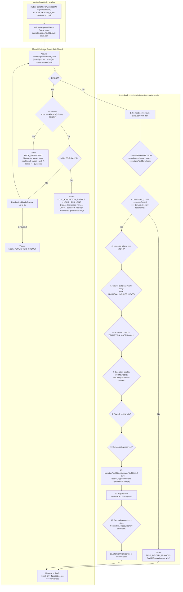
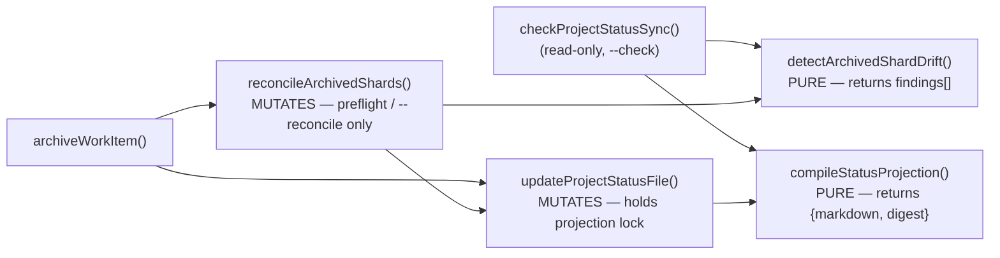

# Software Design Document: Control-Plane State Integrity & Architecture Remediation

## Metadata

- Work Item ID: Issue #277
- Title: Control-Plane State Integrity & Architecture Remediation (Package 1)
- Owner: SA Agent (`sa-architecture-design`)
- Status: Developer rework-cycle-3 contract addendum (Human approved CR-012..CR-014 on 2026-09-17; implementation pending)
- Date: 2026-09-12
- Governing Requirements: `docs/records/requirements/2026-09-12-control-plane-state-integrity-discovery.md` (AC-001..AC-013, BR-001..BR-005)

---

## Context

Rounds 1–3 established the integrity problems (schema discrepancy, actor bypass, optional CAS, fail-open
projection, non-atomic writes, archival drift). Round 4 (#5644452415) rejected four elements of the
Round 3 design as unsound. This revision replaces them:

1. **Stale-lock takeover was unsound (Round 4 Blocker 1).** The atomic-rename takeover cannot make the
   takeover *conditional on the lock that was observed*. `renameSync(lockPath, reclaimPath)` moves
   whatever occupies the pathname at the instant it runs, so a second reclaimer can move a *replacement*
   owner's live lock out of the canonical path. No `fs`-level primitive available to this runtime gives
   compare-and-remove-by-identity. **Decision: abandon takeover entirely and fail closed** (ADR-0027).
2. **Sole-authority contract model conflicted with canonical policy (Round 4 Blocker 2).** `AGENTS.md`
   and the four `*-workflow.yaml` policies own allowed transitions, evidence and retry budget; the
   Round 3 design declared the envelope the *sole* authority, which both contradicts the Requirement's
   own "decouple domain workflow policies from storage envelope" statement and breaks
   `scripts/validate-contracts.mjs`'s `contract_version` cross-check. **Decision: explicit two-layer
   model** (ADR-0026). The matrix also omitted `completed`/`cancelled`, and the engine skips validation
   entirely when a source-state entry is absent — a silent hole. **Decision: define terminal entries and
   fail closed on unknown source state.**
3. **Repair inside the projection compiler broke the read-only boundary (Round 4 Blocker 3).**
   `checkProjectStatusSync()` calls `compileStatusProjection()`; a repairing compiler makes
   `validate:status-projection` mutate the repository and hide the drift it exists to detect, and
   `updateProjectStatusFile()` → `compileStatusProjection()` → repair → `updateProjectStatusFile()`
   recurses. **Decision: separate pure detection from explicit mutation** (ADR-0029).
4. **Atomic replacement does not serialize the root projection (Round 4 Blocker 4).** Writer atomicity
   prevents torn bytes, not lost updates: a compiler may read shards, pause across an archive, then
   overwrite the newer projection with its own atomically-complete stale content. **Decision: a
   projection-level mutation lock with a declared total lock order** (ADR-0030).

Round 5 (#5644601391) rejected two further elements. This revision replaces them:

5. **The durable envelope advertised workflows it cannot represent (Round 5 Blocker 1).** The envelope
   offers five `workflow_id` values but one fixed 11-state vocabulary, while `new-feature`,
   `config-change` and `data-change` each require states outside it, and no
   `framework-meta-workflow.yaml` exists at all. **Decision: take the review's option 1 — narrow
   Package 1's durable envelope and active-shard enforcement to `bug-fix` only** (ADR-0031). The
   authority rule is simultaneously collapsed to a single statement with no fallback and no
   envelope-only exception.
6. **The shard lock travelled with the directory being archived (Round 5 Blocker 2).**
   `archiveWorkItem()` renames the whole shard directory, so a lock stored inside it moves to
   `archive/{id}`; a release against the original path cannot remove it and the original pathname stops
   serializing anyone. **Decision: move shard locks to a stable, never-renamed namespace,
   `docs/records/work-items/.locks/{task_id}.lock`** (ADR-0027, amended).

Round 6 at `dbfbe3e` found three SA-owned executable gaps. This revision closes them:

7. **Version binding was applied globally.** The existing example lane has no
   `policy_contract_version`; its comparison remains `state.contract_version`. Only the separate active
   durable-envelope lane compares `state.policy_contract_version` (ADR-0026, amended).
8. **Strict intersection made `blocked` a dead end.** The bug-fix policy explicitly enumerates resume
   rows back to the two states that can enter `blocked`, and the resume operation binds the target to the
   latest interrupted state (ADR-0031, amended).
9. **Lock selection was not bound to the re-read envelope.** Mutation and archival now receive an
   explicit expected task identifier, use it for both lock and active path selection, and compare it
   against the envelope after re-read under the lock (ADR-0027, amended). Active-root enumeration also
   names both canonical exclusions: exact `archive/` and dot-prefixed entries.

---

## Goals / Non-goals

### Goals
- **G-001 (Two-Layer Contract Model — ADR-0026):** `durable-task-envelope.schema.json`
  (`contract_version: 2`) is the sole authority for the **storage envelope**. The four
  `docs/contracts/*-workflow.yaml` policies remain the sole authority for **workflow behaviour**
  (allowed transitions, required evidence, retry budget). Neither layer is deleted; the binding between
  them is made explicit and machine-checked in separate legacy-example and active-envelope lanes.
- **G-002 (Actor Policy Enforcement & Terminal Closure — AC-003, AC-004, AC-009):** `TRANSITION_MATRIX`
  defines permitted `actors` for all 11 states including terminal `completed`/`cancelled` with empty
  destination sets, and the engine fails closed when a source state has no matrix entry.
- **G-003 (Self-Exclusion JCS Digest & Integrity Verification — ADR-0028):** `digestTaskEnvelope(envelope)`
  copies, deletes top-level `state_digest`, and calls RFC 8785 `digestJcs()`. `stored === computed` is
  enforced on load, transition and resume.
- **G-004 (Fail-Closed Shard Locking — ADR-0027):** One lock per task at the stable path
  `docs/records/work-items/.locks/{task_id}.lock` — never inside the shard directory — via `openSync('wx')` holding
  `{pid, nonce, created_at}`. **No automatic takeover.** An abandoned lock is a refusal with a named
  recovery command, not something the engine clears on its own.
- **G-004a (Identity-Bound Mutation and Archive):** The explicit operation task ID selects both stable
  lock and active shard path; the envelope re-read under that lock must declare the same ID before any
  CAS, write, rename, or projection mutation.
- **G-005 (Crash-Durable Atomic Writer with Cleanup):** `atomicWriteFileSync` with collision-safe `wx`
  temp files, write-completion loops, failure cleanup, `fsyncSync`, atomic rename, directory sync.
- **G-006 (Pure Projection, Explicit Repair — ADR-0029):** `compileStatusProjection()` and
  `detectArchivedShardDrift()` are pure. Repair lives only in `reconcileArchivedShards()`, reachable
  only from archival preflight and an explicit `--reconcile` flag. `--check` writes zero bytes.
- **G-007 (Projection Transaction — ADR-0030, ADR-0032):** `PROJECT_STATUS.md` mutation is serialized by a projection admission lock and non-reclaimable commit guard; active shards are re-read after admission and the durable generation is checked inside the guard.
- **G-008 (Fenced Conditional Commit — ADR-0032):** admission-lock recovery durably increments a monotonic generation while holding the same commit guard required by writers. A writer from an older generation cannot rename, even after a false quiescence assertion. Total order is task admission → projection admission → applicable commit guard; commit guards are never nested.

### Non-goals
- **NG-001:** Cryptographic agent identity authentication (caller-declared role policy only).
- **NG-002:** Unbacked numeric NFR targets.
- **NG-003:** External database engines or distributed consensus.
- **NG-004:** Online recovery from an abandoned commit guard. Admission locks remain recoverable, but the serialization root is deliberately non-reclaimable while any old process could resume.

---

## Architecture Overview

### 1. Hardened State Mutation Lifecycle (Fail-Closed Locking)



### 2. Projection Call Graph (Acyclic, One-Directional)



**Invariant:** no node reachable from `compileStatusProjection()` or `detectArchivedShardDrift()`
writes to the filesystem. `reconcileArchivedShards()` calls `updateProjectStatusFile()` exactly once and
`updateProjectStatusFile()` never calls back into reconciliation — the graph has no cycle.

---

## Component Design

### Component 1: Two-Layer Contract Model (ADR-0026)

- **Files:** `docs/contracts/schemas/durable-task-envelope.schema.json`, `docs/contracts/*-workflow.yaml`,
  `scripts/lib/task-state-machine.mjs`, `scripts/validate-contracts.mjs`, `AGENTS.md`.

| Layer | Authority | Owns | Version field |
|---|---|---|---|
| **Storage envelope** | `docs/contracts/schemas/durable-task-envelope.schema.json` | File shape: `task_id`, `workflow_id` (**narrowed to `bug-fix` only** — see ADR-0031), a `state` enum that is a **superset** of the `bug-fix` policy's states (it retains `designing`/`planning`, which that policy does not use; the intersection rule, not the enum, does the narrowing), `sequence_number >= 1`, 64-hex `state_digest`, history record shape | `contract_version: 2` (const) |
| **Actor policy** | `TRANSITION_MATRIX.actors` in `scripts/lib/task-state-machine.mjs`, against `ROLE_REGISTRY` | Which declared role may act from a given source state (repo-wide, workflow-independent) | n/a — code, covered by parity test |
| **Workflow behaviour** | `docs/contracts/{bug-fix,new-feature,config-change,data-change}-workflow.yaml` | Which transitions are legal *for this workflow*, required evidence per transition, `max_rework_attempts`, terminal requirements | `contract_version: 1` (unchanged) |

- **Explicit, lane-specific binding.** The envelope gains one new required integer property,
  `policy_contract_version`, recording which policy version the shard was written against. The existing
  example-fixture loop remains unchanged and compares `state.contract_version` with
  `policy.contract_version`, because its legacy schemas and YAML fixtures expose only that field. A
  separate active durable-envelope lane compares `state.policy_contract_version` with
  `policy.contract_version`. The two comparisons must live in separate functions or explicit lane
  branches; no shared post-schema comparison may select one field globally. This lets a durable shard be
  `contract_version: 2` over policy v1 without making `undefined !== 1` for every legacy fixture.
- **Transition authority rule.** A transition is permitted if and only if its destination appears in
  `TRANSITION_MATRIX[from].destinations`, the workflow policy's `transitions` list contains `(from, to)`,
  and the evidence keys on that policy row are present. There is no matrix fallback for policy-silent transitions, no envelope-only
  allowlist, and no exception contract. The matrix's `requires` is a design-time authoring aid only and
  is never consulted at validation time; if the matrix and a policy disagree, the narrower of the two
  wins by construction, because legality is an intersection. An unknown `workflow_id`, an unknown source
  state, or a policy-silent transition all fail closed. Requirements and plan
  restate this same rule for traceability; QA's TC-024 must be brought into line with it by its owner.
- **Policy amendment required (additive, no version bump).** `bug-fix-workflow.yaml` today has neither
  a `completed` state nor a `handoff -> completed` transition, so Task 9a's migration of issue-249 /
  issue-275 is illegal under the current policy. The policy gains `completed` and `cancelled` to its
  `states` list and a `handoff -> completed` transition requiring `closeout_evidence`. This is purely
  additive: every existing example under `docs/contracts/examples/` stays valid and `contract_version`
  stays `1`, so no fixture migration is triggered. *Rejected alternative:* bumping every policy to
  `contract_version: 2`, which would force migration of every example fixture in that lane for no
  behavioural gain.
- **Policy-authoritative blocked resume (Round 6).** The policy gains a separate `resume` operation:
  `{ from: blocked, destinations: [investigating, verifying], requires: [resume_evidence, approver_id] }`.
  These are the only states that currently have policy-authorized incoming transitions to
  `blocked`, so they are the complete prior-state restoration set rather than an arbitrary allowlist.
  `resumeTaskState()` is the only operation allowed to consume these rows and must require its target to
  equal the `from` value of the most recent history event whose `to` is `blocked`. Actor authorization is
  still intersected with `TRANSITION_MATRIX.blocked.actors` (`human`, `orchestrator`). Missing Human
  evidence throws `HUMAN_APPROVAL_REQUIRED`; a target other than the recorded interrupted state throws
  `INVALID_RESUME_TARGET`; an ordinary transition attempting either row throws
  `RESUME_OPERATION_REQUIRED`. This preserves strict transition authority while making resume legal
  through its own policy contract.
  *Rejected alternative:* treat `blocked` as terminal or let `resume` bypass policy. The first removes an
  existing Human-gate recovery path; the second recreates an exception contract beside the strict
  intersection.
- **`cancelled` has no ingress in Package 1 — stated deliberately.** Under the authority rule above, a
  transition is legal only if the policy enumerates it, and `bug-fix-workflow.yaml` enumerates no
  `-> cancelled` row. `cancelled` is therefore a valid *storage* state and a declared terminal in the
  matrix, but is **unreachable by transition** in Package 1. No wildcard (`<any> -> cancelled`) is
  introduced, because the validator performs exact `from -> to` lookup and has no wildcard semantics;
  inventing one is out of Package 1's scope. Any future cancellation path must be added as enumerated
  source rows in the policy, each carrying `cancellation_reason` in its `requires`.
- **Package 1 composable scope: `bug-fix` only (ADR-0031).** The envelope's `workflow_id` enum is
  narrowed from five values to `["bug-fix"]`, and `change_type` correspondingly to `["bug-fix"]`, so the
  envelope advertises exactly the one workflow whose state vocabulary it can represent. Both live active
  shards (`issue-249`, `issue-275`) are already `bug-fix`, so the narrowing migrates nothing. Task 8b's
  strict active-shard validation lane consequently enforces `bug-fix` alone. **Consequence, stated so
  nobody rediscovers it as a bug:** `new-feature`, `config-change`, `data-change` and `framework-meta`
  have **no durable shard** in Package 1 — including Issue #277 itself, which is `framework-meta`. They
  continue to be governed by their `*-workflow.yaml` policies and the existing example lane, and any
  attempt to write a durable envelope for them hits the fail-closed unknown-`workflow_id` path by
  design, not by accident. Extending the envelope to a second workflow is a separate package whose
  entry condition is a canonical policy for that workflow (`framework-meta` has none today) plus a
  policy-aware state vocabulary.
  - *Rejected alternative:* make state validation policy-aware and author a canonical policy for all
    five advertised workflows. Rejected because it requires inventing a `framework-meta-workflow.yaml`
    that no approved requirement derives, it replaces one fixed vocabulary with a per-workflow one
    across the engine, the schema and the validator inside a package already carrying four blockers, and
    it widens the blast radius of every remaining control to four workflows that have no durable shard
    to protect. Package 1's job is integrity of what exists, not reach.
  - **Test surface.** The active-envelope composition lane is `bug-fix` only and must exercise the real
    active-shard path, not the `docs/contracts/examples/` lane — `loadSchemas()` in
    `scripts/validate-contracts.mjs` deliberately keeps durable envelopes out of that lane, so example
    fixtures cannot detect a composition failure. A negative case must assert that every non-`bug-fix`
    `workflow_id` is rejected by the envelope schema.
- **AGENTS.md** gains a clarifying sentence next to the Bug Fix policy paragraph (L274-276) stating that
  the policy owns transitions, evidence and retry budget while the durable envelope owns storage shape,
  so the two statements can no longer be read as competing claims of sole authority.

### Component 2: Actor Matrix Completion & Fail-Closed Source State (AC-009)

- `TRANSITION_MATRIX` gains the two missing terminal entries:

```javascript
completed:  { destinations: [], requires: [], actors: [] },
cancelled:  { destinations: [], requires: [], actors: [] }
```

- **`investigating.destinations` gains `implementing` — the matrix is what gives.**
  `TRANSITION_MATRIX.investigating.destinations` is today
  `['designing', 'planning', 'blocked', 'cancelled']` (`scripts/lib/task-state-machine.mjs:49-53`), while
  `bug-fix-workflow.yaml:7` carries `{ from: investigating, to: implementing }`. Under the authority
  rule the intersection at that hop is **empty**, which severs the bug-fix happy path at its second
  transition — a defect the Round 5 review did not name and which strict intersection *created*, not
  revealed. The matrix entry becomes
  `['implementing', 'designing', 'planning', 'blocked', 'cancelled']`.
  *Why the matrix and not the policy:* `AGENTS.md` names the `*-workflow.yaml` policy canonical for
  workflow behaviour, and Component 1 already defines the matrix/envelope layer as a **superset** that
  the policy intersection narrows. A superset that omits a state the canonical policy requires is simply
  wrong as a superset; widening it changes no workflow's legality except where a policy already
  authorized the hop. *Rejected alternative 1:* amend `bug-fix-workflow.yaml` to route
  `investigating -> designing -> planning -> implementing`. Rejected because it rewrites canonical
  workflow behaviour to accommodate an implementation detail, and would force existing
  `docs/contracts/examples/bug-fix-*.yaml` fixtures through a migration for no behavioural gain.
  *Rejected alternative 2:* weaken the intersection — make the policy solely authoritative for legality
  and demote the matrix to actors only. Rejected because the matrix is the only repo-wide, workflow-
  independent floor on reachability, and because Round 5 Blocker 1 required exactly one authority rule
  stated once; relaxing it here would reintroduce the per-hop exception the blocker rejected.
- **Guard against silent recurrence.** Task 3 must include a test that enumerates **every** row of every
  `*-workflow.yaml` in scope and asserts the matrix ∩ policy intersection is non-empty for each source
  state and contains each policy destination. An empty intersection is a build failure, not a runtime
  surprise; this is the only check that would have caught the `investigating` hop before implementation.
- The guard treats `blocked` as non-terminal and proves its separate policy resume operation is valid.
  A positive full-path case enters `blocked` from each permitted source and resumes to that same source;
  negative cases cover ordinary transition use, wrong target, unauthorized actor, and either missing
  `resume_evidence` or missing `approver_id`.
- `blocked.destinations` is written out explicitly as every state except `blocked` itself, replacing the
  `STATES` reference, so that a future state added to `STATES` is not silently reachable from `blocked`.
- The engine's `if (matrixEntry) { ... }` guard (currently `scripts/lib/task-state-machine.mjs:260-294`)
  is inverted to fail closed:

```javascript
const matrixEntry = TRANSITION_MATRIX[fromState];
if (!matrixEntry) {
  const error = new Error(`No transition rule defined for source state '${fromState}'.`);
  error.code = 'UNKNOWN_SOURCE_STATE';
  error.status = 'REJECTED';
  throw error;
}
```

  With empty `destinations`, any outgoing transition from `completed` or `cancelled` now fails
  `ILLEGAL_TRANSITION_REJECTED` rather than skipping matrix validation entirely.
- The existing evidence bypass `if (to !== 'blocked' && to !== 'cancelled' && matrixEntry.requires)`
  is **deleted outright** rather than narrowed. Evidence is sourced from the policy row per the
  authority rule, and `bug-fix-workflow.yaml` already carries `requires: [stop_reason]` on every
  `-> blocked` row, so `blocked` is covered by the ordinary path with no special case. `cancelled` has
  no policy row and so cannot be reached at all (see Component 1); there is no terminal that can be
  entered with no evidence.

### Component 3: Self-Excluding Task Envelope Hasher (ADR-0028)

- **Files:** `scripts/lib/task-state-machine.mjs`, `scripts/lib/status-jcs.mjs`

```javascript
export function digestTaskEnvelope(envelope) {
  if (!envelope || typeof envelope !== 'object') {
    throw new Error('Invalid envelope object for digestion');
  }
  const normalized = { ...envelope };
  delete normalized.state_digest;
  return digestJcs(normalized);
}
```

- `validateEnvelopeSchema(data)`: (1) Ajv-validate against the envelope schema; (2) compute
  `expected = digestTaskEnvelope(data)`; (3) require `data.state_digest === expected`, else throw
  `DIGEST_INTEGRITY_MISMATCH` carrying both `stored_digest` and `recomputed_digest`. The caller's object
  is never mutated.

### Component 4: Fail-Closed Per-Shard Lock (ADR-0027)

- **Files:** `scripts/lib/task-state-machine.mjs`, `scripts/task-machine-cli.mjs`,
  `scripts/compile-status-projection.mjs`
- **Lock location — a stable namespace, never inside the shard (ADR-0027, amended).** The shard lock is
  `docs/records/work-items/.locks/{task_id}.lock`, created with `mkdirSync(recursive)` on first use.
  It is deliberately **not** `work-items/{task_id}/.lock`: `archiveWorkItem()` renames the entire shard
  directory, which would carry a live lock into `archive/{task_id}` where the owner's release against
  the original path cannot remove it, and would free the original pathname to be reacquired mid-archive.
  Every surface — `acquire`, `release`, `inspect`, `unlock`, and cleanup — addresses this one namespace,
  and the lock pathname is therefore invariant across the archive transaction.
- **Explicit active-root exclusions.** `discoverActiveShards()` in `scripts/compile-status-projection.mjs`
  enumerates `docs/records/work-items/*`. Before Task 8b's strict active-shard lane can reject any
  directory lacking a valid `task-state.json`, that enumeration **must** apply exactly two exclusions
  *before* shard validation: the exact reserved entry `archive/`, and every entry whose name begins with
  `.`. The dot-prefix exclusion is non-lossy because the envelope schema forbids a leading dot. The
  `archive` basename is a reserved root namespace; creation, mutation and archival entry points reject
  `expectedTaskId === 'archive'` with `RESERVED_TASK_ID`, so it cannot denote an active shard. The
  dot-prefix rule covers `.locks/`, the existing `.gitkeep`, and ADR-0030's `.projection.lock`. The locks do not
  collide: the projection lock is a **file** at `docs/records/work-items/.projection.lock`, the shard
  locks are files **inside** the `docs/records/work-items/.locks/` **directory**; `.locks` is a reserved
  name that no `task_id` can produce, and neither path is ever a shard.
- **Lock content:** `{ "pid": 12345, "nonce": "<uuid-v4>", "created_at": 1789188000000 }`. The
  payload is valid only when it is complete JSON with exactly the required typed fields: positive integer
  `pid`, UUID-v4 `nonce`, and finite non-negative integer `created_at`.
- **Acquisition:**
  1. `openSync(lockPath, 'wx')`. On success write the complete payload, `fsyncSync` it, close the file,
     and return `nonce`. A crash after the exclusive create but before payload completion can still leave
     an empty or partial file; the recovery contract below handles that state explicitly.
  2. On `EEXIST`, read and strictly parse the lock. Empty content, truncated JSON, invalid JSON, or a
     payload missing any required typed field throws `LOCK_MALFORMED` with the lock pathname and the
     maintenance command `unlock --malformed --quiesced`; acquisition does not modify the bytes. A
     malformed record is never passed to PID/age classification and never auto-reclaimed.
  3. A valid record is classified into **three** outcomes, not
     two, and liveness dominates age (Round 5 Blocker 4):
     - **Young and live** (`created_at` within 30 s and `process.kill(pid, 0)` succeeds): back off with
       randomized jitter and retry for up to 5 s, then throw `LOCK_ACQUISITION_TIMEOUT`.
     - **Old but live** (older than 30 s, `process.kill(pid, 0)` succeeds): throw
       `LOCK_ACQUISITION_TIMEOUT` **with holder diagnostics** (`pid`, `nonce`, `created_at`, age) and a
       `LOCK_HELD_LONG` advisory in the message. The message still names the recovery command
       `node scripts/task-machine-cli.mjs unlock --task <task_id> --nonce <observed-nonce> --quiesced`,
       explicitly marked as available only once the operator can establish quiescence — this tier is the
       permanent-wedge case (a holder that died off-host whose PID number is coincidentally live here),
       so it must never be a dead end. Age alone is **not** an abandonment classifier: a live slow
       holder must never be *automatically* routed into a destructive path (see *Recovery surface*).
     - **Dead PID** (`process.kill(pid, 0)` throws `ESRCH`), at any age: **do not touch it.** Throw
       `LOCK_ABANDONED`, carrying the holder's `pid`, `nonce` and `created_at`, and a message naming the
       exact recovery command:
       `node scripts/task-machine-cli.mjs unlock --task <task_id> --nonce <observed-nonce> --quiesced`.
  4. The asymmetry is deliberate and conservative. A live PID is **not** proof the original holder is
     alive (PID reuse), but treating a live PID as "not abandoned" can only ever *withhold* recovery,
     never authorize a wrong removal — it narrows what enters the destructive path and so cannot
     introduce a new integrity case. Conversely `ESRCH` on a local-first, single-host workspace is
     strong evidence the holder is gone. A lock written by a process that died elsewhere and whose PID
     is coincidentally live locally is therefore never auto-classified as abandoned; it surfaces
     permanently as `LOCK_ACQUISITION_TIMEOUT` + `LOCK_HELD_LONG`, which is the diagnostic tier that
     still names `unlock` for an operator who can establish quiescence. Availability cost, not a
     correctness gap (SEC-003).
- **Fenced recovery and conditional commit (ADR-0032; Human decision 2026-09-14).** The Human
  Maintainer rejected SEC-004's silent-loss residual. The old lock is now an **admission lock**, not the
  commit authority. Each scope has two additional stable paths outside shard directories:
  `.fencing/tasks/{task_id}.json` (or `.fencing/projection.json`) containing
  `{ "schema_version": 1, "generation": <safe integer >= 1> }`, and
  `.commit-guards/tasks/{task_id}.guard` (or `.commit-guards/projection.guard`). A commit guard is
  acquired with `openSync(path, 'wx')`, durably populated and released by its owner in `finally`. It is
  never removed by `unlock`, timeout, PID/age classification, or another online engine process.

  **Writer protocol.** (1) Acquire the recoverable admission lock. (2) Read and strictly validate the
  durable generation `g`; missing/corrupt state is `FENCE_STATE_MISSING`/`FENCE_STATE_MALFORMED`, never
  an implicit reset. (3) Read state and compute a candidate from `(state, digest, g)`. (4) Acquire the
  scope's commit guard. (5) Inside that guard, re-read generation and current state. If generation is
  not `g`, throw `FENCING_TOKEN_STALE`; if digest changed, throw `CAS_CONFLICT`; for shards, repeat the
  task-identity validation. (6) Only after all checks, atomically rename the candidate into place and
  directory-sync. The successful rename is the writer's linearization point. (7) Release the commit
  guard, then release the admission lock by nonce. A retry after either conflict must release, reacquire,
  reread, obtain the new generation/digest, and recompute. Re-labelling a candidate computed from old
  state with a new token is forbidden.

  **Recovery protocol.** `unlock --quiesced` retains the operator warning and nonce/malformed-mode
  checks, but truth of the assertion is no longer a safety premise. It (1) acquires the applicable
  commit guard, (2) re-reads and validates the generation and admission lock, (3) atomically writes and
  directory-syncs exactly `generation + 1`, then (4) removes the admission lock and syncs its directory.
  The durable generation rename is recovery's linearization point. If the process crashes after the
  increment but before unlink, retry increments again; gaps are allowed and reuse is forbidden. If it
  crashes before the increment rename, the old generation remains authoritative. A crash while holding
  the guard wedges the scope and fails closed with `COMMIT_GUARD_ABANDONED`.

  **Durability and lifecycle.** Migration creates generation 1 under a newly-created commit guard before
  fenced writers are enabled. Once a scope has a shard, archive, projection, or generation record,
  missing generation is corruption and cannot initialize to 1. Task generations remain in the stable
  namespace after archival; task identifiers cannot be reused. Neither deletion, archival, process
  restart nor rollback may decrease/reset a generation. Rollback restores code and state files together
  to a pre-activation checkpoint; it must not selectively restore an older generation.

  **Why the local filesystem mechanism is sufficient, and its boundary.** Node `fs` has no atomic
  compare-and-rename across two files. The design does not claim one. Instead every generation bump and
  every candidate commit is serialized by the same exclusive-create guard, so the check and rename are
  inside one critical section. The price is availability: an abandoned commit guard has no safe online
  reclaim. Offline repair is permitted only after all repository writers are stopped and their host or
  execution session has restarted; the runbook preserves the current generation, removes only the guard,
  then validates every shard and projection before writers restart. A CLI flag cannot attest this state,
  so there is no online `--force-commit-guard` command.

  **Required interleavings.** Ordinary A/B writers serialize at the commit guard: the first rename wins,
  then the second fails digest CAS. If recovery occurs while A is admitted, recovery increments `g` under
  the guard; B receives the new generation and A later fails `FENCING_TOKEN_STALE`. If A already holds the
  guard after checking, recovery cannot enter until A renames or releases; A linearizes first, then
  recovery increments. The same proof applies to projection writers even without shard-digest CAS:
  generation validation is inside the projection guard, so a pre-recovery compiler cannot publish after
  recovery. All orderings produce one total order of generation bumps and renames; none silently commits
  an old-generation candidate.

  **Errors and observability.** `FENCING_TOKEN_STALE` reports scope, observed generation and current
  generation with `retryable: true` and `recompute_required: true`; `CAS_CONFLICT` reports both digests;
  `FENCE_STATE_MISSING`, `FENCE_STATE_MALFORMED`, `FENCE_GENERATION_EXHAUSTED`, and
  `COMMIT_GUARD_ABANDONED` are fail-closed/non-retryable without operator action. Logs record scope,
  generation, nonce, operation, result and error code, never arbitrary lock/state contents.
- **Deterministic injection seam (OQ-2 resolved).** Disk operations are assembled through
  `createStateIo({ fsOps = nodeFsOps, processOps = nodeProcessOps, clock = Date, random = Math.random })`.
  `nodeFsOps` is a narrow production adapter exposing only the filesystem calls used by lock acquisition,
  inspection, release/unlink, state writes and projection writes. The factory supplies the same adapter
  to the shard lock manager, projection lock manager, mutation wrapper and atomic writer. Production
  callers use the defaults. Tests inject an in-memory or delegating adapter whose `unlinkSync` and
  write/rename operations can pause at named barriers; no environment flag, mutable global hook, or
  production "test-only" branch is permitted. QA can therefore place both shard writers after CAS and
  before write, or both projection compilers after compile and before write, then release the wrong-unlock
  interleaving without timing sleeps.
- **Admission release:** read `.locks/{task_id}.lock`; unlink only when `parsed.nonce === myNonce`. Always in a
  `finally`. Because the pathname never moves, the release in `finally` refers to the same file the
  acquisition created, including on the archive path where the shard directory itself has been renamed.
- **Why not takeover.** Every automatic-reclaim variant reachable from Node's `fs` API — rename, unlink,
  hardlink-and-compare — leaves a window between deciding the observed lock is stale and removing it,
  during which a different process may have become the legitimate owner of that pathname. Round 4's
  interleaving is one instance of a class, not a bug in one sequence. Refusing is the only formulation
  where "a live lock is never removed by another *engine* process" holds by construction. That property
  is scoped to engine paths only: the operator `unlock` of ADR-0027's amended recovery surface **is** a
  reclaim path and is **not** race-safe. The unqualified Round 4 phrasing is withdrawn.
- **Blast radius (accepted, documented).** A SIGKILL inside the critical section leaves that one work
  item unable to transition until an operator runs `unlock`. The critical section is
  read → validate → compute → write with no network and no waits, typically single-digit milliseconds,
  so the exposure window is small and the failure is loud, diagnosed, and local to one shard.

### Component 4A: Crash and Interleaving Proof Table (ADR-0032)

| Boundary / ordering | Durable outcome | Required next action |
|---|---|---|
| Writer crashes before guard acquisition | No commit; admission may remain | fenced recovery bumps generation, then removes admission |
| Writer crashes after guard create, before check | State/generation unchanged; guard remains | offline host/session restart recovery only |
| Writer crashes after checks, before candidate rename | State unchanged; guard remains | offline recovery; candidate temp is cleaned/reconciled |
| Writer crashes after candidate rename, before directory sync | File is complete but crash durability is not promised until sync completes | offline validation determines old/new complete file; never retry old candidate blindly |
| Writer crashes after directory sync, before guard release | Commit is durable; guard remains | offline recovery preserves state and generation |
| Recovery crashes before generation rename | Old generation authoritative; admission remains | retry recovery |
| Recovery crashes after generation rename, before admission unlink | New generation authoritative; admission remains | retry may increment again, then unlink |
| Recovery crashes after admission unlink, before guard release | New generation authoritative; old writers fenced; guard remains | offline recovery |
| A checks and pauses before acquiring guard; recovery then B | recovery bumps generation; A fails `FENCING_TOKEN_STALE`; B may commit | A reacquires and recomputes |
| A checks inside guard and pauses; recovery waits | A rename precedes recovery bump | recovery proceeds after A releases |
| Projection A compiles before recovery | generation mismatch rejects A inside projection guard | recompile under a new admission/generation |
| Archive A pauses before task guard; recovery increments | A fails `FENCING_TOKEN_STALE`, no rename | reacquire/recompute archive preconditions |
| Archive A holds task guard; recovery begins | A forward rename linearizes first; recovery waits | journal drives later projection/finalize |
| Projection fails; compensation generation is current | fenced archive→active rename, then projection repair | complete only after repaired projection |
| Projection fails; recovery already incremented | stale compensator performs no rename | latest-generation reconciler owns journal |
| Duplicate archive destination or both paths exist | no overwrite; explicit conflict | Human/offline inspection |

A mutation test must move the generation comparison outside the guard and must be killed by the
A-checks/pause/recovery barrier. Another mutant that permits online commit-guard removal must be killed.

### Component 5: Crash-Durable POSIX Atomic Writer

- **Files:** `scripts/lib/task-state-machine.mjs`, `scripts/compile-status-projection.mjs`

```javascript
export function atomicWriteFileSync(targetPath, content) {
  // A zero-return from writeSync makes no progress; looping on it spins forever.
  // It is a fault, not a retry condition — throw and let the catch block clean up the temp file.
  const resolved = path.resolve(targetPath);
  const dir = path.dirname(resolved);
  if (!fs.existsSync(dir)) fs.mkdirSync(dir, { recursive: true });
  const baseName = path.basename(resolved);
  const tmpPath = path.join(dir, `.tmp-${baseName}-${process.pid}-${Date.now()}-${Math.random().toString(36).slice(2, 8)}`);

  let fd;
  try {
    fd = fs.openSync(tmpPath, 'wx');
    const buffer = Buffer.from(content, 'utf8');
    let written = 0;
    while (written < buffer.length) {
      const n = fs.writeSync(fd, buffer, written, buffer.length - written);
      if (n <= 0) {
        const err = new Error(`Zero-progress write to ${tmpPath} after ${written}/${buffer.length} bytes.`);
        err.code = 'ATOMIC_WRITE_NO_PROGRESS';
        throw err;
      }
      written += n;
    }
    fs.fsyncSync(fd);
  } catch (err) {
    if (fd !== undefined) { try { fs.closeSync(fd); } catch {} }
    try { fs.unlinkSync(tmpPath); } catch {}
    throw err;
  } finally {
    if (fd !== undefined) { try { fs.closeSync(fd); } catch {} }
  }

  try {
    fs.renameSync(tmpPath, resolved);
  } catch (err) {
    try { fs.unlinkSync(tmpPath); } catch {}
    throw err;
  }

  let dirFd;
  try {
    dirFd = fs.openSync(dir, 'r');
    fs.fsyncSync(dirFd);
  } finally {
    if (dirFd !== undefined) { try { fs.closeSync(dirFd); } catch {} }
  }
}
```

### Component 6: Pure Projection, Explicit Repair (ADR-0029)

- **Files:** `scripts/compile-status-projection.mjs`, `scripts/archive-work-item.mjs`

| Function | Purity | Callers |
|---|---|---|
| `compileStatusProjection(rootDir)` | **Pure.** Reads shards through `validateEnvelopeSchema`, returns `{markdown, digest}`. Throws `MALFORMED_SHARD` on any invalid shard. Writes nothing. | `updateProjectStatusFile`, `checkProjectStatusSync` |
| `detectArchivedShardDrift(rootDir)` | **Pure.** Returns `{ drifted: boolean, findings: [...] }` — archived shards still named in `PROJECT_STATUS.md`, terminal shards still in `work-items/`. Writes nothing. | `checkProjectStatusSync`, `reconcileArchivedShards` |
| `reconcileArchivedShards(rootDir)` | **Mutating.** Calls `detectArchivedShardDrift`, then `updateProjectStatusFile` once. | `archiveWorkItem` preflight, and `compile-status-projection.mjs --reconcile` only |
| `updateProjectStatusFile(rootDir)` | **Mutating.** Holds the projection lock, compiles fresh under it, atomic-writes. Never calls reconciliation. | above |

- **Sequencing: the operational migration precedes this component (affirmed).** `compileStatusProjection()`
  reads every active shard through `validateEnvelopeSchema` and throws `MALFORMED_SHARD` on any invalid
  one, and `npm run validate:status-projection` runs `--check` against the real
  `docs/records/work-items/*/task-state.json`, both of which are `contract_version: 1` today with no
  `policy_contract_version` and no `sequence_number`. This component's own verification therefore
  **cannot** pass before the shards are migrated. I affirm the Developer Agent's reordering: the backfill
  tool and the operational backfill + terminal hops (plan steps 8a, then 9a) run **before** this
  component; the archival step (9b) still follows the projection lock and archival compensation, because
  compensation does not exist until then; the strict active-shard lane (8b) is enabled last. Making the
  compiler lenient toward v1 shards to preserve the original task order was considered and rejected: a
  fail-open compiler is the defect AC-008 and ADR-0029 exist to remove, and a temporary leniency flag
  would have to be removed by a later task with no test able to prove it was.
- **`--check` is read-only by contract.** `checkProjectStatusSync()` calls only the two pure functions.
  On drift it returns `inSync: false` with a `recovery` field naming
  `npm run compile:status-projection -- --reconcile`, and the CLI exits 1. It must never repair, because
  a repairing check hides exactly the drift CI exists to catch.

### Component 7: Projection Transaction & Lock Order (ADR-0030)

- **Files:** `scripts/compile-status-projection.mjs`, `scripts/archive-work-item.mjs`

- **Problem.** Atomic replacement stops torn bytes, not lost updates. Compiler C reads active shards,
  archiver A then moves a shard and rewrites `PROJECT_STATUS.md`, and C finally writes its stale but
  atomically-complete content — recreating the ghost entry AC-008 exists to eliminate.
- **Control.** A repository-level projection lock at `docs/records/work-items/.projection.lock`, using
  the same `{pid, nonce, created_at}` payload and the same fail-closed policy as the shard lock.
  `updateProjectStatusFile()` becomes: acquire projection lock → **then** `compileStatusProjection()`,
  re-reading shards fresh → `atomicWriteFileSync` → release in `finally`. Compiling before acquiring is
  precisely the defect, so the ordering is normative, not incidental.
- **Total lock order:** task admission may enclose projection admission, but **commit guards are never
  nested**. An archive phase acquires and releases the task commit guard before attempting projection
  admission/guard; projection guard is released before task guard is reacquired for finalize or
  compensation. No code waits for one commit guard while holding another, so the wait-for graph has no
  guard cycle. The stable task admission lock can remain held across phases as an availability hint, but
  correctness never depends on it surviving false-quiescence recovery; generation and transaction-journal
  checks fence every later task phase. The shard lock remains outside the renamed directory.
- **Same fail-closed policy, wider blast radius — stated deliberately.** An abandoned projection lock
  blocks every status update including CI, not one work item. It gets the same policy because an
  automatic clear here is the same unsound primitive as in ADR-0027, and a wrong automatic clear here
  corrupts the repository-wide projection rather than one shard. The compensations are that the
  projection critical section is shorter than a shard transition (compile + one write, no user input),
  that `LOCK_ABANDONED` from the projection lock names
  `task-machine-cli unlock --projection --nonce <observed-nonce> --quiesced`, and that
  the diagnostic is emitted by every validator that touches the projection, so it cannot go unnoticed.

### Component 8: Fenced Transactional Archival (ADR-0029, ADR-0032)

A filesystem cannot atomically rename the shard directory and `PROJECT_STATUS.md`. Archival uses one
durable journal at `.archive-transactions/{task_id}.json`. The strict schema rejects unknown keys and
requires:

```json
{
  "schema_version": 1,
  "journal_revision": 1,
  "journal_digest": "<JCS SHA-256 excluding journal_digest>",
  "transactions": [{
    "intent": {
      "txid": "<UUID-v4>",
      "task_id": "issue-277",
      "intended_outcome": "archived",
      "source_digest": "<64 lowercase hex>",
      "source_generation": 7,
      "created_at": 1789350000000
    },
    "attempts": [{
      "attempt_id": "<UUID-v4>",
      "generation": 7,
      "adopts_attempt_id": null,
      "started_at": 1789350000000
    }],
    "current_attempt_id": "<same UUID-v4>",
    "phase": "prepared",
    "terminal_outcome": null
  }],
  "current_txid": "<same txid>"
}
```

Each transaction `phase` is exactly one of `prepared`, `archive_moved`, `compensation_requested`,
`compensation_moved`, `terminal_archived`, `terminal_compensated`. `terminal_outcome` is `null` for
non-terminal phases, `archived` only with `terminal_archived`, and `compensated` only with
`terminal_compensated`. Each transaction `intent` is immutable. `transactions` and their attempts are append-only;
`journal_revision` increases by exactly one per phase change or adoption. UUID-v4 `txid` and `attempt_id` come from the injected cryptographic UUID source and must be unique across all retained transactions and attempts for the task. Initial creation uses `openSync(journalPath, 'wx')`, full-write loop, file sync and
parent-directory sync while holding task commit guard. `EEXIST` never overwrites. A crash leaving empty
or partial initial bytes yields `ARCHIVE_JOURNAL_MALFORMED` and requires Human/offline inspection; it
never causes inferred intent. Parse/schema failure is `ARCHIVE_JOURNAL_MALFORMED`; journal-digest mismatch, immutable intent change, duplicate identifier, or revision/attempt regression is `ARCHIVE_JOURNAL_TAMPERED`.

**Validation order and conditional journal advancement.** Every recovery or adoption update follows
this order while holding the task admission lock and then the task commit guard:

1. Validate the explicit task ID, derive the active/archive/journal paths from it, and acquire the
   stable task admission lock.
2. Load the strict journal, verify its self-excluding digest and schema, bind every retained intent
   and attempt to the task ID, and verify the latest transaction/current-attempt pointers.
3. Read the durable generation inside the commit guard and classify it as `equal`, `greater`, or
   `lower` relative to the current attempt. `lower` immediately returns
   `FENCE_GENERATION_REGRESSION` with zero writes.
4. Validate the phase/terminal-outcome pair and the operation kind (`recover-existing` versus
   `new-archive-request`).
5. Inspect both physical paths and require exactly one of active-only (`A`) or archive-only (`R`)
   before any equal-generation no-op or adoption early return. Both (`B`) and neither (`N`) return
   `ARCHIVE_LOCATION_AMBIGUOUS` with zero writes.
6. Parse the selected shard, verify task identity, exact intent source digest and envelope digest,
   and apply the phase/location predicate. A single path in the wrong intermediate or terminal
   location returns `ARCHIVE_PHASE_LOCATION_MISMATCH` or `ARCHIVE_TERMINAL_LOCATION_MISMATCH`.
7. Evaluate the total matrix below. A generation-greater auto cell appends a fresh attempt using a
   conditional journal revision, then re-reads the journal, generation, selected shard and digest
   before taking the cell's action. It never retags or reuses an old candidate.
8. Immediately before a rename or phase advance, re-check the complete expected tuple
   `{current_txid, journal_revision, current_attempt_id, attempt.generation, phase,
   terminal_outcome}`, generation and physical predicate inside the same task guard. Any mismatch
   returns `ARCHIVE_JOURNAL_CONFLICT` or `ARCHIVE_EXECUTOR_STALE` and mutates nothing.

Every journal update writes a complete replacement atomically and directory-syncs. An adoption
request against a cell not marked `ADOPT-*` returns `ARCHIVE_ADOPTION_UNSAFE`; it never guesses a
direction. `ARCHIVE_LOCATION_AMBIGUOUS`, `ARCHIVE_PHASE_LOCATION_MISMATCH`,
`ARCHIVE_TERMINAL_LOCATION_MISMATCH`, `ARCHIVE_JOURNAL_CONFLICT`, and
`FENCE_GENERATION_REGRESSION` are deterministic fail-closed outcomes; none mutates a shard or
journal.

**Forward archive.** The first executor holds task admission and task guard, validates the active
terminal envelope, generation and archive absence, creates the immutable `prepared` journal, then
renames active → archive and syncs both parents. The rename is the archive linearization point. Under
the same guard it conditionally advances to `archive_moved`. Recovery before guard acquisition makes
the executor stale; recovery after acquisition waits and linearizes after the rename/guard release.

**Projection, compensation and terminal outcomes.** At `archive_moved`, release task guard, publish a
fresh archive-reflecting projection under projection admission/guard, release them, reacquire task guard,
revalidate, and write `terminal_archived`/`archived`. If projection publish returns a deterministic
failure, release all projection locks, reacquire task guard, and first persist
`compensation_requested`; only that phase authorizes archive → active rename. Under task guard,
revalidate generation/attempt/intent/digest and exact archive-only location, rename, sync both parents,
and advance `compensation_moved`. Release task guard, publish a freshly compiled active-reflecting
projection, release projection locks, reacquire task guard and write
`terminal_compensated`/`compensated`. Success is returned only for a matching terminal phase/location
whose fresh projection check passes.

**Restart recovery for compensation phases.** `compensation_requested/R` retries the fenced
archive→active rename, then persists `compensation_moved/A`; `compensation_requested/A` means the
reverse rename already linearized before the phase write and only persists `compensation_moved/A`.
Both paths then release the task guard, publish a fresh active projection, reacquire the task guard,
and finalize `terminal_compensated/A/compensated`. `compensation_moved/A` skips the rename and resumes
at fresh projection publication, then terminal finalization. A crash at any listed boundary restarts
from the durable phase and exact single path; projection failure leaves `compensation_moved/A` for a
later retry. `B`, `N`, malformed/tampered journal, wrong digest/identity, and generation regression
remain offline-only. No recovery path infers compensation from location alone.

The rework preserves the existing lock order: task admission → task commit guard for shard work,
then release of the task guard before projection admission → projection commit guard; projection
guards are released before task finalization or compensation. No task and projection commit guards
are held simultaneously, so the cycle-3 recovery paths add no nested guard or wait-for cycle.

**Generation-safe adoption and fresh archive requests.** When current generation exceeds the current
attempt generation, a new executor may adopt only an auto-resumable cell in the matrix below. Under
task commit guard it validates
the immutable intent, exact path cardinality/identity/digest and journal digest, appends a new attempt
with a fresh `attempt_id`, `generation=current`, and `adopts_attempt_id=previous`, advances revision, and
sets `current_attempt_id` to the new attempt. It does not alter `intent`, source digest/generation, phase,
or terminal outcome. After adoption it rereads state and recompiles any projection candidate. It never
retags/reuses a mutation or projection candidate computed by the old attempt. Equal generation resumes
the existing attempt after the same checks. Lower generation is regression. `adoptArchiveTransaction`
is only a `recover-existing` operation: it always returns `ARCHIVE_ADOPTION_UNSAFE` for
`terminal_compensated` and never creates a new transaction. A later `archiveWorkItem` invocation is a
`new-archive-request`; it may append a new immutable transaction with a new `txid`, new intent, fresh
source digest/generation and fresh attempt only when the current transaction is `terminal_compensated`,
the shard is exact active-only (`A`), and the current projection matches. It then executes the normal
prepared→archive_moved path. If the projection does not match, it returns `ARCHIVE_PROJECTION_DRIFT`
without appending; if the location is `R`, `B`, or `N`, it returns the corresponding terminal/location
error without mutation. A matching `terminal_archived/R` is a terminal no-op after projection
validation. Initial journal creation alone uses `wx`; later transactions conditionally append under
task guard without deleting history. `terminal_archived` can never append because active is absent and
task-ID reuse is forbidden.

**Exhaustive recovery matrix.** `A` means active-only with exact intent task/digest, `R` archive-only
with exact intent task/digest, `B` both paths and `N` neither. The three relation columns are the
complete 72 cells (six phases × four path cardinalities × three generation relations). Every cell has
one named action/error. `ADOPT-*` appends a fresh attempt before the action; it never changes intent,
phase or terminal outcome until that action executes. `NEW-*` applies only to a fresh `archiveWorkItem`
request after `terminal_compensated`; the recovery/adoption entrypoint returns
`ARCHIVE_ADOPTION_UNSAFE` for that same cell. Before-directory-sync crashes are allowed to restart as
either pre-rename or post-rename single-path state, so these rows cover crash before rename, after
rename before sync, and after sync before phase persistence.

| Cell outcome | Meaning |
|---|---|
| `E-FWD` | Retry fenced active→archive; persist `archive_moved/R`. |
| `ADOPT-FWD` | Append a fresh attempt, reread, then `E-FWD`. |
| `E-AM` | Treat the archive rename as linearized; persist `archive_moved/R`, then resume projection. |
| `ADOPT-AM` | Append a fresh attempt, reread, then `E-AM`. |
| `E-PRJ` | Publish fresh archive projection; success finalizes `terminal_archived/R/archived`, deterministic failure persists `compensation_requested/R`. |
| `ADOPT-PRJ` | Append a fresh attempt, reread, then `E-PRJ`. |
| `E-COMP` | Retry fenced archive→active; persist `compensation_moved/A`. |
| `ADOPT-COMP` | Append a fresh attempt, reread, then `E-COMP`. |
| `E-CM` | Publish fresh active projection and finalize `terminal_compensated/A/compensated`. |
| `ADOPT-CM` | Append a fresh attempt, reread, then `E-CM`. |
| `E-NOA` | Validate fresh projection and return terminal archived success; no journal append. |
| `G-NOA` | Same terminal no-op; generation is not adopted. |
| `NEW-E` / `NEW-G` | Fresh archive request appends a new tx/intent/attempt and starts prepared→archive_moved; recovery/adoption returns `ARCHIVE_ADOPTION_UNSAFE`. |
| `PHASE-MISMATCH` | `ARCHIVE_PHASE_LOCATION_MISMATCH`, zero writes, offline inspection. |
| `TERM-MISMATCH` | `ARCHIVE_TERMINAL_LOCATION_MISMATCH`, zero writes, offline inspection. |
| `AMB` | `ARCHIVE_LOCATION_AMBIGUOUS`, zero writes, offline inspection. |
| `REG` | `FENCE_GENERATION_REGRESSION`, zero writes, offline inspection. |

| Journal phase | Paths | current gen = attempt | current gen > attempt | current gen < attempt |
|---|---|---|---|---|
| `prepared` | A | E-FWD | ADOPT-FWD | REG |
| `prepared` | R | E-AM | ADOPT-AM | REG |
| `prepared` | B | AMB | AMB | REG |
| `prepared` | N | AMB | AMB | REG |
| `archive_moved` | R | E-PRJ | ADOPT-PRJ | REG |
| `archive_moved` | A | PHASE-MISMATCH | PHASE-MISMATCH | REG |
| `archive_moved` | B | AMB | AMB | REG |
| `archive_moved` | N | AMB | AMB | REG |
| `compensation_requested` | R | E-COMP | ADOPT-COMP | REG |
| `compensation_requested` | A | E-CM | ADOPT-CM | REG |
| `compensation_requested` | B | AMB | AMB | REG |
| `compensation_requested` | N | AMB | AMB | REG |
| `compensation_moved` | A | E-CM | ADOPT-CM | REG |
| `compensation_moved` | R | PHASE-MISMATCH | PHASE-MISMATCH | REG |
| `compensation_moved` | B | AMB | AMB | REG |
| `compensation_moved` | N | AMB | AMB | REG |
| `terminal_archived` / `archived` | R | E-NOA | G-NOA | REG |
| `terminal_archived` / `archived` | A | TERM-MISMATCH | TERM-MISMATCH | REG |
| `terminal_archived` / `archived` | B | AMB | AMB | REG |
| `terminal_archived` / `archived` | N | AMB | AMB | REG |
| `terminal_compensated` / `compensated` | A | NEW-E | NEW-G | REG |
| `terminal_compensated` / `compensated` | R | TERM-MISMATCH | TERM-MISMATCH | REG |
| `terminal_compensated` / `compensated` | B | AMB | AMB | REG |
| `terminal_compensated` / `compensated` | N | AMB | AMB | REG |

Projection success followed by a crash before terminal persistence stays `archive_moved/R` or
`compensation_moved/A`; recovery recompiles and idempotently republishes before finalizing. Projection
failure followed by a crash before `compensation_requested` stays `archive_moved/R` and retries the
projection rather than guessing compensation. A crash after the request but before/during reverse rename
maps to the two `compensation_requested` single-path rows. No transitional `B`/`N`, malformed/tampered
journal, digest mismatch or generation regression is auto-repaired; these return the named error and
require Human/offline inspection.

**Deadlock and stale-projection proof.** Task admission may remain held across phases, preserving
shard→projection admission order, but task and projection commit guards never overlap. Each task phase
releases its guard before projection acquisition; projection guard/admission are released before task
finalize/adoption/compensation. Thus no guard wait cycle exists. A generation bump can make an executor
stale between phases, but only a guarded adoption can continue; each adopted projection is compiled
fresh. Terminal state is written only after the matching projection is published and rechecked. A crash
can leave detectable drift, never a success response or silent terminal ambiguity.

Task generations and journals survive archive, compensation, restart and offline guard recovery.
Selective rollback, generation decrement, journal deletion, task-ID reuse, and raw manual `mv` are
forbidden. Offline recovery preserves the journal bytes first, validates the matrix cell, and performs no
directional repair for an ambiguous cell.

### Component 9: Disk-Bound Mutation Wrapper

- **Files:** `scripts/lib/task-state-machine.mjs`, `scripts/task-machine-cli.mjs`
- `transitionTaskState(currentState, ...)` is and stays **pure** — it has no path and cannot re-read a
  shard. The disk-bound critical section is a distinct exported function:

```javascript
export function mutateTaskStateOnDisk(rootDir, expectedTaskId, {
  to, actor, expected_digest, evidence, mode = 'transition'
}) {
  // 0. reject reserved/invalid expectedTaskId; derive shardPath = work-items/{expectedTaskId}/task-state.json
  // 1. acquireShardLock(rootDir, expectedTaskId) -> nonce | LOCK_ABANDONED | LOCK_ACQUISITION_TIMEOUT
  //    resolves to rootDir/docs/records/work-items/.locks/{expectedTaskId}.lock
  // 2. read shardPath from disk inside the lock
  // 3. validateEnvelopeSchema(current)           -> MALFORMED_SHARD | DIGEST_INTEGRITY_MISMATCH
  // 4. require current.task_id === expectedTaskId === basename(dirname(shardPath))
  //                                                -> TASK_IDENTITY_MISMATCH
  // 5. require non-empty expected_digest          -> MISSING_EXPECTED_DIGEST
  // 6. expected_digest === current.state_digest   -> CAS_CONFLICT {current_digest, expected_digest}
  // 7. next = mode === 'resume' ? resumeTaskState(current, ...) : transitionTaskState(current, ...)
  // 8. atomicWriteFileSync(shardPath, JSON.stringify(next, null, 2) + '\n')
  // 9. finally releaseShardLock(rootDir, expectedTaskId, nonce)
}
```

  CLI `transition` and `resume` call **only** this wrapper; no CLI path reaches the pure functions
  directly. Steps 2–7 are the entire critical section.
- **The operation identifier selects both lock and shard.** `acquireShardLock`, `releaseShardLock`,
  `inspect` and `unlock` all take `(rootDir, expectedTaskId)`. Mutation derives its active shard pathname
  from that identifier; it never pre-reads an untrusted envelope to choose a lock. The inside-lock
  identity comparison binds the operation argument, `.locks/{expectedTaskId}.lock`, active directory and
  re-read envelope. If a test replaces the envelope between operation start and lock acquisition, the
  re-read fails `TASK_IDENTITY_MISMATCH` before CAS or write. Deriving only the lock identifier from a
  pre-read envelope was rejected because writer A could hold lock A while modifying an envelope now
  declaring B, concurrently with writer B under lock B.
- `archiveWorkItem(expectedTaskId)` uses Component 8's journaled fenced phases. Every forward or compensating task rename revalidates task generation, journal identity, envelope identity/digest and path preconditions inside the task commit guard. A mismatch performs no rename; projection and task commit guards are never nested.

---

## Architectural Decisions (ADRs)

- **ADR-0026: Two-Layer Contract Model — Durable Envelope v2 over Workflow Policy v1**
  - *Context:* The envelope schema and the `*-workflow.yaml` policies both claimed authority; `AGENTS.md`
    names the policy canonical for states, transitions, evidence and retry budget, while
    `validate-contracts.mjs` cross-checks a single `contract_version` across both.
  - *Decision:* Layer them. The envelope owns storage shape at `contract_version: 2`; the policies keep
    owning workflow behaviour at `contract_version: 1`; the envelope records `policy_contract_version`
    and only the active durable-envelope lane cross-checks that field. The legacy example lane continues
    binding `state.contract_version` to the policy. Legality is the intersection of matrix and policy;
    evidence comes from the policy. `AGENTS.md` is amended to state the split.
  - *Status:* Proposed (Pending Maintainer Approval).
- **ADR-0027: Fail-Closed Shard Locking with Explicit Operator Recovery**
  - *Context:* Automatic stale-lock reclamation cannot be made conditional on the observed lock with the
    primitives available; Round 4 demonstrated an interleaving where a reclaimer moves a live
    replacement lock out of the canonical path.
  - *Decision:* Never reclaim automatically. Staleness and dead PIDs become diagnostics. An abandoned
    lock raises `LOCK_ABANDONED` naming an explicit `unlock` command that verifies the nonce. Supersedes
    the Round 3 atomic-rename takeover design in full.
  - *Amendment (Round 5, Blocker 2):* shard locks live at `docs/records/work-items/.locks/{task_id}.lock`,
    a stable namespace outside the shard directory, so the archive rename cannot move a live lock; and
    `discoverActiveShards()` must skip dot-prefixed entries before any shard-validity check, which is
    non-lossy because `task_id` is constrained to `^[a-z0-9_-]+$`.
  - *Amendment (Round 6, Blocker 4 and correction 3):* mutation and archival accept an explicit
    `expectedTaskId`, select both lock and active shard path with it, then bind it to the directory
    basename and re-read envelope `task_id` while holding the lock. A mismatch fails before mutation.
    Active-root discovery has two canonical pre-validation exclusions: exact reserved `archive/` and
    dot-prefixed entries; an active task identifier equal to `archive` is rejected.
  - *Amendment (Round 5, Blocker 4 — lock-recovery protocol):* two changes, owned by Security Reviewer.
    (a) **Abandonment is classified by dead PID only.** The previous predicate — old **or** dead PID —
    routed a live but slow holder into a destructive recovery path. Age becomes a diagnostic tier
    (`LOCK_ACQUISITION_TIMEOUT` + `LOCK_HELD_LONG`) and never a classifier. (b) **`unlock` is defined as
    a maintenance-only operation requiring explicit operator quiescence (`--quiesced`)**, and the Round 4
    claim that nonce verification makes it race-safe — including the undefined "`wx` sentinel" — is
    **withdrawn in full, not softened**. Nonce verification is retained only as an operator-mistake
    filter. The rejected alternative was a lock-management sentinel honoured by every acquire, release
    and unlock path; it was rejected because the sentinel reproduces the abandonment problem one level
    down, taxes every ordinary transition to protect a rare manual operation, and enlarges the
    concurrency surface. Round 6 invalidated the earlier CAS fallback claim: two writers can both pass
    CAS before either writes. The Human rejected that residual on 2026-09-14. ADR-0032 supersedes maintenance quiescence as a safety premise: fenced recovery increments a durable generation under a non-reclaimable commit guard before removing admission.
  - *Status:* Proposed (Pending Maintainer Approval).
- **ADR-0032: Fenced Conditional Commit for Recoverable Admission Locks**
  - *Context:* A token checked before an unconditional rename leaves a recovery window; Node `fs` has no cross-file atomic compare-and-rename.
  - *Decision:* Serialize every generation bump and writer rename with the same non-reclaimable commit guard. Recovery increments the durable generation before admission removal. Writers recheck generation, digest and identity inside the guard.
  - *Consequence:* False quiescence yields `FENCING_TOKEN_STALE`, not silent overwrite. An abandoned commit guard sacrifices availability and has offline-only recovery.
  - *Status:* Accepted for blueprint validation by Human Maintainer on 2026-09-14; Security and QA design reviews passed; Human blueprint approval and implementation evidence pending.
- **ADR-0028: Self-Excluding RFC 8785 JCS Task Envelope Hashing**
  - *Context:* Hashing an envelope including `state_digest` is circular.
  - *Decision:* `digestTaskEnvelope()` excludes the top-level `state_digest` before `digestJcs()`;
    `stored === computed` is verified on load, transition and resume.
  - *Status:* Proposed (Pending Maintainer Approval).
- **ADR-0029: Pure Projection with Explicit Repair and Compensated Archival**
  - *Context:* Putting repair inside `compileStatusProjection()` makes `validate:status-projection`
    mutate the repository, hides drift, and recurses through `updateProjectStatusFile()`.
  - *Decision:* `compileStatusProjection()` and `detectArchivedShardDrift()` are pure; repair lives only
    in `reconcileArchivedShards()`, reachable from archival preflight and `--reconcile`. `--check` writes
    zero bytes and exits 1 with a named recovery command. Archival compensates on failure.
  - *Status:* Proposed (Pending Maintainer Approval).
- **ADR-0030: Projection Mutation Lock and Total Lock Order**
  - *Context:* Atomic replacement of `PROJECT_STATUS.md` does not serialize read-compile-write, so a
    slow compiler can overwrite a newer post-archive projection with stale content.
  - *Decision:* Serialize projection mutation behind `.projection.lock`; recompile shards only after the
    lock is held; declare the total order shard lock → projection lock and forbid inversion; apply the
    ADR-0027 fail-closed abandonment policy with its wider blast radius stated and justified.
  - *Status:* Proposed (Pending Maintainer Approval).
- **ADR-0031: Package 1 Durable Envelope Scoped to `bug-fix`, Single Authority Rule**
  - *Context:* The envelope advertised five `workflow_id` values against one fixed 11-state vocabulary
    that three of them contradict, and a fifth (`framework-meta`) has no canonical policy at all. The
    authority rule was simultaneously stated three ways — strict intersection, a matrix fallback for
    policy-silent transitions, and an envelope-only allowlist in QA TC-024 — which are mutually
    unreachable.
  - *Decision:* Narrow the durable envelope and the active-shard enforcement lane to `bug-fix` for
    Package 1, and define the authority rule as an operation-qualified intersection of matrix and policy
    with policy-sourced evidence, no fallback and no exception contract. A policy-aware vocabulary over
    all five workflows is deferred to a later package with a canonical policy per workflow as its entry
    condition.
  - *Amendment (Round 6, Blocker 3):* add a separate policy `resume` operation from `blocked` to
    `investigating` or `verifying`, requiring Human resume evidence. Only `resume` may consume it, and
    the destination must equal the latest into-`blocked` history event's source. This makes the Human
    recovery path part of the strict policy intersection instead of an exception to it.
  - *Status:* Proposed (Pending Maintainer Approval).
