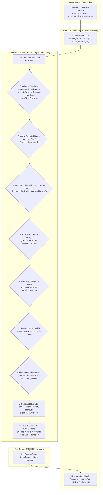

# Software Design Document: Control-Plane State Integrity & Architecture Remediation

## Metadata

- Work Item ID: Issue #277
- Title: Control-Plane State Integrity & Architecture Remediation (Package 1)
- Owner: SA Agent (`sa-architecture-design`)
- Status: Draft (Rework Round 2 — Addressing Maintainer Review #5644271486)
- Date: 2026-09-12
- Governing Requirements: `docs/records/requirements/2026-09-12-control-plane-state-integrity-discovery.md` (AC-001..AC-008, BR-001..BR-004)

---

## Context

During the production deployment and dynamic workflow state audits (Issues #249, #272, #275) and subsequent architecture reviews, five critical vulnerabilities and design gaps were identified in control-plane state management:
1. **Schema & Policy Composition Gap (F-01 / Round 2 Gap 2):** Two conflicting versions existed: legacy workflow policies (`bug-fix-workflow.yaml`) specify domain lifecycle rules at `contract_version: 1`, while durable envelope schema (`durable-task-envelope.schema.json`) specifies persistence at `contract_version: 2`. Evaluating `contract_version` identically across both causes composition failure. Furthermore, runtime transition matrices and evidence requirements must be driven dynamically by workflow policies rather than hardcoded tables.
2. **Actor Authorization Bypass (F-02):** In `scripts/lib/task-state-machine.mjs`, transitions were executed without checking actor permissions against policy-defined roles.
3. **Digest Self-Reference & Integrity Verification Gap (F-03 / Round 2 Gap 1):** Computing JCS digests over the entire envelope including `state_digest` produces circularity. `scripts/lib/status-jcs.mjs` strips `recordDigest` but not `state_digest`. A dedicated envelope hasher `digestTaskEnvelope(envelope)` is required to exclude `state_digest` explicitly, and integrity verification (`stored === computed`) must be enforced on load.
4. **Lock Ownership (ABA) & Crash-Durable Atomic Writer Gap (Round 2 Gap 5):** Simple PID-based lockfiles risk ABA deletion if a stale lock is cleared and reacquired by another process. Atomic writes lacked temp file unlinking on failure and parent directory fsync.
5. **Archival Reconciliation & Crash Recovery Boundary (F-10 / Round 2 Gap 3):** Archiving a shard by moving directory requires atomic projection update via `updateProjectStatusFile()`, with both exception compensation and a deterministic crash-recovery reconciliation mechanism (`archiveWorkItem --reconcile-all`).

---

## Goals / Non-goals

### Goals
- **G-001 (Two-Layer Policy & Envelope Composition - ADR-0026):** Decouple domain workflow policy (`workflow_contract_version: 1`, e.g. `bug-fix-workflow.yaml`) from storage persistence (`envelope_version: 2`, `durable-task-envelope.schema.json`). Introduce a unified policy-driven transition evaluator that reads workflow policy yaml directly.
- **G-002 (Self-Exclusion JCS Digest & Integrity Verification - ADR-0028):** Implement `digestTaskEnvelope(envelope)` which creates a shallow copy, deletes top-level `state_digest`, and invokes RFC 8785 `digestJcs()`. Implement mandatory digest verification (`stored === computed`) across `load`, `transition`, and `resume`.
- **G-003 (True Atomic CAS with Nonce-Based Lock Ownership - ADR-0027):** Require mandatory `--expected-digest`. Implement per-shard mutual exclusion file locking (`.lock` via `openSync('wx')`) storing `{pid, nonce, created_at}` to prevent ABA lock deletions. Re-read disk state under lock.
- **G-004 (Crash-Durable Atomic Writer & Temp Cleanup):** Implement `atomicWriteFileSync` with collision-safe `wx` temp files, full write verification, failure cleanup (`unlinkSync`), `fsyncSync` data flush, atomic rename, and directory sync.
- **G-005 (Transactional Archival with Exception Compensation & Crash Reconciliation - ADR-0029):** Ensure `archiveWorkItem` calls `updateProjectStatusFile()`, rolls back directory move on exception, and provides `reconcileArchivedShards()` command for process crash recovery.

### Non-goals
- **NG-001:** Cryptographic agent authentication (caller-declared role policy validation only; cryptographic signatures deferred).
- **NG-002:** Unbacked numeric NFR targets (replaced with deterministic functional invariants).
- **NG-003:** External database engines or distributed network consensus mechanisms.

---

## Architecture Overview

### 1. Hardened State Mutation Lifecycle with Nonce Lock & Atomic CAS



---

## Component Design

### Component 1: Two-Layer Contract Composition & Dynamic Policy Loader (ADR-0026)
- **Files:** `docs/contracts/schemas/durable-task-envelope.schema.json`, `docs/contracts/*-workflow.yaml`, `scripts/lib/task-state-machine.mjs`, `scripts/validate-contracts.mjs`
- **Architectural Responsibilities:**
  - **Explicit Layer Separation:**
    1. *Envelope Layer:* Governed by `docs/contracts/schemas/durable-task-envelope.schema.json`. Requires `envelope_version: 2` (or preserves `contract_version: 2` representing envelope version, while storing `workflow_contract_version: 1` matching policy `contract_version: 1`).
    2. *Policy Layer:* Governed by `docs/contracts/*-workflow.yaml` declaring allowed states, transition graph, required evidence, retry limits, and authorized actors.
  - **Dynamic Workflow Policy Loader:**
    `loadWorkflowPolicy(workflowId)` reads `docs/contracts/${workflowId}-workflow.yaml`. Runtime transition validation is dynamically evaluated against the policy rules rather than a hardcoded static matrix.
  - **Contract Validator Composition:**
    In `scripts/validate-contracts.mjs`, validator checks:
    - Envelope adheres to `durable-task-envelope.schema.json`.
    - Shard's `workflow_contract_version === policy.contract_version` (or mapped composition).
    - Shard history and state transitions conform to policy graph.

### Component 2: Self-Excluding Task Envelope Hasher & Integrity Verification (ADR-0028)
- **Files:** `scripts/lib/task-state-machine.mjs`, `scripts/lib/status-jcs.mjs`
- **Architectural Responsibilities:**
  - **Dedicated Hasher `digestTaskEnvelope(envelope)`:**
    ```javascript
    export function digestTaskEnvelope(envelope) {
      if (!envelope || typeof envelope !== 'object') {
        throw new Error('Invalid envelope object for digestion');
      }
      // Shallow copy and delete top-level state_digest to prevent circular hashing
      const normalized = { ...envelope };
      delete normalized.state_digest;
      return digestJcs(normalized);
    }
    ```
  - **Universal Validation Seam with Digest Verification:**
    `validateEnvelopeSchema(data)`:
    1. Validates JSON schema structure using Ajv Draft 2020-12.
    2. Computes `expected = digestTaskEnvelope(data)`.
    3. Verifies `data.state_digest === expected`. Throws `DIGEST_INTEGRITY_MISMATCH` if corrupted or tampered.

### Component 3: Nonce-Based Per-Shard Lock & Lost-Update Prevention (ADR-0027)
- **Files:** `scripts/lib/task-state-machine.mjs`, `scripts/task-machine-cli.mjs`
- **Architectural Responsibilities:**
  - **Lock File Format:** Writes JSON to `docs/records/work-items/{issue_id}/.lock` containing:
    ```json
    { "pid": 12345, "nonce": "uuid-v4-or-crypto-random", "created_at": 1789188000000 }
    ```
  - **Acquisition Protocol:**
    - Attempts `fs.openSync(lockPath, 'wx')`.
    - If `EEXIST`: inspects existing lockfile. If older than 30s and recorded PID is dead (`process.kill(pid, 0)` throws `ESRCH`), safely unlinks using compare-before-delete (reading nonce before unlinking) and retries.
    - Retries with backoff up to 5 seconds before throwing `LOCK_ACQUISITION_TIMEOUT`.
  - **Release Protocol:**
    - Reads existing `.lock`. If `parsed.nonce === myNonce`, unlinks `.lock`. Avoids ABA deletion of a newly acquired lock.

### Component 4: Crash-Durable POSIX Atomic Writer with Cleanup
- **Files:** `scripts/lib/task-state-machine.mjs`, `scripts/compile-status-projection.mjs`
- **Architectural Responsibilities:**
  - **POSIX Atomic Writer `atomicWriteFileSync(targetPath, content)`:**
    ```javascript
    export function atomicWriteFileSync(targetPath, content) {
      const resolved = path.resolve(targetPath);
      const dir = path.dirname(resolved);
      if (!fs.existsSync(dir)) fs.mkdirSync(dir, { recursive: true });
      const baseName = path.basename(resolved);
      const tmpPath = path.join(dir, `.tmp-${baseName}-${process.pid}-${Date.now()}-${Math.random().toString(36).slice(2, 8)}`);
      
      let fd;
      try {
        fd = fs.openSync(tmpPath, 'wx');
        const buffer = Buffer.from(content, 'utf8');
        let written = 0;
        while (written < buffer.length) {
          written += fs.writeSync(fd, buffer, written, buffer.length - written);
        }
        fs.fsyncSync(fd);
      } catch (err) {
        if (fd !== undefined) {
          try { fs.closeSync(fd); } catch {}
        }
        try { fs.unlinkSync(tmpPath); } catch {}
        throw err;
      } finally {
        if (fd !== undefined) {
          try { fs.closeSync(fd); } catch {}
        }
      }

      try {
        fs.renameSync(tmpPath, resolved);
      } catch (err) {
        try { fs.unlinkSync(tmpPath); } catch {}
        throw err;
      }

      let dirFd;
      try {
        dirFd = fs.openSync(dir, 'r');
        fs.fsyncSync(dirFd);
      } finally {
        if (dirFd !== undefined) {
          try { fs.closeSync(dirFd); } catch {}
        }
      }
    }
    ```

### Component 5: Transactional Archival, Explicit Wiring & Crash Reconciliation (ADR-0029)
- **Files:** `scripts/archive-work-item.mjs`, `scripts/compile-status-projection.mjs`
- **Architectural Responsibilities:**
  - **Explicit Writer Wiring:**
    `archiveWorkItem(issueId)` explicitly executes `updateProjectStatusFile(rootDir)` (not just `compileStatusProjection`).
  - **Exception Compensation:**
    If `updateProjectStatusFile` throws during archival, compensation rollback moves `docs/records/work-items/archive/{issue_id}` back to `docs/records/work-items/{issue_id}` and throws `ARCHIVE_RECONCILIATION_FAILED`.
  - **Process Crash Recovery Boundary:**
    Provides `reconcileArchivedShards(rootDir)` CLI command (`--reconcile-all`):
    Scans `archive/` and active `work-items/`. If any terminal shard was moved but `PROJECT_STATUS.md` was not updated due to mid-operation process crash (SIGKILL), re-runs atomic projection update to achieve consistent state.

---

## Acceptance Traceability Matrix (AC-001 to AC-008 -> TC-001 to TC-018)

| AC ID | Verification Target | Test Case ID | Test Type | Method |
|---|---|---|---|---|
| **AC-001** | Envelope Schema & Self-Exclusion Digest | `TC-001` | Positive / Contract | Validate v2 envelope with `digestTaskEnvelope(data) === data.state_digest` |
| **AC-001** | Stored Digest Tampering Detection | `TC-002` | Security / Integrity | Tampered state body with unchanged digest throws `DIGEST_INTEGRITY_MISMATCH` |
| **AC-002** | Legacy v1 Rejection & Backfill Idempotency | `TC-003`, `TC-004` | Migration | Reject unmigrated v1 shards; assert backfill upgrades cleanly and is idempotent |
| **AC-003** | Actor Policy Validation & Spacing/Case Normalization | `TC-005`, `TC-006` | Authorization | Rejection of unauthorized actors; normalization of `'Developer Agent'` -> `'developer-agent'` |
| **AC-004** | Permitted Transition & Dynamic Policy Composition | `TC-007`, `TC-008` | State Machine | Dynamic evaluation against `bug-fix-workflow.yaml`; append immutable history |
| **AC-005** | Mandatory CAS on Transition & Resume | `TC-009`, `TC-010` | CLI / Engine | Missing `--expected-digest` aborts with `MISSING_EXPECTED_DIGEST` across transition & resume |
| **AC-006** | True Two-Process Concurrency & Conflict | `TC-011`, `TC-012` | Concurrency Invariant | Parallel processes targeting same digest result in exactly 1 success, 1 `CAS_CONFLICT` |
| **AC-006** | Nonce Lock Ownership & Stale Recovery | `TC-013` | Concurrency Resilience | Compare-before-delete prevents ABA lock corruption; dead PID stale lock cleared |
| **AC-007** | Fail-Closed Status Projection | `TC-014`, `TC-015` | Fail-Closed CI | Malformed JSON or invalid schema in `work-items/*` aborts compiler with exit 1 |
| **AC-008** | Atomic Writer with Temp Cleanup & Dir Sync | `TC-016` | Crash Durability | Injected failure cleans up temp files; complete old or new content preserved |
| **AC-008** | Archival Writer Wiring & Exception Rollback | `TC-017`, `TC-018` | Lifecycle Integration | `updateProjectStatusFile` invoked; mock exception triggers compensating directory move |

---

## Architectural Decisions (ADRs)

- **ADR-0026: Two-Layer Composition of Workflow Policy and Storage Envelope**
  - *Context:* Workflow policy (`contract_version: 1`) and durable storage envelope (`envelope_version: 2`) serve distinct architectural concerns.
  - *Decision:* Compose the layers explicitly. Shards store `workflow_id`, `workflow_contract_version: 1`, and `envelope_version: 2`. Transitions validate against dynamic policy files.
  - *Status:* Proposed (Pending Maintainer Approval).
- **ADR-0027: Nonce-Based Per-Shard Mutual Exclusion Lock with True Atomic CAS**
  - *Context:* Read-then-write CAS without mutual exclusion allows lost updates; simple PID locks have ABA risks.
  - *Decision:* Per-shard lock file with `{pid, nonce, created_at}` and compare-before-delete stale recovery. Re-read disk state under lock.
  - *Status:* Proposed (Pending Maintainer Approval).
- **ADR-0028: Self-Excluding RFC 8785 JCS Task Envelope Hashing**
  - *Context:* Hashing entire envelope including `state_digest` produces circular reference.
  - *Decision:* Implement `digestTaskEnvelope()` excluding top-level `state_digest` before calling `digestJcs()`. Verify digest equality on load.
  - *Status:* Proposed (Pending Maintainer Approval).
- **ADR-0029: Archival Exception Compensation and Deterministic Crash Reconciliation**
  - *Context:* Directory rename without projection update leaves stale active records; SIGKILL mid-operation breaks compensation.
  - *Decision:* Wire `updateProjectStatusFile()` directly; compensate on exception; provide `--reconcile-all` command for crash recovery.
  - *Status:* Proposed (Pending Maintainer Approval).
