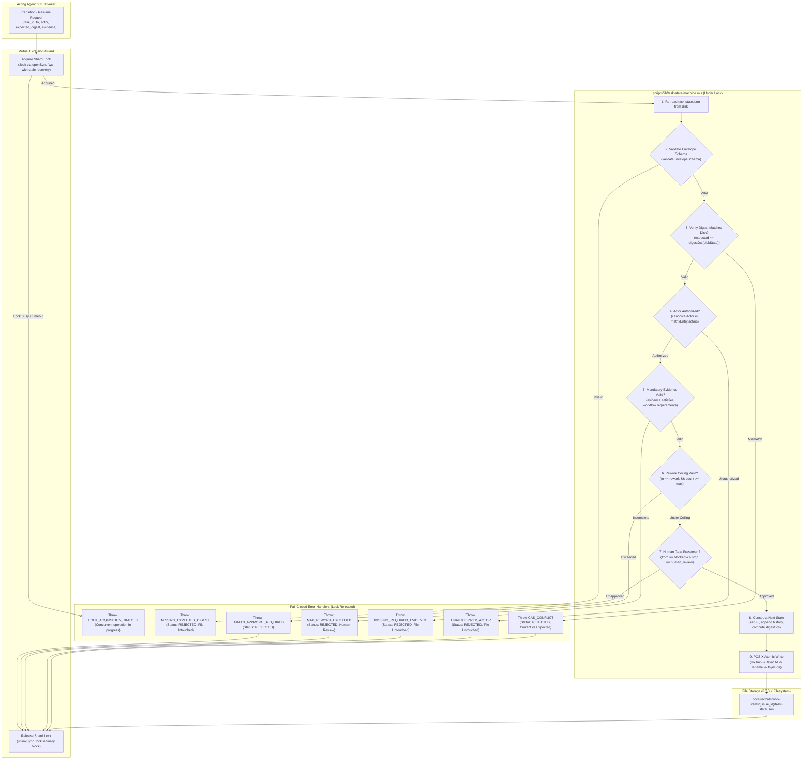
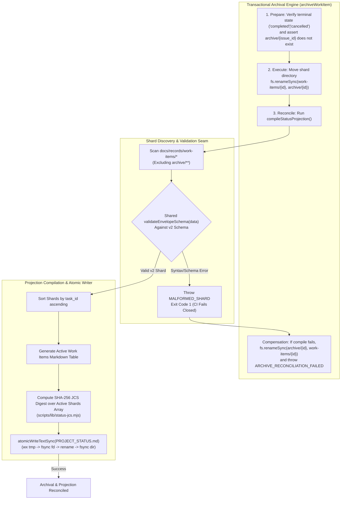

# Software Design Document: Control-Plane State Integrity & Architecture Remediation

## Metadata

- Work Item ID: Issue #277
- Title: Control-Plane State Integrity & Architecture Remediation (Package 1)
- Owner: SA Agent (`sa-architecture-design`)
- Status: Approved
- Date: 2026-09-12
- Governing Requirements: `docs/records/requirements/2026-09-12-control-plane-state-integrity-discovery.md` (AC-001..AC-008, BR-001..BR-004)

---

## Context

During the production deployment and dynamic workflow state audits (Issues #249, #272, #275), five critical architectural vulnerabilities and discrepancies were identified in the control-plane state management system:
1. **Schema Discrepancy (F-01):** Two conflicting schemas exist in `docs/contracts/schemas/`. Legacy `task-state.schema.json` enforces a 7-state model (`intake`, `investigating`, `implementing`, `verifying`, `rework`, `handoff`, `blocked`) restricted to `bug-fix`, while `durable-task-envelope.schema.json` defines the canonical v2 11-state model (`intake`, `investigating`, `designing`, `planning`, `implementing`, `verifying`, `rework`, `handoff`, `blocked`, `completed`, `cancelled`) supporting 5 workflow types (`bug-fix`, `new-feature`, `framework-meta`, `config-change`, `data-change`). Active shards (`issue-249`, `issue-275`) still declare legacy `contract_version: 1`.
2. **Actor Authorization Bypass (F-02):** In `scripts/lib/task-state-machine.mjs`, `TRANSITION_MATRIX` defines permitted `actors` per state, but `transitionTaskState()` never validates the incoming `actor` parameter against `matrixEntry.actors`. Any role or unauthenticated string can trigger state transitions without authorization.
3. **Optional CAS Bypass (F-03):** In `scripts/lib/task-state-machine.mjs` (line 232) and CLI `scripts/task-machine-cli.mjs` (lines 102, 120, 161), CAS digest verification is purely optional or omitted on resume. Any caller omitting `--expected-digest` bypasses CAS checks entirely, permitting silent concurrent state overwrites.
4. **Projection Shard Fail-Open (W1):** In `scripts/compile-status-projection.mjs` (`discoverActiveShards`), unparseable or schema-violating shards are caught by a `try/catch` block that logs a console warning and skips the shard. This fails open, dropping corrupt tasks from `PROJECT_STATUS.md` without failing CI or compilation.
5. **Non-Atomic Root Projection Writes & Archival Desynchronization (F-10):** In `scripts/compile-status-projection.mjs` (`updateProjectStatusFile`), `PROJECT_STATUS.md` is updated using non-atomic `fs.writeFileSync`. A process interruption mid-write corrupts `PROJECT_STATUS.md`. Furthermore, `compile-status-projection.mjs` discovers completed/cancelled shards awaiting archival, while `archive-work-item.mjs` does not trigger projection updates, leaving stale active entries.

---

## Goals / Non-goals

### Goals
- **G-001 (Schema & Contract Layering - AC-001, AC-002, BR-001, ADR-0026):** Establish `docs/contracts/schemas/durable-task-envelope.schema.json` as the sole canonical envelope for active durable task state. Enforce `contract_version: 2`, integer `sequence_number >= 1`, RFC 8785 JCS SHA-256 `state_digest`, and immutable history. Support workflow policies (e.g. `docs/contracts/bug-fix-workflow.yaml`) within the v2 envelope.
- **G-002 (Actor Policy Validation - AC-003, AC-004, BR-002):** Enforce strict validation of acting role against `matrixEntry.actors` in `transitionTaskState()`. Canonicalize actor IDs to lowercase kebab-case against `ROLE_REGISTRY`. Reject unauthorized transitions with `UNAUTHORIZED_ACTOR`.
- **G-003 (True Atomic CAS Concurrency - AC-005, AC-006, BR-003):** Eliminate optional CAS bypass. Require `--expected-digest` on every state transition and resume command. Implement per-shard mutual exclusion locking (`.lock` via `wx`) with disk re-read and atomic update under lock to eliminate two-process lost updates.
- **G-004 (Fail-Closed Projection Compilation - AC-007, BR-004):** Make `compile-status-projection.mjs` fail closed on unparseable or schema-violating shards using a unified validation seam (`validateEnvelopeSchema`), throwing `MALFORMED_SHARD` and exiting with code 1.
- **G-005 (Transactional Archival & Atomic Durability - AC-008, BR-004):** Redesign `archiveWorkItem` with two-phase execution and compensation rollback. Unify atomic file writing (`atomicWriteJsonSync` and `atomicWriteTextSync`) with collision-safe temp files (`wx`), `fsyncSync`, atomic rename, and directory sync.

### Non-goals
- **NG-001:** Modifying production application business code, schema definitions, or test suites outside control-plane state management.
- **NG-002:** Altering Core Bootloader Tier 1 context token budget limits (remains <= 3,500 tokens).
- **NG-003:** Relaxing the 2-cycle rework retry ceiling or bypassing human approval gate invariants.
- **NG-004:** Cryptographic agent authentication or cryptographic identity verification. The actor guard validates transition policy against caller-declared role identity; process authentication is out of scope.
- **NG-005:** Introducing external database engines (PostgreSQL, Redis) or distributed network consensus mechanisms. The architecture remains local-first, Git-native, and POSIX file-based.

---

## Architecture Overview

The Control-Plane State Integrity architecture hardens state mutation, concurrency verification, projection compilation, and lifecycle reconciliation across two core pipelines:

### 1. Hardened State Mutation Lifecycle with Per-Shard Lock & Atomic CAS



### 2. Transactional Archival & Fail-Closed Projection Pipeline



---

## Component Design

### Component 1: Contract Layering & Shared Validation Seam (ADR-0026)
- **Files:** `docs/contracts/schemas/durable-task-envelope.schema.json`, `docs/contracts/bug-fix-workflow.yaml`, `scripts/lib/task-state-machine.mjs`
- **Architectural Responsibilities:**
  - **Two-Layer Contract Separation:**
    1. *Workflow Policy Layer (v1):* Workflows (e.g. `bug-fix-workflow.yaml`) declare domain lifecycle rules: allowed states, valid transition pairs, required evidence keys, retry ceilings (`max_rework_attempts: 2`), and terminal requirements.
    2. *Durable Storage Envelope Layer (v2):* `durable-task-envelope.schema.json` governs filesystem persistence: `task_id`, `workflow_id`, `contract_version: 2`, `sequence_number >= 1`, 64-char hex `state_digest`, and immutable `history`.
  - **Shared Validation Seam (`validateEnvelopeSchema(data)`):**
    A unified, authoritative validation function implemented in `scripts/lib/task-state-machine.mjs` using Ajv Draft 2020-12. Invoked uniformly across:
    - `createTaskState()`
    - `loadTaskState()`
    - `transitionTaskState()` (pre-validation on disk read, post-validation before write)
    - `resumeTaskState()`
    - `compile-status-projection.mjs` (`discoverActiveShards`)
    - `backfill-task-state-v2.mjs` (migration verification)
  - Legacy `task-state.schema.json` is retained solely as an archive validator for historical commits; active shards declaring `contract_version: 1` fail closed.

### Component 2: Strict Actor Policy Validation & Trust Boundary
- **File:** `scripts/lib/task-state-machine.mjs`
- **Architectural Responsibilities:**
  - Scope: Operates strictly as **transition policy validation against caller-declared role identity**. It verifies that the role asserted by the caller is permitted to execute the requested transition according to the transition matrix.
  - Normalization: Canonicalize actor strings to lowercase kebab-case (e.g., `'Developer Agent'` -> `'developer-agent'`).
  - Validation: Verify canonical actor exists in `ROLE_REGISTRY` and is included in `matrixEntry.actors`.
  - Enforcement: Reject unauthorized role transitions immediately with `UNAUTHORIZED_ACTOR`, status `REJECTED`, leaving disk unmutated.
  - Emergency/Human Invariants: Enforce that exiting state `blocked` with `stop_reason: human_review_required` requires `actor: 'human'` or `'orchestrator'` and evidence containing valid `approver_id`.
  - *Residual Risk Documentation:* This gate does not perform cryptographic signature verification or OS process authentication; any local caller supplying `--actor qa-agent` is evaluated under that role. Full process authentication is deferred to future token-based identity infrastructure.

### Component 3: Per-Shard Mutual Exclusion & Atomic CAS Concurrency Engine
- **Files:** `scripts/lib/task-state-machine.mjs`, `scripts/task-machine-cli.mjs`
- **Architectural Responsibilities:**
  - **Mutual Exclusion Lock:** For any mutating operation (`transition`, `resume`), acquire a file lock at `docs/records/work-items/{issue_id}/.lock` using `fs.openSync(lockPath, 'wx')`.
    - *Stale Lock Recovery:* If `.lock` exists, inspect its `mtime`. If older than 30 seconds, verify if the recorded PID is dead (`process.kill(pid, 0)` throws `ESRCH`), remove stale lock, and reacquire. If active, retry with backoff up to 5 seconds before throwing `LOCK_ACQUISITION_TIMEOUT`.
  - **True Atomic CAS Sequence:**
    1. Acquire shard lock.
    2. Re-read `task-state.json` from disk under lock.
    3. Validate envelope schema via `validateEnvelopeSchema(currentState)`.
    4. Verify `expected_digest === digestJcs(currentState)`. Throw `CAS_CONFLICT` on mismatch.
    5. Evaluate actor authorization, evidence, and rework budget against workflow policy.
    6. Construct next state: increment `sequence_number`, append immutable transition record to `history`, clear `stop_reason`.
    7. Compute `nextState.state_digest = digestJcs(nextState)` using canonical RFC 8785 serialization.
    8. Write `nextState` to disk via `atomicWriteJsonSync` under lock.
    9. Release shard lock in `finally` block (`fs.unlinkSync(lockPath)`).
  - **CLI Enforcement:** Enforce mandatory `--expected-digest` across *both* `transition` and `resume` CLI commands.

### Component 4: Canonical RFC 8785 Serialization & Crash-Durable Atomic Writer
- **Files:** `scripts/lib/task-state-machine.mjs`, `scripts/lib/status-jcs.mjs`, `scripts/compile-status-projection.mjs`
- **Architectural Responsibilities:**
  - **Canonical Serialization Unification:** Discard custom recursive JSON serializers. Directly import and use `digestJcs` and `canonicalizeJcs` from `scripts/lib/status-jcs.mjs` for all state envelope and projection digest calculations.
  - **POSIX Crash-Durable Atomic Writer:**
    Implement `atomicWriteFileSync(targetPath, content)`:
    ```javascript
    export function atomicWriteFileSync(targetPath, content) {
      const resolved = path.resolve(targetPath);
      const dir = path.dirname(resolved);
      if (!fs.existsSync(dir)) fs.mkdirSync(dir, { recursive: true });
      const baseName = path.basename(resolved);
      const tmpPath = path.join(dir, `.tmp-${baseName}-${process.pid}-${Date.now()}-${Math.random().toString(36).slice(2, 8)}`);
      
      // 1. Collision-safe temporary file write with 'wx'
      const fd = fs.openSync(tmpPath, 'wx');
      try {
        fs.writeSync(fd, content, 0, 'utf8');
        // 2. Flush file data and metadata to physical storage
        fs.fsyncSync(fd);
      } finally {
        fs.closeSync(fd);
      }
      
      // 3. Atomic rename replacing target
      fs.renameSync(tmpPath, resolved);
      
      // 4. Directory fsync to persist directory entry pointer update
      const dirFd = fs.openSync(dir, 'r');
      try {
        fs.fsyncSync(dirFd);
      } finally {
        fs.closeSync(dirFd);
      }
    }
    ```
  - **Observable Invariant:** Under process crash, SIGKILL, or power interruption, the target file is guaranteed to contain either the complete previous valid state or the complete new valid state—never a partial, truncated, or corrupted byte stream.

### Component 5: Transactional Archival Engine & Active Shard Rebalancing
- **File:** `scripts/archive-work-item.mjs`
- **Architectural Responsibilities:**
  - **Two-Phase Archival with Compensation:**
    - *Prepare Phase:* Validate issue ID format; ensure active shard exists; parse and validate shard against `validateEnvelopeSchema`; verify state is terminal (`completed` or `cancelled`); ensure target directory `docs/records/work-items/archive/{issue_id}` does not already exist.
    - *Execute Phase:* Move shard directory via `fs.renameSync(shardDir, targetShardDir)`.
    - *Reconcile Phase:* Execute `compileStatusProjection()`.
    - *Compensating Rollback:* If projection compilation throws an error (e.g. malformed shard detected elsewhere), move directory back: `fs.renameSync(targetShardDir, shardDir)`, and throw `ARCHIVE_RECONCILIATION_FAILED`.
  - **Lifecycle Transition Path for Active Shards:**
    - `issue-249`: Currently in `verifying`. Transition path: `verifying` -> `handoff` (by `qa-agent`, evidence: `original_repro_result`, `verification_result`) -> `completed` (by `orchestrator`, evidence: `terminal_handoff_receipt`) -> invoke `archiveWorkItem('issue-249')`.
    - `issue-275`: Currently in `verifying`. Transition path: `verifying` -> `handoff` (by `qa-agent`, evidence: `original_repro_result`, `verification_result`) -> `completed` (by `orchestrator`, evidence: `terminal_handoff_receipt`) -> invoke `archiveWorkItem('issue-275')`.

---

## API Contract

### Module Function Signatures (`scripts/lib/task-state-machine.mjs`)
```typescript
interface TransitionRequest {
  to: StateEnum;
  actor: RoleEnum;
  expected_digest: string; // Mandatory 64-char hex
  evidence?: Record<string, any>;
  stop_reason?: StopReasonEnum | null;
  next_route?: RoleEnum | null;
}

interface ResumeRequest {
  to: StateEnum;
  actor: 'human' | 'orchestrator';
  approver_id: string;
  expected_digest: string; // Mandatory 64-char hex
  resume_evidence?: string;
  next_route?: RoleEnum | null;
}

function validateEnvelopeSchema(data: unknown): TaskEnvelopeV2;

function transitionTaskState(
  currentState: TaskEnvelopeV2,
  request: TransitionRequest
): TaskEnvelopeV2;

function resumeTaskState(
  currentState: TaskEnvelopeV2,
  request: ResumeRequest
): TaskEnvelopeV2;

function executeAtomicTransition(
  shardFilePath: string,
  request: TransitionRequest
): TaskEnvelopeV2;

function inspectTaskState(
  taskState: TaskEnvelopeV2
): TaskStateInspection;

function atomicWriteFileSync(
  targetPath: string,
  content: string
): void;
```

### CLI Command Interface (`scripts/task-machine-cli.mjs`)
```bash
# Transition with mandatory CAS and actor authorization:
node scripts/task-machine-cli.mjs transition \
  --file docs/records/work-items/issue-277/task-state.json \
  --to planning \
  --actor sa-agent \
  --expected-digest 4a9f8...64hex \
  --evidence '{"sdd_ref":"docs/records/sdd/2026-09-12-control-plane-state-integrity-sdd.md","adr_ref":"ADR-0026"}'

# Resume with mandatory CAS and approver identification:
node scripts/task-machine-cli.mjs resume \
  --file docs/records/work-items/issue-277/task-state.json \
  --to investigating \
  --actor human \
  --approver-id maintainer-boss \
  --expected-digest 4a9f8...64hex \
  --evidence '{"human_clearance_note":"Approved rework cycle"}'
```

### Structured Error Response Format
```json
{
  "status": "REJECTED",
  "error_code": "UNAUTHORIZED_ACTOR | MISSING_EXPECTED_DIGEST | CAS_CONFLICT | MALFORMED_SHARD | MISSING_REQUIRED_EVIDENCE | LOCK_ACQUISITION_TIMEOUT | ARCHIVE_RECONCILIATION_FAILED",
  "message": "Human-readable diagnostic description",
  "current_digest": "4a9f...64hex (present on CAS_CONFLICT)",
  "expected_digest": "7b2c...64hex (present on CAS_CONFLICT)"
}
```

---

## Data Model & Migration Strategy

### Task Envelope v2 Specification (`docs/contracts/schemas/durable-task-envelope.schema.json`)
- `task_id`: String pattern `^[a-z0-9_-]+$`.
- `workflow_id`: Enum `['bug-fix', 'new-feature', 'framework-meta', 'config-change', 'data-change']`.
- `contract_version`: Integer const `2`.
- `sequence_number`: Integer minimum `1`.
- `state_digest`: String 64-char hex pattern `^[a-f0-9]{64}$`.
- `state`: 11-state enum (`intake`, `investigating`, `designing`, `planning`, `implementing`, `verifying`, `rework`, `handoff`, `blocked`, `completed`, `cancelled`).
- `history`: Array of immutable transition objects (`from`, `to`, `at`, `actor`, `evidence_refs`).
- `evidence`: Free-form object storing verified evidence keys defined by the active workflow policy.

### Migration & Backfill Strategy
- **Phase 1 (Deploy Schema & Backfill Tool):**
  - Canonical envelope schema v2 deployed to `docs/contracts/schemas/durable-task-envelope.schema.json`.
  - Migration script `scripts/backfill-task-state-v2.mjs` converts existing active shards (`issue-249`, `issue-275`):
    - Sets `contract_version: 2`.
    - Sets initial `sequence_number = history.length + 1`.
    - Canonicalizes existing actor strings in history to kebab-case.
    - Computes `state_digest = digestJcs(shard)` using `status-jcs.mjs`.
    - Validates via `validateEnvelopeSchema(shard)`.
- **Phase 2 (Activate Strict Quality Gates):**
  - Deprecate `task-state.schema.json`.
  - Wire `validateEnvelopeSchema` into `scripts/validate-contracts.mjs`, `compile-status-projection.mjs`, and CI to fail closed on any active shard with `contract_version: 1`.
- **Rollback Plan:**
  - Backfilled shards preserve all historical entries and evidence. If migration rollback is required, run `scripts/backfill-task-state-v2.mjs --rollback` to reset `contract_version: 1` and remove `sequence_number` and `state_digest`.

---

## Error Handling & Fail-Closed Invariants

| Error Code | Trigger Condition | Exit Behavior | Disk State Mutation |
|---|---|---|---|
| `LOCK_ACQUISITION_TIMEOUT` | Shard `.lock` held by active process > 5 seconds | Throws Error, CLI exits `1` | 0% (Untouched) |
| `UNAUTHORIZED_ACTOR` | Actor string not in `TRANSITION_MATRIX[fromState].actors` | Throws Error, CLI exits `1` | 0% (Untouched) |
| `MISSING_EXPECTED_DIGEST` | `expected_digest` omitted, null, or empty string on transition/resume | Throws Error, CLI exits `1` | 0% (Untouched) |
| `CAS_CONFLICT` | `expected_digest !== digestJcs(currentState)` | Throws Error, CLI exits `1` | 0% (Untouched) |
| `MALFORMED_SHARD` | Shard in `work-items/*` violates JSON syntax or v2 schema | Throws Error, CLI exits `1` | 0% (Untouched) |
| `MISSING_REQUIRED_EVIDENCE` | Required evidence key(s) absent from `evidence` payload | Throws Error, CLI exits `1` | 0% (Untouched) |
| `MAX_REWORK_EXCEEDED` | `rework_count >= 2` when transitioning to `rework` | Transition rejected, human gate required | 0% (Untouched) |
| `HUMAN_APPROVAL_REQUIRED` | Autonomous attempt to exit `blocked` without human credentials | Transition rejected | 0% (Untouched) |
| `ARCHIVE_RECONCILIATION_FAILED`| Status projection compilation fails following shard archival | Compensating rollback; shard restored | Restored to pre-archival location |

---

## Security Considerations

1. **Role Policy Enforcement:** Actor strings are canonicalized to kebab-case and verified against `TRANSITION_MATRIX.actors`. Agents cannot self-certify transitions reserved for specialized roles (e.g., Developer cannot self-approve QA verification).
2. **Cryptographic State Integrity:** Every state transition computes an SHA-256 digest over the canonical RFC 8785 representation (`scripts/lib/status-jcs.mjs`). Any tampering with history or state properties invalidates subsequent transitions.
3. **Mutual Exclusion & Concurrency Isolation:** Per-shard lockfiles ensure that competing agent processes or parallel CLI calls cannot interleave read-modify-write sequences.
4. **Crash Durability:** POSIX atomic writing with `wx` temp files, `fsyncSync` data flush, and parent directory `fsync` prevents mid-write truncation and directory pointer desynchronization under system failure.
5. **Residual Security Risk (Explicit):** Actor authorization operates on caller-declared role identity without cryptographic process authentication. Any local execution context can declare `--actor qa-agent`. Cryptographic agent signatures and caller authentication are tracked as future enhancements.

---

## Deterministic Functional Invariants & Quality Governance

- **Deterministic Functional Invariants:**
  - *Zero Lost Updates:* Two concurrent transition requests targeting the same shard digest will result in exactly one successful mutation and one `CAS_CONFLICT` rejection.
  - *Crash Invariance:* Under injected process termination (SIGKILL) during file write, the target file retains either 100% complete prior content or 100% complete new content.
  - *Fail-Closed Projection:* Any invalid JSON or schema violation encountered in `work-items/*` terminates projection compilation immediately with exit code 1.
  - *Lock Zero-Leak:* Shard `.lock` files are unlinked in `finally` blocks upon both successful completion and error throw.
- **Review Gate Governance (QG-001):**
  - All script changes to `.mjs`/`.js` files must satisfy `scripts/validate-review-gate.mjs` by including an added QA code review record under `docs/records/qa/*-code-review.md`.

---

## Architectural Decisions (ADRs)

- **ADR-0026: Two-Layer Composition of Workflow Policy (v1) and Durable Storage Envelope (v2)**
  - *Context:* Discrepancy existed between workflow policies (`bug-fix-workflow.yaml`, 7 states) and durable task envelopes (`durable-task-envelope.schema.json`, 11 states).
  - *Decision:* Reconcile by establishing a strict two-layer architecture. Workflow policies govern domain rules (allowed states, transitions, required evidence, retry ceilings). Durable envelopes govern filesystem persistence (identity, sequence numbers, JCS digests, transition history).
  - *Consequences:* Workflows can evolve domain rules independently while storage envelopes maintain a single universal validation contract.
- **ADR-0027: Per-Shard Mutual Exclusion Lock with True Atomic CAS**
  - *Context:* Read-then-write CAS without mutual exclusion is vulnerable to lost updates between concurrent local processes.
  - *Decision:* Implement per-shard file locks (`.lock` via `wx`) with stale-lock detection and disk re-read under lock before CAS evaluation.
  - *Consequences:* Eliminates concurrency race conditions in multi-agent and local CLI execution.
- **ADR-0028: Canonicalization Unification via RFC 8785 `status-jcs.mjs`**
  - *Context:* The state machine implemented custom recursive JSON serialization instead of using the repository's canonical JCS library.
  - *Decision:* Unify all digest and canonicalization logic around `scripts/lib/status-jcs.mjs` (`canonicalizeJcs`, `digestJcs`).
  - *Consequences:* Eliminates divergence between status projection hashing and state machine CAS digests.
- **ADR-0029: Transactional Archival with Compensating Rollback**
  - *Context:* Moving shards to archive without projection reconciliation produced ghost active tasks in `PROJECT_STATUS.md`.
  - *Decision:* Execute archival as a two-phase operation that immediately compiles status projection and rolls back shard directory move if compilation fails.
  - *Consequences:* Guarantees consistency between filesystem shards and root status projections.

---

## Acceptance Traceability Matrix (AC-001 to AC-008)

| AC ID | Verification Method | Expected Outcome |
|---|---|---|
| **AC-001** | Validate active work item shards against `durable-task-envelope.schema.json` | 100% PASS with `contract_version: 2`, `sequence_number >= 1`, valid SHA-256 JCS digest |
| **AC-002** | Submit shard with `contract_version: 1` or 7-state structure to `validateEnvelopeSchema` | Rejection with diagnostic schema error requiring v2 migration |
| **AC-003** | Attempt transition `verifying` -> `handoff` with `actor: 'developer-agent'` | Rejection with `UNAUTHORIZED_ACTOR`, exit code 1, disk file untouched |
| **AC-004** | Execute permitted transition with authorized actor and mandatory evidence | Success, sequence number incremented, new SHA-256 JCS digest computed |
| **AC-005** | Attempt transition or resume without `--expected-digest` or empty string | Immediate rejection with `MISSING_EXPECTED_DIGEST`, exit code 1 |
| **AC-006** | Attempt concurrent transition or provide stale expected digest | Abort with `CAS_CONFLICT`, returns current and expected digests |
| **AC-007** | Execute `compileStatusProjection` with a malformed JSON file in `work-items/test-issue/` | Process aborts with `MALFORMED_SHARD`, exit code 1 |
| **AC-008** | Interrupt write during `atomicWriteFileSync` or inspect file operations | Writes utilize `.tmp` with `wx` + `fsyncSync` + `renameSync` + dir sync; zero byte corruption |

---

## Related Artifacts & Links

| Artifact | Purpose | Repository Path |
|---|---|---|
| Requirement Discovery | Authoritative requirement source | `docs/records/requirements/2026-09-12-control-plane-state-integrity-discovery.md` |
| Durable Envelope Schema v2 | Canonical JSON Schema Draft 2020-12 | `docs/contracts/schemas/durable-task-envelope.schema.json` |
| Canonical JCS Implementation | Authoritative RFC 8785 canonicalizer & hasher | `scripts/lib/status-jcs.mjs` |
| Task State Machine | State machine engine and transition matrix | `scripts/lib/task-state-machine.mjs` |
| Task Machine CLI | CLI tool for inspection, transitions, and resumes | `scripts/task-machine-cli.mjs` |
| Status Projection Compiler | Active shard discovery and projection compiler | `scripts/compile-status-projection.mjs` |
| Shard Archival Tool | Terminal shard archival script with compensation | `scripts/archive-work-item.mjs` |
